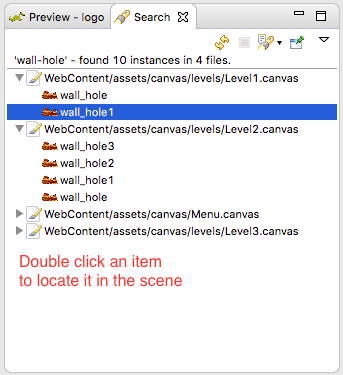
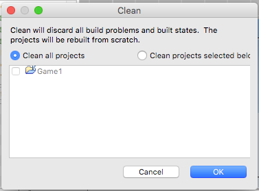

Assets Management
=================

In Phaser Editor we encourage to use the `Asset Pack JSON Format <http://www.html5gamedevs.com/topic/6807-new-phaser-asset-pack-feature-please-test>`_ to load the assets of your games, it allow a better organization and comprehension of the assets and we provide many features around this file, specially the scene maker.

The asset pack
--------------

In the Phaser repository there is the file ``resources/Asset Pack JSON Format/assetPack.json``. It is an example of how the assets can be loaded via the asset pack. We reproduce here the Phaser's authors explanation of that file: 

    An Asset Pack is a means to control the loading of assets into Phaser via a JSON file. Use ``Phaser.Loader.pack()`` to load your data file.
    
    The file is split into sections (...) Sections are a way for you to control the splitting-up of asset loading, so you don't have to load everything at once.

    The key you use for the sections is entirely up to you and is passed to the ``Phaser.Loader.pack`` call.

    Within each section is an Array of objects. Each object corresponds to a single file to be loaded. The "type" property controls the type of file. Note that lots of the file properties are optional. See the ``Phaser.Loader`` API Documentation to find out which ones, as they match the API calls exactly.

    Where a file type has a callback, such as "script", the context in which the callback is run should be passed to the ``Phaser.Loader.pack`` method. See the examples for further details.

Create the pack file
--------------------------

If you create a project based on the built-in Phaser Editor templates then this file is created automatically. You can find it in the ``WebContent/assets/assets-pack.json`` path. 

To create the pack file manually, go to ``File → New → Asset Pack File``:

.. image:: images/NewAssetPackMenu.png
  :alt: Asset pack file menu

It opens the Asset Pack File wizard. In this wizard, you should write the name of the file and select the folder where to create the pack. By default, it selects the ``assets`` folder, but you can select any folder in any project. Press Finish to create the file and it opens in the Asset Pack editor. 

.. image:: images/NewAssetPackSelectFolder.png
  :alt: Asset pack wizard

The pack file editor
--------------------

The Asset Pack file is a JSON file that you can edit manually, but in Phaser Editor this file can be modified using a dedicated editor with a graphical interface.

The editor has two panels: the assets tree and the asset details.

In the assets tree, you add, remove and rename the sections and the entries. The asset details panel shows the properties of the object selected in the tree.

To modify an asset entry, you select it in the tree and change the values in the details panel.

The details panel also shows the JSDoc of the different parameters, it is the same doc of the parameters of the loader method.

For example, if you select an "image" object in the tree, the details panel shows the parameters of the ``Phaser.Loader.image()`` method. You can modify the values of the parameters and you can see the documentation of it (hover the mouse in the parameter's name). 

.. image:: images/AssetPackEditor.png
  :alt: Asset pack editor

Load the assets from the pack file
----------------------------------

In Phaser the assets are loaded in the preload method of the game state. The code to load them looks like this:

.. code-block:: javascript

  game.load.image("dino", "path/to/dino.png");      
  game.load.image("montain", "path/to/montain.png");
  game.load.spritesheet("girl", "path/to/mujer-trotando.png", 64, 64);
  game.load.audio("music", "path/to/guajira.ogg");
  ...

For each asset to load you have to write a loader's method call.

When you use an asset pack you only have to write a line to load a section from the asset pack:

.. code-block:: javascript

  game.load.pack("level", "path/to/assets-pack.json");

It automatically loads all the assets defined in the ``"level"`` section of the pack ``assets-pack.json``.

Assets explorer
---------------

The Assets explorer is a key tool in Phaser Editor. It allows the user to navigate, preview, use and refactor the assets in a friendly way.

Navigate the assets
~~~~~~~~~~~~~~~~~~~

The Assets view show the hierarchy of the assets declared on the packs of the active project. The assets, as in the pack editor, are grouped in pack files and sections, but in addition, you can get access to the frames of spritesheets or texture atlases. For example, a texture atlas is a node that you can expand to see all the sprites of the texture.

The visual scenes and prefabs (Canvas files) are also available in the Assets view, unser the Canvas section.

.. image:: images/AssetsView.png
  :alt: Assets explorer

To open the Assets view type ``Ctrl+3`` and write ``assets``. It shows you a list of elements related to the word ``assets``, just click the one that says ``Assets View``. 

Quick preview of the assets
~~~~~~~~~~~~~~~~~~~~~~~~~~~

Many of the items in the Assets window can be quickly previewed: audio entries, videos, images, textures and Canvas (visual editor) files. Just hover the mouse on top of the element and a quick popup will show you the preview. Or drag the item and drop it in the `Preview <./preview-window.html>`_ window. 

The icons and preview images of the assets are computed in a background process that is triggered each time the assets change. Check the `Troubleshooting`_ section below, there is explained how to fix some glitches related to assets. 

Add objects to a Canvas scene
~~~~~~~~~~~~~~~~~~~~~~~~~~~~~

In addition to the assets of the pack files, the Assets window show the visual scenes and prefabs (Canvas files). These files can be dragged from the Assets window and dropped into an open visual editor to create new objects.

Assets references search
~~~~~~~~~~~~~~~~~~~~~~~~

To search all the references -in the whole project- of an asset could be a very desired feature in certain cases. In the Assets window you can right-click on an asset and select to search all the references.

.. image:: images/FindAssetsMenu.png
  :alt: Find asset references

For now only Canvas scenes have references to the assets, so a search for references will show a list of objects in the scenes that are using the selected asset.

The result of  a search is shown in the Search window, and you can double click on any of the element to locate them in the visual scene editor.

Assets refactoring
~~~~~~~~~~~~~~~~~~

A nice new feature in Phaser Editor is the refactoring tools. These tools allow the user to change asset names, delete asset entries or replace asset textures by executing safe operations that can be undone.

Delete an asset
^^^^^^^^^^^^^^^

To delete an asset entry right-click on it and select the ``Refactoring → Delete`` option.  Please remember that an asset entry is just a definition, an entry, in the asset pack file. By deleting an asset entry you only are modifying the ``pack.json`` file, the real file, like an image, is not touched.

.. image:: images/DeleteAssetMenu.png
  :alt: Delete asset menu

*Note that some elements shown in the Assets view cannot be deleted. For example you cannot delete a frame of a texture atlas, you only can delete a complete texture atlas.*

After select the option to delete an asset, it opens a confirmation dialog with the option of preview the list of files that will be affected by the deletion.

.. image:: images/PreviewAffectedFiles.png
  :alt: Preview the affected files

Rename asset
^^^^^^^^^^^^

The process of rename an asset is pretty similar to the process of deleting it. A confirmation dialog is opened and the user can preview the affected files. The main difference is that if the user confirms the operation, then all the Canvas files will be updated to use the new name.

Move asset
^^^^^^^^^^

Assets can be moved from one section to other. Just follow the same process of the rename, in the context menu select the ``Refactoring → Move`` option. It shows a dialog to select the new section for the asset and the option to preview the affected files. This operation can be undone and updates all the affected files so it does not introduce errors.

Global replace texture
^^^^^^^^^^^^^^^^^^^^^^

This is a very useful operation and consists on replace certain texture (represented by an asset in the pack file) in all the objects of all the scenes of the project. These are the steps:

* Select the texture you want to replace. For example, a demo texture that you want to replace for the final texture.

.. image:: images/AssetReplaceMenu.png
  :alt: Asset replace menu

* Select the texture replacement and confirm.

.. image:: images/SelectNewTextureReplacement.png
  :alt: Select the new texture

All the objects that used ``flor`` as texture will be modified to use the texture ``zombi-head``.

Troubleshooting
---------------

If you find that your assets are in an invalid state or you see a strange behavior then to fix it you can try by cleaning the projects.

Internally Phaser Editor uses a memory model with all the assets and its properties. This memory model should be synchronized with the physical and real data, but it happens sometimes because of external changes or maybe bugs, the memory model is not in synchronization with the physical one. In this case, the best is to force the editor to create the memory model from scratch.

To do this select in the main menu the option ``Project → Clean...``, it opens a dialog with the list of your projects. Select those you want to re-build and press the **OK** button. After this operation all the visual editors and views should be updated to show the new fresh/fixed data.

If the strange behavior continues please `open an issue <https://github.com/PhaserEditor2D/PhaserEditor/issues>`_.
