Canvas, The Scene Editor
========================

Canvas is a visual (WYSIWYG) game level/object editor for Phaser. With this tool, you can create a level or the prefabs (reusable objects) of the game, layout sprites and edit object properties like transformation, physics body, and animation. The scenes are compiled to Phaser code, in JavaScript or TypeScript.

There are three types of Canvas files: states (compiled to a ``Phaser.State`` code), sprite prefabs (compiled to ``Phaser.Sprite`` code) and group prefabs (compiled to`Phaser.Group` code). These Phaser classes contain the code that creates the objects of the game world. It is not like other tools like Tiled that uses a custom format to represent the layout and properties of the objects, else it compiles to a code that mimics what a developer can write with his "own hands". This method has the advantage that the user can read and understand what is behind the scene and like in other tools provided in Phaser Editor, the developer can learn Phaser or reuse his current Phaser learnings.

When you create a scene (let's say one named ``Level``) you get two files: ``Level.canvas`` and ``Level.js``. The ``Level.canvas`` file contains the objects of the scene and uses a custom Phaser Editor format. The ``Level.js`` file is compiled from the ``Level.canvas`` file and contains all the Phaser code that creates the real scene. Note that in a game distribution only the ``Level.js`` file is needed since ``Level.canvas`` is only for design purpose.

Read in Zenva GameDev Academy `Make a Mario-Style Platformer with the Phaser Editor <https://gamedevacademy.org/make-a-mario-style-platformer-with-the-phaser-editor/>`_

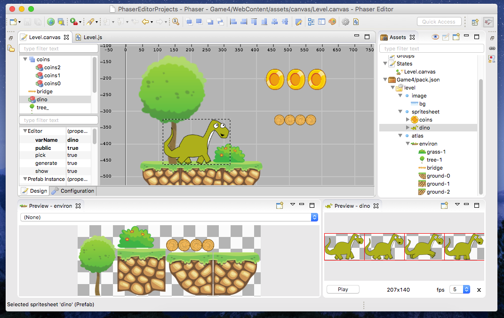

Play the demos
--------------

To play around with a Canvas demo you can create a project with the `Phaser Example Project wizard <first-steps.html#phaser-example-project-wizard>`_. There you can select any of the templates under the **Phaser Editor Demos** category.

States, sprites and groups
-------------------------- 

In this section, we are going to do a quick explanation of the difference and purpose of each type of Canvas: states, sprites, and groups.

The state scene
~~~~~~~~~~~~~~~

A Phaser game is divided by states, for example, the menu screen is coded in a state, a game level is coded in a state, the "game over" screen... What the user does is to write a special class that extends the ``Phaser.State`` type, and implement some special methods where the creation and logic of the game are coded. These methods are the ``preload``, ``create``, ``update`` and others.

This is an example of a state scene and the code compiled by Canvas:

A state with two coins...

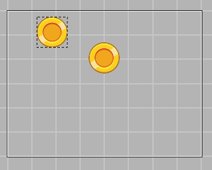

. . . is compiled into this code:

.. highlight:: javascript

.. code::

	// -- user code here --

	/* --- start generated code --- */

	// Generated by Phaser Editor v1.4.0 (Phaser v2.6.2)

	/**
	 * DemoState.
	 */
	function DemoState() {
		
		Phaser.State.call(this);
		
	}

	/** @type Phaser.State */
	var DemoState_proto = Object.create(Phaser.State.prototype);
	DemoState.prototype = DemoState_proto;
	DemoState.prototype.constructor = DemoState;

	DemoState.prototype.init = function () {
		
	};

	DemoState.prototype.preload = function () {
		
		this.load.pack('level', 'assets/pack.json');
		
	};

	DemoState.prototype.create = function () {
		this.add.sprite(119, 23, 'coins', 0);
		
		this.add.sprite(334, 129, 'coins', 0);
		
	};

	/* --- end generated code --- */
	// -- user code here --

To create a State scene click in the main menu the ``File → New → State File`` option, it opens the State File wizard. The first page of that wizard asks for the parent folder and the name of the scene. Usually, we create a ``WebContent/assets/canvas`` folder where to place all the scenes and prefabs, but you are free to use any folder inside the ``WebContent`` directory. In the next picture we use ``Level`` as the name of the scene, that will create a ``Level.canvas`` file. This is very important: the name of the file will be used to create the name of the state class.

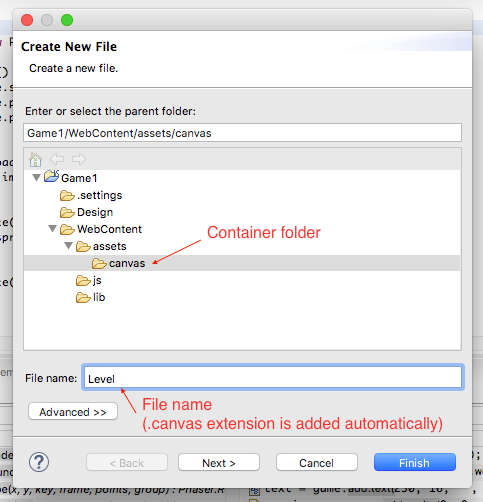

If you press **Finish** the state file is created with the default parameters, but we recommend that you press the **Next** button, to do some customization of the scene:

.. image:: images/SceneWizard_Settings.png
	:alt: State wizard settings page.

Many of the parameters shown in that page come from the Phaser API, however, there are other parameters like the **Base Class Name** or **Code Format** that are used by the scene-to-code compiler.

All these settings can be changed later in the configuration tab of the editor.

Sate scenes will be displayed in the `Assets <assets-manager.html#assets-explorer>`_ window under the **State** section.

The sprite scene (prefab)
~~~~~~~~~~~~~~~~~~~~~~~~~

The sprite scene or sprite prefab is a Canvas file with a unique object that compiles to a ``Phaser.Sprite`` sub-class. In the Phaser examples it is called as "custom sprite", in other tutorials and examples about Phaser it is called also "prefab". We like the word "prefab" since it is a concept used in other game visual tools, but the purpose is the same, to write reusable components that can be used in different parts of the game, without the need to duplicate code. For example, you can create a ``Coin`` prefab with the coin animations, so you can use that animated coin in any other scene. 

This is an example of how a sprite canvas file is compiled into a custom ``Phaser.Sprite``:

The coin scene (with a ``rotate`` animation) is compiled into a custom Sprite class:

.. image:: images/CoinPrefab.png
	:alt: Coin prefab.

.. code::

	// -- user code here --

	/* --- start generated code --- */
	
	// Generated by Phaser Editor v1.4.0 (Phaser v2.6.2)

	/**
	 * Coin.
	 * @param {Phaser.Game} aGame A reference to the currently running game.
	 * @param {Number} aX The x coordinate (in world space) to position the Sprite at.
	 * @param {Number} aY The y coordinate (in world space) to position the Sprite at.
	 * @param {any} aKey This is the image or texture used by the Sprite during rendering. It can be a string which is a reference to the Cache entry, or an instance of a RenderTexture or PIXI.Texture.
	 * @param {any} aFrame If this Sprite is using part of a sprite sheet or texture atlas you can specify the exact frame to use by giving a string or numeric index.
	 */
	function Coin(aGame, aX, aY, aKey, aFrame) {
		Phaser.Sprite.call(this, aGame, aX, aY, aKey || 'coins', aFrame == undefined || aFrame == null? 1 : aFrame);
		this.scale.setTo(0.5, 0.5);
		var _anim_rotate = this.animations.add('rotate', [0, 1, 2, 3, 4, 5], 5, true);
		
		// public fields
		
		this.fCoins = this;
		this.fAnim_rotate = _anim_rotate;
		
	}

	/** @type Phaser.Sprite */
	var Coin_proto = Object.create(Phaser.Sprite.prototype);
	Coin.prototype = Coin_proto;
	Coin.prototype.constructor = Coin;

	/* --- end generated code --- */
	// -- user code here --

To create a sprite prefab, in the main menu select the ``File → New → Sprite Prefab File`` option. It opens a wizard that on its first page asks for the container folder and the name of the file.

Press the **Next** button to set some needed parameters, the most important is the sprite type and texture:

.. image:: images/CreateSpritePrefab.png
	:alt: Sprite prefab wizard

In the current version of Canvas the sprites cannot have children, so a sprite prefab cannot have children either, it is a file with a single object.

The group scene (prefab)
~~~~~~~~~~~~~~~~~~~~~~~~

In Phaser, a group is an object with a different purpose. It can be used as a pool of objects or like a transformation list of objects. As well as the sprites, you can create "custom groups", or what we name group prefabs. These group prefabs can be added to other scenes so they are a way to write reusable components. For example, you can create a tree with fruits and use it in different levels.

This group prefab...

.. image:: images/GroupPrefab.png
	:alt: Group prefab.

. . . is compiled into this code:

.. code::

	// -- user code here --

	/* --- start generated code --- */
	
	// Generated by Phaser Editor v1.4.0 (Phaser v2.6.2)

	/**
	 * Tree.
	 * @param {Phaser.Game} aGame A reference to the currently running game.
	 * @param {Phaser.Group} aParent The parent Group (or other {@link DisplayObject}) that this group will be added to.
	    If undefined/unspecified the Group will be added to the {@link Phaser.Game#world Game World}; if null the Group will not be added to any parent.
	 * @param {string} aName A name for this group. Not used internally but useful for debugging.
	 * @param {boolean} aAddToStage If true this group will be added directly to the Game.Stage instead of Game.World.
	 * @param {boolean} aEnableBody If true all Sprites created with {@link #create} or {@link #createMulitple} will have a physics body created on them. Change the body type with {@link #physicsBodyType}.
	 * @param {number} aPhysicsBodyType The physics body type to use when physics bodies are automatically added. See {@link #physicsBodyType} for values.
	 */
	function Tree(aGame, aParent, aName, aAddToStage, aEnableBody, aPhysicsBodyType) {
		
		Phaser.Group.call(this, aGame, aParent, aName, aAddToStage, aEnableBody, aPhysicsBodyType);
		this.game.add.sprite(41, 6, 'objects', 'Tree_3', this);
		
		this.game.add.sprite(103, 87, 'objects', 'fruit', this);
		
		this.game.add.sprite(147, 34, 'objects', 'fruit', this);
		
		this.game.add.sprite(190, 91, 'objects', 'fruit', this);
		
		this.game.add.sprite(243, 47, 'objects', 'fruit', this);
		
		this.game.add.sprite(95, 221, 'objects', 'Bush (1)', this);
		
	}

	/** @type Phaser.Group */
	var Tree_proto = Object.create(Phaser.Group.prototype);
	Tree.prototype = Tree_proto;
	Tree.prototype.constructor = Tree;

	/* --- end generated code --- */
	// -- user code here --

To create a group prefab select in the main menu the ``File → New → Group Prefab File`` option. It opens a wizard that asks on the first page for the name of the file. You can press the **Finish** button to create the file or press **Next** to customize some options, like the base class name (other than ``Phaser.Group``) or the code format (JavaScript 5, JavaScript 6 or TypeScript).

Objects creation
----------------

In general, a Canvas scene is formed by a tree of objects (sprites) and a couple of configuration parameters. In this section, we are going to explain how to add the objects.

Related Phaser concepts
~~~~~~~~~~~~~~~~~~~~~~~

In Phaser the common syntax to create the sprites is like this:

.. code::
	
	game.add.sprite(10, 10, "enemy");

The ``game`` var is a reference to the global game instance, the first two arguments are the position of the sprite (``10, 10``) and the last argument is the asset key of a texture. The assets of the game are stored in a cache and identified by a key that is declared in the ``preload`` method, for example:

.. code::
	
	function preload() {
		game.load.image("enemy", "assets/monster.png");
	} 

Phaser Editor uses an `Asset manifest file (pack) <assets-manager.html>`_ that contains the declaration of the assets and the keys. Instead of writing the code to load each asset, you only need to load the asset pack file:

.. code::
	
		game.load.pack("level", "assets/pack.json");

That loading code is written in the ``preload`` method of the states, so if the state was compiled from a Canvas file then it is generated automatically.

By dropping an asset
~~~~~~~~~~~~~~~~~~~~~~~~~~~

The common way to create an object is by getting an asset from somewhere and dropping it into the scene. In the next sections, we explain the different sources of the assets.

From the Assets window
^^^^^^^^^^^^^^^^^^^^^^

In the `Assets <assets-manager.html#assets-explorer>`_ explorer you will find all the assets declared in the pack files. To create a common sprite you can drag a texture from that window and drop it into the scene:

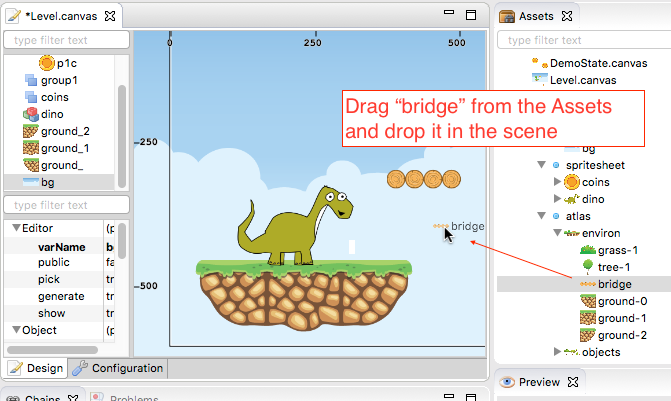

Note a texture could be represented by an image key, a sprite-sheet frame key or a texture atlas frame key.

The type of object created by dropping an asset in the scene depends on the type of the asset. If you drop a texture (image, atlas frame or spritesheet frame), it creates a simple sprite, a direct instance of ``Phaser.Sprite``. If you drop a bitmap font, a bitmap text (``Phaser.BitmapText``) object is created, and if you drop a tilemap asset, a ``Phaser.Tilemap`` object is created. There are different types of sprites (like tile sprites or buttons) that can be created with a texture, in the next sections, we explain how to create them.

From the Assets view, you can add prefabs too. Look for the **Sprites** and **Group** sections of that window. When the prefab is dropped into the scene then a prefab instance is created. This is how looks a code compiled from a State scene that contains prefab instances. Note the difference between to add a sprite from a texture (``bg``) and a sprite from a prefab (``Tree``):

.. code::

	Level.prototype.create = function () {
		this.add.sprite(0, 0, 'bg');
		
		var _tree = new Tree(this.game);
		_tree.position.setTo(39, 130);
	};

From the Preview window
^^^^^^^^^^^^^^^^^^^^^^^

The `Preview window <preview-window.html>`_ allows you to get a closer look at the assets. Like in the Assets window, you can drag an asset key from the Preview and drop it to the scene. For example, you can drop "cells" from a sprite-sheet of a retro game into the scene. This method could be easier than getting it from the Assets tree:

.. image:: images/AddObjectFromPreview.png
	:alt: Add object from the Preview window.

You can drag the objects from an image, a texture atlas or a sprite-sheet. In case of sprite-sheets, you can select many frames (hold the `Shift` key and move the mouse) and drop them into the scene: new objects will be created but keeping the original positions. This is useful to create tile-based scenes.

.. image:: images/DropSpritesheetFrames.gif
	:alt: Drop sprite-sheet frames

From the Palette
^^^^^^^^^^^^^^^^

The Palette is a docked window at the right of the scene and is used to keep at hand a selection of assets that you use often. You can add assets to the palette in the same way you add them to the scene. One time the assets are in the palette you can drag them from there and drop them into the scene. To show the palette you can click on the palette icon.

.. image:: images/AddAssetFromPalette.png
	:alt: Add the assets from the palette.

From the context menu
^^^^^^^^^^^^^^^^^^^^^

If you like to work without distracting windows around you can maximize the scene editor (``Ctrl+M``) so it gets all the application space. In this mode you have the option to add the objects by using the Add Sprite dialog, just right-click on the scene and select ``Sprite → Add... → Sprite``:

.. image:: images/AddSpriteMenu.png
	:alt: Context menu to open the Add Sprite dialog.

It shows a dialog with all the assets that can be used to create the sprite:

.. image:: images/AddSpriteDialog.png
	:alt: Add Sprite dialog.

As you can see in the previous menu, you can add another type of objects like buttons (``Phaser.Button``), tiles (``Phaser.TileSprite``) and prefabs. It does the same, to open a dialog with the assets or prefabs to be added but it creates an object of different type.

Selecting the container
^^^^^^^^^^^^^^^^^^^^^^^

It is a very common case when you want to add the new object to a specific group. To do this just select the group and then add the object to the scene. For example, if you want to add more blocks to the ``ground`` group, then select ``ground`` and then add the objects to the scene. If instead of a group you select a sprite and add a new object, this object will be added to the parent of the selected sprite. For example, if you select a ``block`` sprite and add a new object then it will be inserted into the block's parent group, in this case, the ``ground`` group.

Group creation
~~~~~~~~~~~~~~

You can create an empty group or a group with the selected objects as children:

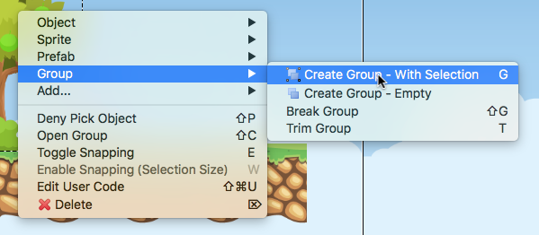

Note to create a group with the selected objects you can press the ``G`` key.

Other group operations are:

- Break group (``Shift+G``): it re-parents the children and destroys the group.
- Trim group (``T``): it removes the blank spaces around the children.

Object morphing
~~~~~~~~~~~~~~~

The common way to create an object is by adding an asset to the scene and it creates a regular sprite (``Phaser.Sprite``). If you want to create a different type of object (like a button or a tile) you have two options: the `From the context menu` option or the morphing option.

To morphing an object means to convert an object from one type to another type, for example, to morph a sprite into a button or into a tile sprite. When you morph an object into another type it keeps the same properties, like transformation, texture, body.

To morph an object right click on it and select one of the options displayed in the ``Sprite → Morph To...`` menu:

.. image:: images/MorphObjectTo.png
	:alt: Morph object to another type.

In addition, you can press the ``L`` key to morph the selected sprite to a tile sprite, and resize it. It is a handy shortcut for games based on fixed-size art. If the sprite is already a tile sprite it just show the handlers to resize it.

Text morphing
^^^^^^^^^^^^^

You can morph a Text or Bitmap Text object into other type of objects, but the must interesting is to morph between them. When you morph a Text object to a Bitmap Text object, or a Bitmap Text into a Text object, some properties remain the same, like the size, text and alignment. This helps to swap from a demo art assets to the final art assets.

A handy command is the ``Text → Select All Texts With The Same Font`` (available in the context menu), that allow to select all objects of the scene that shares the same font, then you can morph them into a different type of font:

Select all objects with the same font and run the Morph To BitmapText command:

.. image:: images/MorphToBitmapTextMenu.png
	:alt: Morph to bitmap text.

It opens a Bitmap Font selection dialog:

.. image:: images/SelectBitmapFontToMorph.png
	:alt: A dialog to select the bitmap font.

Then all texts are morphed to the selected font:

.. image:: images/MorphedText.png
	:alt: The text morphed into a bitmap text.

Dynamic object creation
~~~~~~~~~~~~~~~~~~~~~~~

Many genres of games create the levels dynamically or part of the levels. With Canvas you can design the sprite and group prefabs and then create instances of them dynamically.

Dynamic creation of sprite prefab objects
^^^^^^^^^^^^^^^^^^^^^^^^^^^^^^^^^^^^^^^^^

To create a sprite prefab dynamically follow this syntax:

.. code::

	var coin = new Coin(game, 10, 10);
	game.add.existing(coin);

Where ``game`` is a reference to the ``Phaser.Game`` instance and ``10, 10`` is the location of the object, and ``Coin`` is the name of a sprite prefab.

If you want to add the sprite to a group, then the syntax is:

.. code::

	var coin = new Coin(game, 10, 10);
	parentGroup.add(coin);

You can also create the sprite with a different texture:

.. code::
	
	var coin = new Coin(game, 10, 10, 'atlas', 'blue-coin');

Where ``'atlas'`` is the name of a texture loaded with the ``atlas`` key, and ``'blue-coin'`` is the name of a frame of the texture.

Dynamic creation of group prefab objects
^^^^^^^^^^^^^^^^^^^^^^^^^^^^^^^^^^^^^^^^^

Just like sprite prefabs you can create group prefabs like this:

.. code::
	
	var group = new SkyBackground(game);

Where ``game`` is an instance of the Phaser game and ``SkyBackground`` is a group prefab.

If you want to add the new group to a parent group then this is the syntax:

.. code::
	
	var group = new SkyBackground(game, parentGroup);

Scene navigation
----------------

For large scenes, it is very important to navigate the tree of objects and quickly find specific objects. In the next section, we show the tools provided by Phaser Editor for this purpose.

The Outline window
~~~~~~~~~~~~~~~~~~

In the top/left corner of the editor, there is the Outline window. It shows the hierarchy of the scene objects. There you can filter, select, delete, group and move the objects of the scene:

.. image:: images/CanvasOutline.png
	:alt: Outline window.

The Quick Outline window
~~~~~~~~~~~~~~~~~~~~~~~~

In addition, there is the Quick Outline window. It is opened by the user with the key sequence ``Ctrl+O``. The object selected by the user is focused on the scene, so it can be used as a search tool too.

This quick window is very useful when the scene left panel is hidden to gain in space.

.. image:: images/CanvasQuickOutline.png
	:alt: Quick outline window.

Object properties
-----------------

To edit the scene object properties there is the Properties Grid window. The Phaser objects contain a lot of properties, but in Canvas we just support a subset of them, especially those that have an impact on the visual aspects of the objects.

To edit the properties of an object follow these steps:

- Select the object -you cannot edit many objects at the same time- in the scene or in the Outline window.
- The object's properties are shown in the Property Grid.
- Click on the value of a property and change it. Then press ENTER to apply that change. In case of numeric properties, you can write a math expression like ``15*30``, then it is evaluated and the result is set to value.
- Some properties have special editors that open in a separated window.
- You always can undo the change by pressing ``Ctrl+Z``.

.. image:: images/PropertyGrid.png
	:alt: Edit the sprite properties.

As you can note, in the top of the grid there is a text field with a "type filter text" message, it helps to filter the list of properties and find the one of your interest.

As an alternative to the Property Grid, you can open the Quick Edit dialog (by pressing ``Q`` or clicking on the button of the toolbar). It is actually the same thing of the Property Grid but it is shown in a popup dialog.

A nice feature is that you can hover the mouse over a property and it displays the help of it. This help is the same of the Phaser API, actually, that help is taken from the Phaser metadata generated by Phaser Editor, by parsing the Phaser sources.

.. image:: images/PropertyGridHelp.png
	:alt: The help of a property in the grid.

When you change a property it is highlighted with a bold font, and generated in the code in this way:

.. code::

	var sprite = this.add.sprite(10, 20, "wall");
	sprite.tint = 0xfcfcfc; // modified property

Common object properties
~~~~~~~~~~~~~~~~~~~~~~~~

All the objects in the scene share a common set of properties:

================================= =======================================
Property                          Documentation
================================= =======================================
``name``                          A user defined name. This value isn't ever used internally by Phaser or Phaser Editor.
``x/y``                           The position of the Game Object on the x axis relative to the local coordinates of the parent.
``angle``                         The angle property is the rotation of the object in *degrees*.
``scale.x/y``                     The scale of the object. 
``pivot.x/y``                     The pivot point of this object that it rotates around.
``alpha``                         The alpha value of the object. 0 is transparent, 1 is fully opaque.
``fixedToCamera``                 If true the Game Object will appear to be 'fixed' to the camera, regardless of where in the game world the camera is viewing. Useful for backgrounds or UI elements in scrolling games.
``renderable``                    Whether this object is renderable or not. Often used in Phaser Editor to create hidden layers with physics bodies.
================================= =======================================

Transformation tools
^^^^^^^^^^^^^^^^^^^^

In addition, to set the values directly in the property grid you can change the transformation of an object by selecting it and executing one of the transformation commands. It shows little handlers that you can drag to transform the object. The commands can be executed from the context menu under the ``Transform`` menu, the scene toolbar or by pressing the key shortcuts: Scale (``S``), Angle (``N``), Anchor (``H``) and Pivot (``V``). 

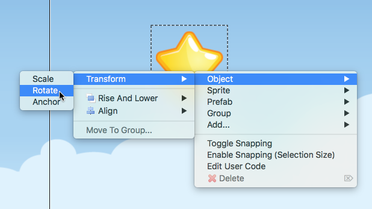

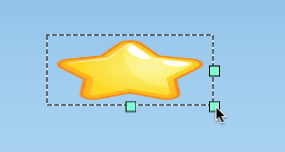

Prefab instance properties
~~~~~~~~~~~~~~~~~~~~~~~~~~~

By default the properties of a prefab instance cannot be changed, the ``position`` and ``override`` properties are the exception. The ``override`` property contains the list of properties that can be changed in that prefab instance. It means, that if you want to change the scale of a prefab instance then first step is to "open" or "unlock" the scale property by checking it on the ``override`` list. Note that when a property is not checked in the ``override`` list it is shown as disabled in the Property Grid and cannot be edited.

To reset the value of a property to the prefab's original value, just uncheck the property in the ``override`` list.

.. image:: images/OverridePrefabProperty.png
	:alt: Override a prefab instance property.

You can open this dialog by selecting the prefab instance and pressing the ``R`` key.

Sprite properties
~~~~~~~~~~~~~~~~~

The ``Phaser.Sprite`` is the common class for all the game objects based on textures. In this section, we show the properties supported by Phaser Editor and some dedicated property editors.

================================= =======================================
Property                          Documentation
================================= =======================================
``anchor.x/y``                    The anchor sets the origin point of the texture. The default is 0,0 this means the texture's origin is the top left Setting than anchor to 0.5,0.5 means the textures origin is centered Setting the anchor to 1,1 would mean the textures origin points will be the bottom right corner.
``tint``                          The tint applied to the sprite. This is a hex value. A value of 0xFFFFFF (white) will remove any tint effect. To edit this value the editor shows the native color dialog. You can press ``DEL`` to reset the value.
``animations``                    A list of animations. This property is explained in the `Animations`_ section.
``data``                          An empty object where the user can add custom properties. See the `User data`_ section.
``frameName``                     This property is shown only for sprites with a texture based on a texture atlas frame. When the user edits this property it shows a dialog with all the frames of the atlas. Read more in the `Texture`_ section.
``frame``                         This property is shown only for sprites with a texture based on a sprite-sheet frame index. When the user edits this property it shows a dialog with all the frames of the sprite-sheet. Read more in the `Texture`_ section.
================================= =======================================

Arcade Physics
^^^^^^^^^^^^^^

For now, the scene editor only supports Arcade physics. It does not mean that you cannot add another type of physics to your game, else that you should set the other physics bodies by hand, without any special tool.

To enable Arcade physics on a sprite you have two options:

- Set ``true`` the ``physicsGroup`` property of the parent group of the sprite. Physics bodies are automatically enabled in objects added to a physics group.
- Select the object and open the context menu, in the ``Sprite → Arcade`` menu there are two commands: ``Set Arcade Body - Rectangular`` and ``Set Arcade Body - Circular``, both commands enable a physics body (rectangular or circular) in the selected object. 

.. image:: images/SpriteArcadeMenu.png
	:alt: Set Arcade physics body to sprite.

When you add a body to a sprite, a new section ``Arcade`` is added to the Property Grid. This section contains many properties related to the Arcade physics body of the sprite and can be edited. In addition, you can visually edit the size and offset of the body, just right click on the sprite and select ``Sprite → Arcade → Edit Body`` or press the ``B`` key.

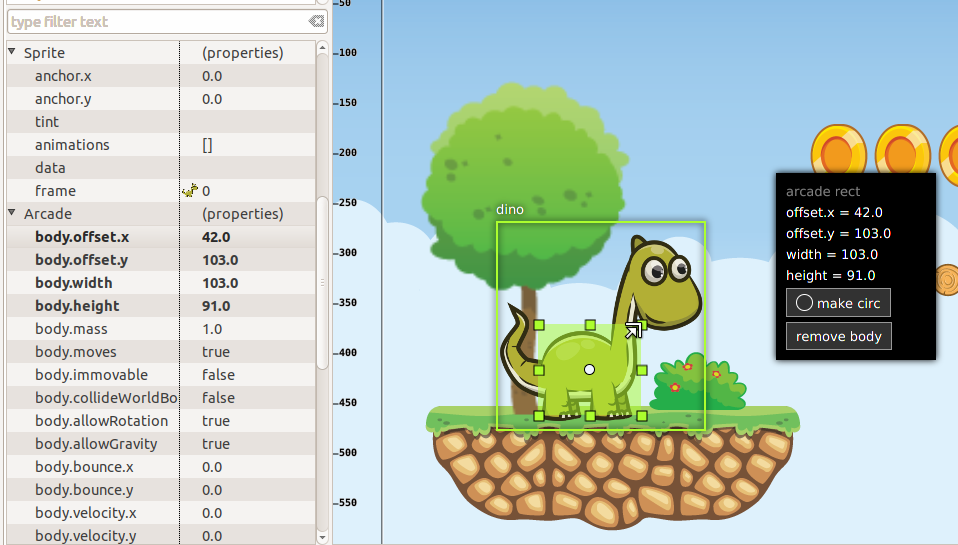

Animations
^^^^^^^^^^

The ``animations`` property is a reference to the ``Phaser.AnimationManager`` of the sprite. This manager contains a list of sprite animations and provides methods to manipulate the animations like ``add``, ``play``, ``stop`` and others.

To add animations to a sprite select it and press the ``A`` key, or go to the `animations` property in the properties grid and click on the dialog button.

.. image:: images/AnimationsDialog.png
	:alt: The animations dialog.

As you can see in the dialog you can add/remove animation, add/remove frames to an animation sequence, edit each animation properties and play an animation. The animations properties you can edit are:

================================= =======================================
Property                          Documentation
================================= =======================================
``Frame Rate``                    The animation speed in frames per second.
``Loop``                          To repeat the animation.
``Kill On Complete``              If checked the animation will be played once and then destroyed.
``Auto Play``                     If checked the animation will be played just after it is created. Only one animation can be auto-played.
``Public``                        If checked a field will be generated to reference this animation. Useful if you want to publish animations of prefabs.
================================= =======================================

The animations are compiled into code in this way:

.. code::

	var _dino = this.add.sprite(10, 10, 'dino', 1);
	var _dino_walk = _dino.animations.add('walk', [0, 1], 5, true);
	_dino_walk.play(); // the "walk" animation was set to Auto Play
	_dino.animations.add('jump', [2], 5, false);
	_dino.animations.add('stay', [3], 5, false);

If the animation ``jump`` was set to Public then a field ``fDino_jump`` will be generated:

.. code-block:: javascript
	:emphasize-lines: 6,6

	var _dino_jump = _dino.animations.add('jump', [2], 5, false);
	_dino.animations.add('stay', [3], 5, false);
	
	// public fields
	
	this.fDino_jump = _dino_jump;

User data
^^^^^^^^^

The ``data`` property of the sprites is a reference to an empty object where the user can put any attribute. Often this data is used to create small variations between the sprites without the need to create new sprite types (or prefabs). In Phaser Editor you can set the JSON value of that property. When the user clicks it to edit it opens a dialog with a text editor where you can write the JSON values:

.. image:: images/DataDialog.png
	:alt: The dialog to edit the data content.

For example, if you have some enemies in a level that walk from one side to other, you can set in the ``data`` property the ``velocity`` and the ``left`` and ``right`` borders of the enemy walk. Each enemy will get a different movement range. In the ``update`` method of the level, you can read that information for each enemy and update its position.

Texture
^^^^^^^

Canvas support three different type of textures: image, sprite-sheet frame and atlas frame. If the sprite is based on atlas or sprite-sheet, the user can change the frame by editing the ``frameName`` or ``frame`` property. In addition, there is a ``Change Texture`` command that allows the user to replace the texture with any other texture type. This command is available in the context menu ``Sprite → Change Sprite Texture`` or can be executed by pressing ``Ctrl+T``. It opens a dialog with all the textures declared in the asset pack. This command allows selecting more than one sprite so you can change the texture of all of them.

.. image:: images/ChangeTextureDialog.png
	:alt: A dialog to change the texture of the selected sprites.

Another nice command is ``Sprite → Select All Sprites With Same Texture``, it selects all the sprites in the same scene with the same texture of the selection. It helps to replace demo textures by final textures.

In addition, Phaser Editor provides texture refactoring, it is a process that allows changing the texture of all the sprites of all the scenes. You can read more about it the `Global replace texture <assets-manager.html#global-replace-texture>`_ section.

Button properties
~~~~~~~~~~~~~~~~~

The button object (``Phaser.Button``) inherits all the properties from the sprite and adds the following:

================================= =======================================
Property                          Documentation
================================= =======================================
``callback``                      The function to call when the button is pressed.
``callbackContext``               The context which the callback will be called (``this`` by default).
``overFrame``                     The ``frame``/``frameName`` when the button is in the Over state.
``outFrame``                      The ``frame``/``frameName`` when the button is in the Out state.
``downFrame``                     The ``frame``/``frameName`` when the button is in the Down state.
``upFrame``                       The ``frame``/``frameName`` when the button is in the Up state.
================================= =======================================

When the user clicks to edit any of the ``(over/out/down/up)Frame`` parameters it shows a dialog to select the new frame, from the list of frames of the same texture, atlas or sprite-sheet.

TileSprite properties
~~~~~~~~~~~~~~~~~~~~~

These are the tile (``Phaser.TileSprite``) properties supported by Canvas:

========================== ======================================================
Property                   Documentation
========================== ======================================================
``tilePosition.x/y``       The offset position of the image that is being tiled.
``width``                  The width of the tiling sprite.
``height``                 The height of the tiling sprite.
``tileScale.x/y``          The scaling of the image that is being tiled.
========================== ======================================================

You can convert any sprite on a tile sprite by selecting it and press ``L``. This command also can be used to resize the tile. It is very helpful in games with a lot of tiles. In combination with tiles you can set the scene snapping, to create scenes based on fixed-size textures.

.. image:: images/ResizeTile.png
	:alt: Resizing a tile.

Text properties
~~~~~~~~~~~~~~~

These are the Text (``Phaser.Text``) properties supported by Canvas:

========================== ======================================================
Property                   Documentation
========================== ======================================================
``text``                   The text content (change it by pressing ``Ctrl+T``).
``style.font``             The name of the font.
``style.fontSize``         The font size in pixels.
``style.fontWeight``       ``BOLD`` or ``NORMAL``.
``style.fontStyle``        ``REGLURA`` or ``ITALIC``.
``style.fill``             The text stroke color.
``style.strokeThickness``  The text stroke width.
``style.backgroundColor``  The background color of the text.
``style.align``            The text horizontal align (``LEFT``, ``CENTER`` and ``RIGHT``)           
========================== ======================================================

Phaser Editor uses JavaFX to render the scenes but Phaser uses the browser for the same purpose. This means that in some cases the text object is not rendered in design-time like Phaser renders it at run-time.

Note that Phaser Editor can use the fonts installed in the OS, but the majority of them are not available in all platforms, so we recommend to use safe fonts or load the font files in the CSS of your game.

Bitmap Text properties
~~~~~~~~~~~~~~~~~~~~~~

The ``Phaser.BitmapText`` properties supported by Canvas:

========================== ======================================================
Property                   Documentation
========================== ======================================================
``font``                   The key of the BitmapFont asset.
``text``                   The text to be displayed by this BitmapText object. Can be changed by pressing the ``X`` key.
``fontSize``               The font size in pixels.
``maxWidth``               The maximum width of this BitmapText in pixels.
``align``                  Alignment for multi-line text (``'left'``, ``'center'`` or ``'right'``), does not affect single lines of text.
========================== ======================================================

Text and Bitmap Text common commands
~~~~~~~~~~~~~~~~~~~~~~~~~~~~~~~~~~~~

The Text and BitmapText objects contain similar properties that can be changed with the same command (or toolbar button).

.. image:: images/FontToolbar.png
	:alt: Common commands to Text and BitmapFont.

============================================ ===========================
Command                                      Description
============================================ ===========================
``1`` Change text                            Opens a text dialog.
``2`` Change font                            If a Text object is selected, it opens a system Font dialog. If a Bitmap Text object is selected, it opens a dialog to select a Bitmap Font asset.
``3`` Font size up                           Increment the font size.
``4`` Font size down                         Decrement the font size.
``5`` Align left                             Align text to left.
``6`` Align center                           Align text to center.
``7`` Align right                            Align text to right.
============================================ ===========================

Group properties
~~~~~~~~~~~~~~~~

Many times, groups are used as proxy to apply properties or operations to all the children. Here we show the properties supported by the scene editor:

========================== ======================================================
Property                   Documentation
========================== ======================================================
``physicsGroup``           Set to ``true`` if you want to create this group as a Physics Group. A Physics Group is the same as an ordinary Group except that is has enableBody turned on by default, so any Sprites it creates are automatically given a physics body.
``physicsBodyType``        If ``physicsGroup`` is ``true`` this is the type of physics body that is created on new Sprites.
``physicsSortDirection``   If this Group contains Arcade Physics Sprites you can set a custom sort direction via this property. 
``setAll``                 A list of key/value pairs to generate a call to the ``setAll`` method.
========================== ======================================================

Physics groups
^^^^^^^^^^^^^^

Physics groups are created with a different syntax:

.. code::

	var _ground = this.add.physicsGroup(Phaser.Physics.ARCADE);
	_ground.physicsSortDirection = Phaser.Physics.Arcade.LEFT_RIGHT;

And as mentioned in the previous section, the goal of this kind of groups is to automatically enable physics bodies on the children.

The ``setAll`` property
^^^^^^^^^^^^^^^^^^^^^^^

The ``setAll`` method is often used on the creation of scenes to initialize some values of the children objects. For example, if you are creating a platformer game you can group all the ground sprites on a group and set all the children to ``body.immovable = true`` in this way:

.. code::
	
	groundSprites.setAll("body.immovable", true);

Now you don’t need to write it, you can click on the ``groundSprites`` group and edit the ``setAll`` property.

The ``setAll`` property editor is very simple, it is a dialog with a key/value table. For each row of the table, a new ``setAll`` method call will be generated, the first column will be generated as the property name and the second column as the property value. Note that the name is generated inside a string expression ``"..."`` but the value of the property is generated verbatim, so you can write any expression there, a string literal, a number, a boolean, a function call, the name of a variable, whatever you want.

.. image:: images/GroupSetAll.png
	:alt: SetAll property dialog.

Design-time object properties
~~~~~~~~~~~~~~~~~~~~~~~~~~~~~

There are special properties that are not directly related to any Phaser API, else these are parameters provided to customize some editor's behaviors like code generation of objects manipulation. These properties are under the "Editor" section of the Property Grid and we are explain them here:

========================== ======================================================
Parameter                  Documentation
========================== ======================================================
``varName``                Used as var name in the generated code and label in the Outline window. Do not confuse it with the **name** parameter, which is part of the Phaser API.
``public``                 To make public an object in the generated code. By default the objects variables are declared is local in the creation method, however public objects will be referenced by instance fields, so they are accessible from any other context.
``pick``                   If set to ``false`` then it cannot be selected in the scene.
``generate``               Set to ``false`` if you need to keep the object in the scene but exclude it from the generated code.
``show``                    Set to ``false`` if you want to hide the object in the scene, but it will be included in the code generation. Useful when you want to temporarily hide distracting elements from the scene, like background objects.
``closed``                 It only applies to groups. If set to ``true``, the group and the children are going to perform like a single object in operations like selection and dragging. It means, if you pick a child, the group is selected. Yet you can select the children in the Outline window.
========================== ======================================================

Scene configuration
-------------------

As you can note the scene editor has two tabs: Design and Configuration. The Design tab contains everything about the objects and the Configuration tab contains other parameters not related to any object in particular else with the scene.

The Configuration tab is split in two panels, the left panel shows a list of sections and the right panel a grid of properties of the selected section.

The configuration of sprites and group scenes are the same, it contains only an Editor section with design/code-generation specific parameters. The state scene contains the Editor section in addition to a State section with ``Phaser.State`` related parameters.

The Editor section
~~~~~~~~~~~~~~~~~~

This section contains a couple of parameters that are not related to any Phaser API else they are related to code generation or design functionalities:

========================== ======================================================
Parameter                  Documentation
========================== ======================================================
**Scene**
``width``                  The width of the scene.
``height``                 The height of the scene.
``backgroundColor``        The background color.
``gridColor``              The grid color
``showGrid``               Show the grid lines.
**Snapping**
``enable``                 The snapping make it easy to place objects in a grid.
                           You can toggle this parameter with the ``E`` key.
                           The ``W`` key enable the snapping and set the 
                           ``stepWidth`` and ``stepHeight`` with the size of 
                           the selected object
``stepWidth``	           The X step. Press ``W`` to set this with the width
                           of the selected object.
``stepHeight``             The Y step. Press ``W`` to set this with the height
                           of the selected object.
**Source**
``className``              The name of the generated class. It does not change
                           the name of the file.
``baseClass``              The name of the extended class, for example a custom ``MySprite`` class that extends ``Phaser.Sprite``.
``userCode``               A series of chunk of codes that the user can insert into the generated code. In the `User code`_ section we explain this in details.
``lang``                   The language or format of the code: JavaScript 5, JavaScript 6 or TypeScript.
``generateOnSave``         By setting it to ``false`` it disable the automatic code generation.
========================== ======================================================

State scene configuration
~~~~~~~~~~~~~~~~~~~~~~~~~

The configuration of sprite and group scenes are pretty the same, it only contains an Editor section. However the state scene has a State section with some paremeters related to the ``Phaser.State`` API. At the moment this section only contains a few parameters but the ideal is to have a bigger set of parameters so it makes easy to the user to configure a state. Let's see the list of parameters supported rigth now:

============================= ======================================================
**Scale**                     A section dedicated to the ``Phaser.ScaleManager`` API (``game.scale``).
``scaleMode``                 The scaling method used by the ScaleManager when not in fullscreen.
``pageAlignHorizontally``     When enabled the Display canvas will be horizontally-aligned in the Parent container.
``pageAlignVertically``       When enabled the Display canvas will be vertically-aligned in the Parent container.
**Physics**                   A section dedicated to the ``Phaser.Physics`` API (``game.physics``).
``startSystem``			      To start one of the selected physics engines (P2JS, NINJA, BOX2D, ARCADE).
**Stage**                     A section dedicated to the ``Phaser.Stage`` API (``game.stage``)
``backgroundColor``           Gets and sets the background color of the stage. Note that it does not change the color of the scene in design-time.
**Preload**                   A section related to the Phaser loader API.
``pack``                      Like in ``Phaser.Loader.pack()`` this parameter accepts a list of sections of the pack files of the project. When you drop an asset to the scene it loads its pack section automatically, however it is possible that you create other sections with other kind of assets so in this parameter you can declare them to be loaded.
``isPreloader``               Set to ``true`` if you like to use this state as a preloader state. More is explained in the `Preloader state configuration`_ section.
``preloadSprite``             This parameter is shown onny if the ``isPreloader`` parameter is ``true``. When you edit this parameter it shows a dialog to select one of the scene sprites. This sprite will be used as the preload sprite as is explained in the ``Phaser.Loader.setPreloadSprite()`` method: Set a Sprite to be a "preload" sprite by passing it to this method. A "preload" sprite will have its width or height crop adjusted based on the percentage of the loader in real-time. This allows you to easily make loading bars for games. The sprite will automatically be made visible when calling this. 
``preloadSprite.direction``   The direction parameter of the ``Phaser.Loader.setPreloadSprite()`` method. It should be ``HORIZONTAL`` or ``VERTICAL``.
``autoLoad``                  Set to ``false`` if you want to disable the automatic loading of assets. This is very useful when you have a Preloader state where all the assets are loaded, so the rest of states do not need to load them. If you like to load a particular asset then set it on the ``pack`` property. Note that when the ``isPreloader`` property is set to ``true`` the ``autoLoad`` should be ``false``, because all the sections to load are set manually.
============================= ======================================================

Preloader state configuration
~~~~~~~~~~~~~~~~~~~~~~~~~~~~~

Often games load and process all the assets on a loading screen. In Phaser, this loading screen is coded in a preloader state.
A preloader state is just like any other Phaser state, but the sprites are created in the ``preload`` method (instead of the ``create`` method) and the ``game.load.setPreloadSprite()`` method is used to set the sprite to be used as progress bar.

The Phaser Project wizard of the editor provides a few project layout options, one of them is the **Multiple states with preloader (for larger games)**. We recommend using that layout if you like to add a loading screen to your game. If you want to see a demo just select the **Include demo assets** parameter, it will create a project with a loading screen with a dino progress bar:

.. image:: images/CreatePreloaderDemoProject.png
	:alt: Create a project with a preloader state.

The created project contains a ``Preloader.canvas`` file with the preload sprite (the dino kid):

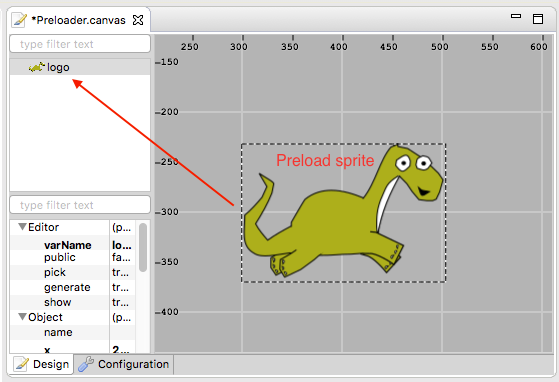

In the Configuration tab, in the State section, you can see the ``isPreloader`` is set to ``true`` and the ``preloadSprite`` is set to ``logo``:

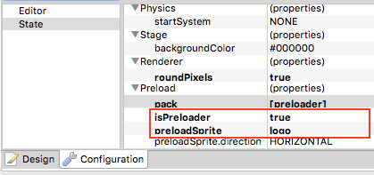

When you run the project you will see how the dino is cropped from left to right as a progress of the loading. We recommend to test it on Chrome and enable the ``Network → Throttling`` parameter because serving from localhost is too fast to see the progress.

As we commented before, a key difference between a preloader state and a common state is that the sprites are created in the ``preload`` method. Why? Because the ``create`` is called only when all the assets are loaded, but what we need is to show the progress of the assets loading. Usually what is coded in the ``create`` method is code to start the next state of the game. So the code of the ``Preloader.js`` state of the previous project looks like this:

.. code-block:: javascript
	:emphasize-lines: 35,36,37

	// -- user code here --

	/* --- start generated code --- */

	// Generated by Phaser Editor v1.4.0 (Phaser v2.6.2)

	/**
	 * Preloader.
	 */
	function Preloader() {
		
		Phaser.State.call(this);
		
	}

	/** @type Phaser.State */
	var Preloader_proto = Object.create(Phaser.State.prototype);
	Preloader.prototype = Preloader_proto;
	Preloader.prototype.constructor = Preloader;

	Preloader.prototype.init = function () {
		
		this.scale.scaleMode = Phaser.ScaleManager.SHOW_ALL;
		this.scale.pageAlignHorizontally = true;
		this.scale.pageAlignVertically = true;
		
	};

	Preloader.prototype.preload = function () {
		
		this.load.pack('preloader', 'assets/pack.json');
		
		
		var _logo = this.add.sprite(299, 231, 'logo');
		
		this.load.setPreloadSprite(_logo, 0);
		
	};

	Preloader.prototype.create = function () {
		
		this.nextState();
		
		
	};

	/* --- end generated code --- */
	// -- user code here --

User code
---------

Usually, tools like Canvas provide a dedicated runtime to load the scenes in the Phaser games, however, that practice is not in the Phaser Editor's philosophy of support plain Phaser, so we decided to use a compiler technique. This means that the scenes files are compiled into plain Phaser code, that can be integrated into the game as any other code written by the user.

The scenes are compiled into Sprite, Group and State classes, however, there are many aspects of the game that are out of the scope of the tool, like for example the logic of the game is something that you have to write yourself. In this section, we explain how you can insert your own code into the files generated by the editor.

There are two main ways to insert your code: (1) by writing it directly in certain parts of the file or (2) by writing it in the ``userCode`` parameter of the scene configuration.

Writing into the code file
~~~~~~~~~~~~~~~~~~~~~~~~~~~~

You are always allowed to write in any part of the generated file, but if you do not follow certain rules that code could be overwritten (lost) in the next compilation. There are very well defined sections of the file where you can write your code and it is preserved from compilation to compilation.

- As general rule just write your code in sections where it says ``// -- user code here --``.
- All the files have a ``/* --- start generated code --- */`` line at the beginning of the file, you can write your code before that.
- All the files have a ``/* --- end generated code --- */`` line at the end of the file, you can write your code after that.
- In JavaScript 6 and TypeScript generated files you can write your code between the comments:
	
	- ``/* sprite-methods-begin */`` and ``/* sprite-methods-end */``
	- ``/* group-methods-begin */`` and ``/* group-methods-end */``
	- ``/* state-methods-begin */`` and ``/* state-methods-end */``

These sections are created in places that allow the user to add more elements to the classes, like methods or fields.

Writing into the configuration
~~~~~~~~~~~~~~~~~~~~~~~~~~~~~~~

The other way to insert user code into the generated file is to write it in the configuration of the scene (look at the Configuration tab the Editor section). The compiler reads the content of the ``userCode`` parameter and writes it into the file. In this case, there is no risk to lost the code because it is saved in the Canvas file.

The ``userCode`` parameter is divided into sections that refer to different points of the generated code. The idea is to insert code into the generated methods, ``before`` and ``after`` the method's body. For example you can add code after the body of the method ``create`` to perform other initialization routines, like create tween objects or audio objects or set other parameters to the current objects.

When you click to edit the ``userCode`` parameter it opens a dialog with a tab for method, and each tab has two text boxes, one to write the ``before`` code and other to write the ``after`` code. For example, a state scene ``userCode`` has a tab for Constructor, Init, Preload and Create. All these tabs denote a method generated by the editor, so you can write your own code there.  

For example, let's see a case of user code inserted in a state scene via configuration:

.. image:: images/UserCodeDialog.png
	:alt: User code dialog.

The code set there is inserted in the ``create`` method of the compiled code:

.. code-block:: javascript
	:emphasize-lines: 3,12

	Level.prototype.create = function () {
		
		this.beforeCreate();
		
		this.add.sprite(-175, -85, 'bg');
		
		var _tree_ = this.add.sprite(10, 127, 'environ', 'tree-1');
		_tree_.scale.setTo(2.0687500039674838, 2.072000037051153);
		
		this.add.sprite(453, 306, 'environ', 'bridge');
		
		this.addKeyboardShortcuts();
		
	};

We recommend writing just a few lines of code via the ``userCode`` configuration, especially because that dialog does not provide advanced features like code completion. In our demos and games what we do is to write a call to a method that was defined at the end of the file, in a protected zone, using the method explained in the `Writing into the code file`_ section.

You can open the user code dialog directly from the scene, press ``Ctrl+Shift+U`` or right click and select the ``Edit User Code`` menu option.

Public objects
~~~~~~~~~~~~~~

In the `Object properties`_ section we mentioned the ``public`` property of an object. It is a `design time property <#design-time-object-properties>`_ used to publish the objects beyond its context. To publish objects is needed to access particular objects outside the ``create`` method. The concept is simple, for each public object is created an instance field that references it. These public fields follow the format ``f<ObjectName>``, for example, if the object ``star`` is marked as public a field ``fStar`` is generated:

.. code-block:: javascript
	:emphasize-lines: 6,13

	Level.prototype.create = function() {
		var _star = this.add.sprite(67, 197, 'environ', 'star');

		// public fields

		this.fStar = _star;

	};

	/* --- end generated code --- */

	Level.prototype.update = function() {
		this.fStar.angle += 5;
	};

Objects alignment and depth order
---------------------------------

Position commands are always a powerful resource to build the layout of scenes. In Canvas we support some basic commands for alignment (left, right, top, bottom, center, and middle) and for depth order (rise, rise to top, lower and lower to bottom).

Alignment
~~~~~~~~-

The alignment commands are available in the context menu and the Canvas toolbar:

.. image:: images/AlignObjects.png
	:alt: Align objects.

The alignment commands are related to the parent group of the target object. If the sprite "head" belongs to the group "dino", and we select the "left" alignment, then the local X position of "dino" will be set to ``0``, it means, that it will be at the left border of the group. Note that objects with no parent are set to belong to the global scene group.

Depth order
~~~~~~~~~~~

Pretty similar to alignment commands there are the order commands. To apply them first you select the target objects and click on the corresponding toolbar button or context menu option.

The "order" commands send an object back and forward, in the display list of its group.

*NOTE: In Phaser, there are some alignment constants and methods, but they are more (we think) about to align an object at runtime. It is a great resource for those who set the game layout "by hand". We are exploring this new features and in future versions of Canvas we can take advantage of it or reuse some concepts, like align in a grid.*

Common editing operations
-------------------------

Canvas support common editing operations like:

* Cut, Copy and Paste of the objects.
* Undo, Redo of all major operations on nodes.
* Zoom in/out/restore. Scroll the wheel of the mouse to zoom in/out, and the Zoom 1:1 button in the toolbar.
* Pan the scene, by holding the middle mouse button and dragging in any direction.
* Object selection, by clicking it or dragging the mouse and create a selection box.
* Object moving, first you select the objects and then you drag them.

Removing distractions
---------------------

The default layout in Phaser Editor is a bit charged, it opens the Project Explorer, Chains view, Problems view, Preview view and Assets view, in addition to the editor area. However, Eclipse (the platform behind Phaser Editor) has a very customizable and flexible layout. You can minimize windows and open them with a quick look, or dock the windows (the right term for them is "views") in the screen corners or stack them. We encourage you to read the Workbench User Guide bundled in Phaser Editor.

Drag the windows to a corner or fold it with other windows:

.. image:: images/DockedWindows.png
	:alt: Docked windows.

A window (like the scene editor) can be detached from the main application by dragging it away from the main window:

.. image:: images/DetachedWindow.png
	:alt: Stand-alone scene editor.

Double click in the scene editor tab (or press ``Ctrl+M``), it maximizes the editor window and minimizes all the other windows around. You will get all the space for the scene editor but at the same time you can do a quick look (by clicking on its icon) to the minimized windows (like the Assets or Preview windows):

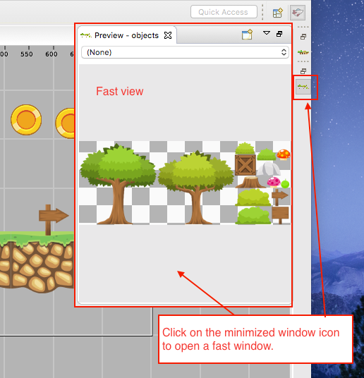

Other elements you can remove are the property grid and the outline windows that are inside the scene editor. To do this just click on the "side panel" icon of the toolbar:

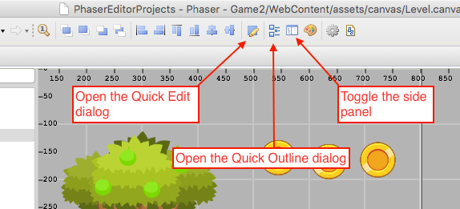

Really you don't need these panels all the time open, you always can edit the properties of an object by pressing ``Q``, it opens a quick edit dialog with  the property grid inside:

.. image:: images/QuickEditDialog.png
	:alt: Edit the object in place.

To navigate the scene you can open the Quick Outline window by pressing ``Ctrl+O``:

.. image:: images/QuickOutlineWindow.png
	:alt: Quick navigate the scene.

To quickly add objects to the scene you can use the fast view to the minimized windows but also you can use the Palette, that is a small panel where you can collect the assets to be used in the scene. In the section `from the palette`_ it is explained in details.
