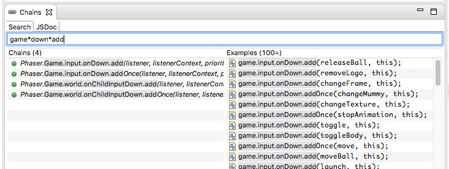

Chains: Search on the Phaser Docs
=================================

Phaser Chains is a tool we did to search the Phaser docs. It has an [original online version][1] and was integrated in some editors like Brackets, IntelliJ, Eclipse and the `Phaser website <http://phaser.io/learn/chains>`_.

In Phaser Editor we support a native and well integrated version of Chains. When you open Phaser Editor, by default it shows the Chains view in the bottom panel. It is the main source you have to access the Phaser documentation.

However Chains is used by hundred of developers is possible some methods or properties are not listed there, it happens because to build the chains we parse the Phaser jsdocs and this is not always 100% accurate, so if you see there is a method or property is missing in Chains we recommend to checkout the official Phaser Documentation.

Search for chains
-----------------

The main difference of this tool with a common documentation view is that you search for a method chain like:

.. code-block:: text

	game.add.

As you can see the Phaser API makes an extensive use of method/properties chains like ``game.load.image()`` or ``sprite.animations.add``. So the Chains idea is that you type the chain you are interested to investigate and then it shows all the matching chains of the Phaser API.

.. image:: images/ChainsSearchAPI.png
	:alt: Query the Phaser API.

In the screenshot you can see in the left panel it shows the matching chains. If you click it then it opens the documentation of the last element of the chain. This documentation is shown in the JSDoc tab that is next to the Search tab:

.. image:: images/ChainsJSDocTab.png
	:alt: The documentation of a method.

In addition to the JSDoc you can see the source code of a chain. Just right click on a chain and select ``Show Source Code``. It opens an editor with the source code of the chain.

Search examples
---------------

An important source to learn the Phaser stuff is browsing the examples are published in the Phaser website and included in the Phaser download. These examples are small but complete snippets of code that demonstrate and explain a particular question of Phaser.

In Phaser Editor we provide these examples as project templates so you can study Phaser creating an example project. However, it is very useful to have the examples also available in Chains, they are a perfect complement for the  documentation. So when you search for a chain, in the right panel of Chains it shows the matching lines in the different examples. In this way you can discover how that API is used in Phaser.

To see the complete example, as we said, you can create a project based in a particular example, but also in Chains you can click the row of the example and it opens the complete example's file.

The drawback of an example opened from the Chains is that you cannot run it, but the advantage is that you get a quick view of it.

Using wildcards
---------------

A powerful feature of Chains is that you can search using wildcards ``*``. This allow to you to find chains that you are not sure how they are writing but you remember some parts of it. For example, if in your game you need to listen for an input down event you can write a search pattern like this:

.. code-block:: text
	
	game*down*add

It matches with:

If you want to know what classes are extending the ``Phaser.Sprite`` class then you can search for:

.. code-block:: text

	extends*Sprite

.. image:: images/ChainsExtends.png
	:alt: Chains: matches Sprite inheritance.

	