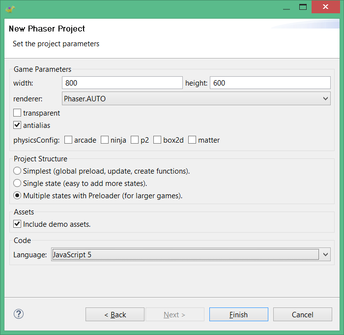
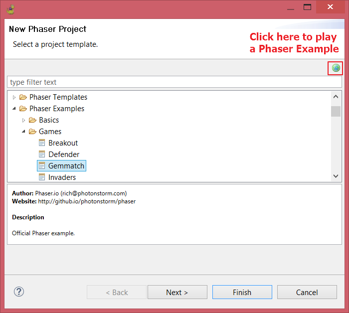

First Steps
===========

This is a small guide you can follow to start writing your games and perform common tasks related to the editor's features.

Download and install
--------------------

`Download the Phaser Editor ZIP file <http://phasereditor.boniatillo.com/blog/downloads>`_ of your OS (win64, linux64 or macosx) and uncompress it.

Notes for Windows users 
~~~~~~~~~~~~~~~~~~~~~~~

To execute the editor just double click on the ``PhaserEditor.exe`` file.

Notes for MacOS users
~~~~~~~~~~~~~~~~~~~~~

To execute the editor double click on the ``Phaser Editor`` application. It is a simple ``.app`` folder. By default the projects will be created in the ``~/Library/PhaserEditorProjects`` folder.

Notes for Linux users
~~~~~~~~~~~~~~~~~~~~~

Before to run the editor you should set execution permission to some programs bundled in Phaser Editor. To do this, run the ``SetExecPermissions.sh`` script:

.. code-block:: bash

  $ cd "Phaser Editor"
  $ chmod +x SetExecPermissions.sh
  $ ./SetExecPermissions.sh

Then run the editor as any other Linux program:

.. code-block:: bash

    $ ./PhaserEditor

Phaser Editor was tested on Ubuntu 14.04 Gnome.

Some users are getting issues at the editor startup. Please `check this issue to get a workaround <https://github.com/boniatillo-com/PhaserEditor/issues/10>`_. Basically, the idea is to run the editor in this way: 

.. code-block:: bash

  $ ./PhaserEditor -persistState false -clearPersistedState

The first run
-------------

The first time you run Phaser Editor a Workspace Launcher dialog is open. In this dialog you have to set the path to the folder where you want to create the workspace.

A workspace is the container folder of your projects. All your projects will be created inside the workspace, but also, in the workspace are saved your preferences and UI state. This means, that if you start Phaser Editor and select a workspace, the editor will get the preferences saved there.

A project is a folder where you add the code of your game. So you can create many projects in the same workspace.

.. image:: images/WorkspaceLauncher.png

Update
------

By default when the editor opens it checks for available updates. We recommend you to install them, important bug fixes are provided this way.

`Learn more about the update process <update.html>`_

Create a project
----------------

In Phaser Editor there are two ways of creating a Phaser project: by using the **Phaser Project** wizard or the **Phaser Example Project** wizard.

Most users may use the **Phaser Project** wizard, it allows to set some parameters like the language (JavaScript/TypeScript), the layout (single/multiple state based game) and many others.

The **Phaser Example Project** wizard allows the user to create a project based on the official Phaser examples (and other examples, like the Phaser Editor demos). This way is great for users who start in Phaser and want to mess around with the examples.

Phaser Project wizard
~~~~~~~~~~~~~~~~~~~~~

To create the project go to ``File > New > Phaser Project``. It opens a dialog where, at the first page, asks for the name of the project:

 .. image:: images/NewProject_SetName.png

Write the name of your project and press the **Next** button if you want to change the project settings or press **Finish** to create the project with the default settings. We recommend you press **Next** and adjust some of the settings.

So, by pressing **Next** the wizard shows the settings page:

This page contains a group of parameters that affect different aspects of a project:

=============================== ===================================================
``Game Parameters``             Are the same parameters of the ``Phaser.Game`` constructor.  Set these parameters to control how the game instance is created.
``Project Structure``           Contains a list of project layouts that you can select. You can select to create a project with a very simple structure or a complex, production ready structure. These layout are related with the number of Phaser states are going to be used in the game.
``Assets``                      In this section you can set if you want to add some demo assets to the project. This could be good if you want to take a better idea of how a Phaser project is. In many of the layouts, when you select to add assets, some prefabs are created so it is a good way to know how prefabs work.
``Language``                    To select the language of your project (JavaScript 5, JavaScript 6 or TypeScript). At the time there is not a built-in JavaScript 6/TypeScript editor inside Phaser Editor but we included this option because developers can use any other external editor like `VSCode <http://code.visualstudio.com>`_. There are some third-party plugins for Eclipse that support TypeScript, `here we talk about one of them <http://phasereditor.boniatillo.com/blog/2017/04/welcome-typescript-ide>`_.
=============================== ===================================================

If you select JavaScript 6 as language and you want to use the built-in JavaScript editor we recommend to disable the JavaScript validator, so no syntax errors will be reported. Just go to the preferences page ``Window > Preferences > JavaScript > Validator``:

.. image:: images/DisableJSValidation.png
	:alt: Disable JavaScript validation.

After setting the parameters, press the **Finish** button to create the project and files.

In dependence of your layout one file or other will be open to start editing the game. Usually what is opened is a visual scene file (canvas file) so you can start adding new objects to the game.

`Learn more about the scene editor <canvas.html>`_

Phaser Example Project wizard
~~~~~~~~~~~~~~~~~~~~~~~~~~~~~

In addition to the **Phaser Project** wizard there is the  **Phaser Example Project** wizard, that provide a list of templates based on Phaser examples.

- **Main Editor Demos**: provided by Phaser Editor. We recommend to start with them since it shows some the most important features in the editor, like the scene maker and the assets manager.
- **Phaser Coding Tips**: contains the issues of the [official Phaser tutorials][13].
- **Phaser Templates**: contains the templates listed in the Phaser github repo.
- **Phaser Examples**: contains the official Phaser examples. These templates are a great resource to learn and test Phaser features, you can create a project, run it and modify it.

After you select the template you can press **Finish** to create a project with an auto-generated name, or click **Next** to change it.

The Project Explorer
--------------------

The Project Explorer is a view with all the projects of the workspace. It is like a filesystem explorer, you can browse your projects and apply actions to the folders or files (open a file, create a folder, optimize the PNG of a folder, etc...).

A nice feature of Phaser Editor is the preview of the assets. In the Project Explorer you have two ways of preview the media files: hover the file with the mouse or select it and press ``CTRL+ALT+V``.

.. image:: images/ProjectExplorer.png
  :alt: Project Explorer preview image file 

By default, Phaser Editor updates (refreshes) the Project Explorer if the workspace is changed by external programs (for example if you modify, delete or add a file in the OS explorer). However, you can refresh the Project Explorer manually if you select a resource (project, folder or file) and press `F5` .

Run the game
------------

To run your game there is a button in the main toolbar, it opens the default OS browser and start a built-in HTTP server to listen in a random free port. First you have to select, in the Project Explorer, the project you want to run, then press the Run Phaser Project button in the main toolbar (or press ``ALT+F5`` ).

.. image:: images/RunProject.png
  :alt: Run project

To run your game we said that you have to select the project of your game, but really you can select any file or folder of the project, or the file of the active editor can be used to know what project to run.

Phaser Editor has a built-in HTTP server to serve the static content of the projects. The first time you run a project, the server is started and serves all the static content of the workspace. So, in the browser is open an URL like: ``http://localhost:1982/YourGameName/WebContent/index.html``.

Git
---

Phaser Editor supports Git by default. You can learn how to version projects in the `EGit page <https://www.eclipse.org/egit/>`_ .

Learn Phaser
------------

(This section is a promotion)

If you want to learn Phaser or go deeper in it, we recommend the following Zenva Academy courses:

`The Complete Mobile Game Development Course – Platinum Edition <https://academy.zenva.com/product/the-complete-mobile-game-development-course-platinum-edition/?a=42>`_: Hands-on online course to learn iOS and Android Game Development from total scratch! Learn JavaScript, HTML5, Phaser and Cordova!

`Advanced Game Development with Phaser <https://academy.zenva.com/product/advanced-game-development-with-phaser/?a=42>`_:  Become a Black Belt Phaser developer and create advanced games. Multiplayer included!

.. image:: images/zenva_course_2.jpeg
  :alt: Advanced Game Development with Phaser
  :width: 100%
