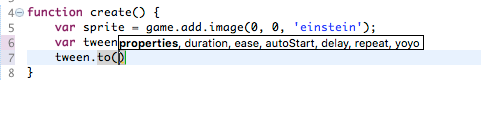
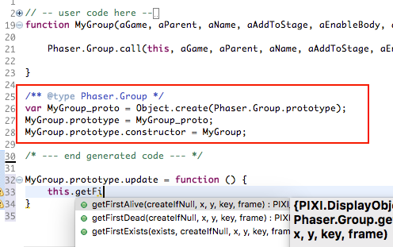
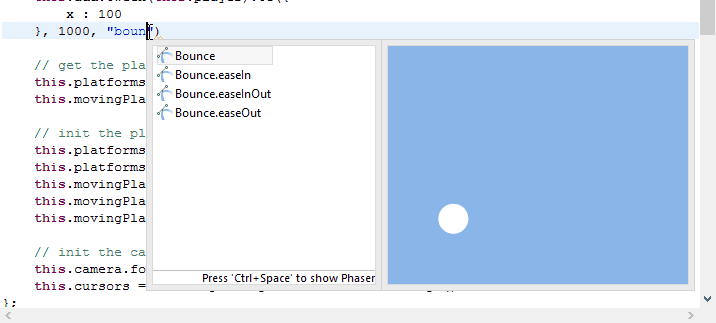

Coding The Game: The JavaScript Editor
--------------------------------------

With Phaser you write the game with JavaScript as main language (there is also support for TypeScript). In Phaser Editor the JavaScript programming is a first citizen, the JavaScript editor is the more important component for us, and we do an extra effort to build the best experience for the Phaser developer.

The JavaScript editor is part of the JSDT (Eclipse Web Tools) and we extended and modified it to adjust it to the Phaser API and style.

When you create a Phaser Project the main JS file is opened in the editor. To open the JS editor manually you can navigate to the JS file in the Project Explorer and double click on it.

Phaser API smart code completion
================================

The JS editor has a *"a complex inference engine"* to bind JS elements with static type information. We think it works very well with the Phaser API. We made a Phaser API library to make it easier for the inference engine to compute the static type of the JS expressions. 

If you follow certain coding structure you will enjoy a smart completion of the Phaser methods, properties and classes. JavaScript is a dynamic language and there are cases where compute the type of an expression is hard or impossible. However, in Phaser Editor you can annotate with static type information different statements like var declarations, method returns, method parameters and prototypes. See the next section.

Member proposals:

.. image:: images/ApiSmartCompletion.png
	:alt: Auto-complete Phaser API.

Arguments proposals:

Drawbacks:

Note in the proposals you see types like ``Phaser_Game`` or ``Phaser_Sprite``, etc.. It happens because JSDT does not understand the concept of namespaces, so we had to tweak the editor to simulate namespaces. This means that you can autocomplete ``Phaser.Sprite`` but also ``Phaser_Sprite``, however the last one is not valid in Phaser. We are working on replace the JSDT inference engine for a more accurate tool based on the Language Server Protocol of Microsoft.

Type annotation on a var declaration
====================================

Annotate var declarations is the general way to set the static type of a variable:

.. image:: images/TypeDecl_Var.png
	:alt: Type of var declarations.

This is something that you would like to use in a callback function:

.. image:: images/TypeDecl_Context.png
	:alt: Context type declaration.

Type annotation on a method declaration
=======================================

In a method you can declare the type of the return and the parameters:

.. image:: images/TypeDecl_Method.png
	:alt: Method args and return type annotation.

.. image:: images/VarTypeFromMethodReturn.png
	:alt: The return type is set to the var.

Unfortunately, for now, the type annotations are not supported in anonymous functions.

Type annotation on prototype declaration
========================================

In Phaser you are not forced to use type inheritance, however, a recommended practice is to split your game in functional components like game states, custom sprites and groups. In Phaser Editor we encourage to use prototype inheritance between other reasons because it helps with auto completion.

In JavaScript you can define a prototype like this:

.. code::

	function NewClass() {
		BaseClass.call(this);
	};

	NewClass.prototype = Object.create(BaseClass.prototype);
	NewClass.prototype.constructor = NewClass;

	NewClass.myNewMethod = function () {
		// ...
	};

In Phaser Editor if you annotate the prototype with the ``BaseClass`` then in the context of the prototype functions you will get the smart completions of the ``BaseClass`` too. Just take a look to the files generated by the ``New > Group Prefab File``, that creates a custom group: 

Note that we annotate an intermediate ``MyGroup_proto`` var with the ``Phaser.Group`` type, then we assign this var to the new prototype declaration. 

.. code::

	/** @type Phaser.Group */
	var MyGroup_proto = Object.create(Phaser.Group.prototype);
	MyGroup.prototype = proto;
	MyGroup.prototype.constructor = MyGroup;

This is not the more beautiful thing of the world, we prefer to use something like a ``@extends`` JSDoc tag, but for now it is not possible. We recommend to use the new file wizards, they generated a code that can be "understood" by the JavaScript editor.

Phaser API hover help
=====================

The hover help is about to get the documentation of a Phaser API element just with a mouse hover. It works pretty similar to the smart completions, the type inference engine should be able to compute the static type of the hover element, so you have to follow the same coding style (annotating the declarations with JSDoc tags) explained in the previous section.

.. image:: images/HoverAPI.png
	:alt: Hover the mouse on a method to open a doc popup.

Code templates
==============

With the code templates you can get snippets of code to cover specific Phaser tasks. These templates are the same are used in the official Phaser [online editor][10].

.. image:: images/CodeTemplates.png
	:alt: Code templates.

Asset keys proposals
====================

When you define your assets in an asset pack file then the JS editor read the asset keys and show them in the proposals popup. These proposals are listed when the content assist popup is invoked in a string context:

.. image:: images/AssetKeysCompletion.png
	:alt: Assets key proposals.

As you can see in the above screenshot, the asset keys are shown in the information control of the content assist popup. In the case of audio files it plays the sound.

File names proposals
====================

Also file names are shown in the content assist popup and they are visualized in the information control. In the next image are listed all the file names that match the ``png`` string: 

.. image:: images/FilesCompletion.png
	:alt: File names completions.

Easing names proposals
======================

Tweens are part of any Phaser game. When you create a tween you should provide the easing to be used in the animation. A common way to identify the easing is giving the easing function:

.. code::

	game.add.tween(item).to({y: 240}, 2400, Phaser.Easing.Bounce.Out);

But also you can write the easing name:

.. code::

	game.add.tween(item).to({y: 240}, 2400, "Bounce.easeOut");

In Phaser Editor you get easing names completions:

Look the ball is animated with the selected easing.

Errors, warnings and quick fix
==============================

By default Phaser Editor checks for syntax and semantic problems (errors and warnings). These problems are shown in the Problems view. In the JS editor the expression with problems is underlined with a yellow or red color in dependence of if it is a warning or an error.

Many of these problems can be fixed automatically with the Quick Fix command. When you get a problem, put the cursor on the error and press ``CTRL+1``, the Quick Fix dialog is shown with different options.

Hover the mouse on the error marker:

.. image:: images/QuickFix_1.png
	:alt: Error tip.

Then press ``Ctrl+1`` to fix it:

.. image:: images/QuickFix_2.png
	:alt: Fix options.

You can change the validator settings to ignore a kind of problem or treat it as a warning or error. These settings can be changed in a specific project (right click on the project and select Properties) or for the whole workspace (in the main menu ``Windows > Preferences``).

.. image:: images/JSValidationSettings.png
	:alt: JavaScript validation preferences.

Preview
=======

The JavaScript editor supports some preview features. When you hover a file name string, then it shows a popup with a preview of that file. In a similar way, if you hover the name of an `asset entry in the asset pack <assets_manager.html>`_ , then it shows a popup with a preview of the identified asset.

To quick preview an object you can hover its name but also you can put the cursor in the middle of the name and type ``Ctrl+Alt+V`` that command opens the identified object in the `Preview window <preview_window.html>`_.

.. image:: images/JSEditorAssetPreview.png
	:alt: Hover the mouse to preview the assets.