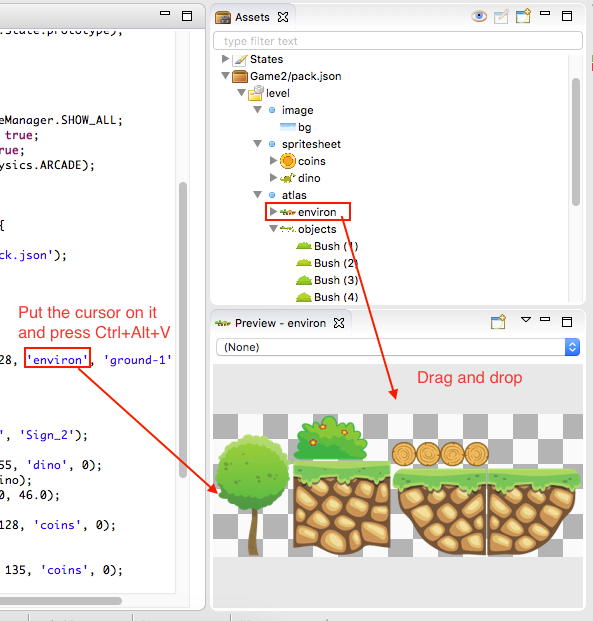
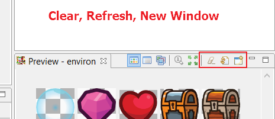

The Preview Window
==================

As the name suggest, in this window you can visualize different objects, specially the asset declarations of the `asset pack <assets_manager.html>`_ and media files (images, sounds, videos).

This Preview window usually show details of the previewed object like dimension, name, etc... In addition in the case of textures you can `drag the frames drop them into a scene <canvas.html#from-the-preview-window>`_, to create new obejcts.

To preview an asset you can drag it from the Assets explorer or Project Explorer and drop it into the Preview window, or select an asset and press ``Ctrl+Alt+V``.

In the JavaScript editor, if you put the cursor on a string literal and press ``Ctrl+Alt+V``, the asset of the same name will be opened in the Preview.

Note in the toolbar of the Preview window there are the following actions:

========================= ===============================================
Open New Window           Opens a new Preview, so you can visualize many objects at the same time.
Refresh (``F5``)          To update the content. This is useful when the object was changed by an external tool.
Clear                     Empty the window.
========================= ===============================================

The sprite-sheet preview
~~~~~~~~~~~~~~~~~~~~~~~~

When you open a sprite-sheet asset in the Preview window it shows a special control where you can play animations with the sprite-sheet frames. It is useful for quick animations preview. In addition, you can select a couple of frames and drop then into the scene. To select more than one frame keep the ``Shift`` key pressed and move the mouse over the frames.

.. image:: images/SpritesheetPreviewAnimation.gif
	:alt: You can play animations in the sprite-sheet preview.

The textures atlas preview
~~~~~~~~~~~~~~~~~~~~~~~~~~

The preview of a texture atlas asset has three different modes: Tile, List and Texture (or Original). The Tile mode shows the sprites of the atlas in a grid that you can zoom in/out (with the mouse wheel). The List mode shows the sprites in a list together with the names, and you can filter them by writing in a search field. The Texture mode shows the atlas texture as it is. In all the modes you can click on a sprite and drag it anywhere in the screen and drop it in other Preview window or in an scene editor. Note the toolbar of the Preview window shows the buttons to change from one mode to other:

.. image:: images/AtlasPreview.gif
	:alt: Preview a texture map.

Image preview
~~~~~~~~~~~~~

To preview an image asset or file, drop it into the Preview window. You can zoom in/out the image with the mouse wheel or move the image by dragging it with the right button of the mouse. The toolbar contains two actions: Reset Zoom and Fit the image to the window area:

.. image:: images/ImagePreview.png
	:alt: Preview an image.

Audio preview
~~~~~~~~~~~~~

To preview an audio asset or file, drop it into the Preview window. It shows a button to playback the sound:

.. image:: images/SoundPreview.png
	:alt: Preview of a sound file or asset.

Audio-sprites preview
~~~~~~~~~~~~~~~~~~~~~

To preview an audio-sprites asset drop it into the Preview window. the preview control contains a combo with the names of the sprites, a sound player with the whole sound file and a playback button to play the selected sprite in the combo.

.. image:: images/AudioSpritePreview.png
	:alt: Preview of a sound file or asset.

Video preview
~~~~~~~~~~~~~

To preview an video asset or file, drop it into the Preview window. It shows a button to playback the video:

.. image:: images/VideoPreview.png
	:alt: Preview of a sound file or asset.
