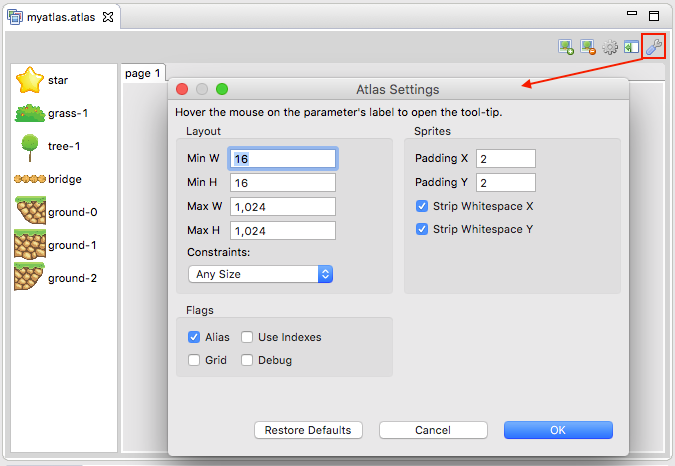

Texture Packing Editor
======================

Texture maps (or atlases) is an important resource that developers have to improve the performance of their games.

In Phaser Editor we give full support to texture atlases, we provide the Texture Atlas Editor to do the job. There are other external tools that you can use but we think that integrating a texture packer in Phaser Editor is part of our philosophy of delivering a complete and integrated development environment.

Our Atlas Editor uses the `LibGDX Texture Packer <https://github.com/libgdx/libgdx/tree/master/extensions/gdx-tools>`_, it features the MaxRect algorithm and can be tuned to satisfy the requirements of the majority of the games.

Create the atlas
----------------

To create an atlas click on ``File > New > Atlas Generator File``, it opens a dialog to set the name of the atlas and the container folder. This container folder should be a sub-folder of the ``WebContent`` folder.

.. image:: images/NewAtlasWizard.png
	:alt: New texture map wizard.

When you press **Finish**, a file ``myatlas.atlas`` is created and opened in the Atlas Editor. This file does not contain any relation with Phaser, else it contains Phaser Editor related stuff, like the atlas settings and the path of the source images. So you should exclude it from a game build,  but keep it on your game development source.

One time the atlas file is created and the Atlas Editor is open to editing it then you can start adding images to the atlas.

To add the image files to the atlas follow these steps:

- Select the image files in the Project Explorer.
- Drag the files and drop them into the atlas editor. You can also drop complete folders.
- Save the atlas file (``Ctrl+S`` or ``File > Save``). It generates the Phaser atlas JSON file (with the JSON Hash format) and the texture image (PNG) file.

.. image:: images/AtlasImportImages.png
	:alt: Drag and drop the source images into the editor.

The last step, to save, is very important, remember ``myatlas.atlas`` file is an internal Phaser Editor file, it is a configuration file used to generate the final JSON atlas and PNG texture file to be used in the game. So when you save the editor a ``myatlas.json`` and ``myatlas.png`` files are generated. These are the files you should load in your game. Also, note the source images are not placed under the ``WebContent`` folder else under the ``Design`` folder. Phaser Editor creates the ``Design`` folder and encourages the developers to put there the files are not included in the game but are used to generate the game assets, like is the case of the atlas source images.

To load the atlas in your game you can use the ``Phaser.Loader.atlasJSONHash()`` method or load the `Asset Pack <assets-manager.html>`_ file.

.. image:: images/AtlasSaveGenerateFiles.png
	:alt: Save to generate the texture files.

Tuning the atlas parameters
---------------------------

Texture MAPS can be used in different objects of your game like sprites, tile sprites, sprite-sheets, etc.. Often you should adjust the parameters of the packer to get a texture applicable to the different functions.

To change these parameters click the "settings icon" in the editor toolbar. It opens the Settings dialog:

The settings are:

============================== ==========================================================
Parameter                      Documentation
============================== ==========================================================
``Min/Max Size``               To change the size of the texture image. There are cases where the editor generates more than one Phaser (JSON) atlas files. It is because the texture has no space for all images so it creates another atlas to put there the remaining images. However you can change the max size of the texture to make space for all the sprites.
``Size constraints``           You can select ``Any Size`` (default) or ``POT (Power of 2)``. In the second case the editor generates a texture with a size power of 2. In some platforms this kind of textures performs better.
``Padding``                    It controls the spacing between the sprites. It is useful to remove artifacts from sprites animations, tile sprites, in general when the source images has color pixels in the borders. By default it puts 2.
``Strip white spaces``         To remove the extra space of sprites. If your source images have extra space (transparent areas) around the picture, then activating these parameters the editor generates a texture that removes that spaces and a JSON file that specify to Phaser to render the sprites with the right spacing. By default these parameters are on.
``Use indexes``                To sort the sprites by using a ``_01.png`` suffix in the source files.
``Alias``                      Equal images are packed once.
``Grid``                       To pack the images in a uniform grid. You can use this together with the Indexes option to create spritesheets.
============================== ==========================================================

Multiple pages
--------------

As we mentioned before, it is possible that one texture has no enough space for all the sprites, then many "pages" or textures are generated to place the remaining sprites.

When this happens the editor creates multiple tabs to show all the textures and generates the Phaser atlas files with a number suffix. For example, if the packer generates two textures we get the files `myatlas1.json`, `myatlas1.png`, `myatlas2.json` and `myatlas2.png`:

.. image:: images/AtlasMultiPage.png
	:alt: The source images can be packed in more than one texture maps.

The side panel
-------------------------------
Close to the settings icon, there is the "side panel" icon. By default the side panel is hidden but you can show it selecting that icon.

This panel shows the name of the sprites and a small window with the sprites and pages information.

When you click on a sprite in the right panel (canvas), that sprite is selected in the side panel, and when you select a sprite in the side panel, it is highlighted in the texture canvas.

You can delete some sprites by selecting it and pressing the `DEL` key or clicking on the delete icon that is placed in the editor's toolbar. Remember each time you change the atlas you should save it to generate the Phaser files.

.. image:: images/AtlasSidePanel.png
	:alt: Side panel.

Update the atlas with external changes
--------------------------------------

In the editor's toolbar, you can see a "gear" icon, click it to re-build the atlas. When you change the source image files then you should rebuild the atlas to regenerate the texture, do this by pressing that "gear" icon.

When you rebuild the atlas, the editor shows a dialog to confirm that you want to save it, if you accept, then the atlas is saved and the Phaser atlas files are generated.

