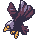
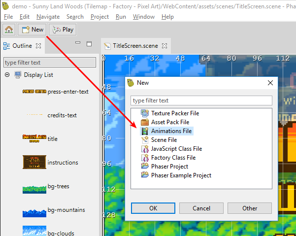
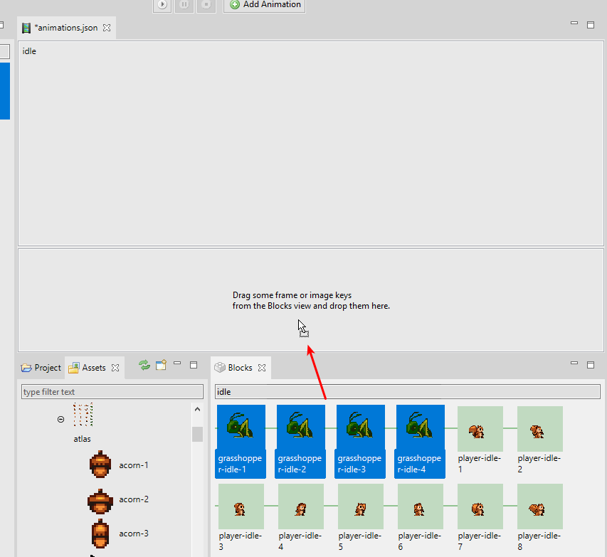
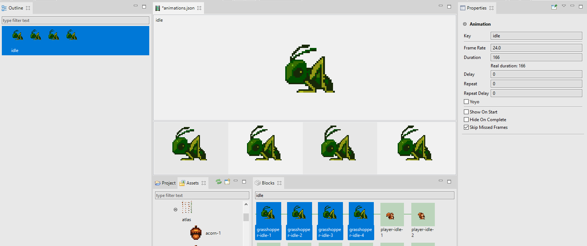
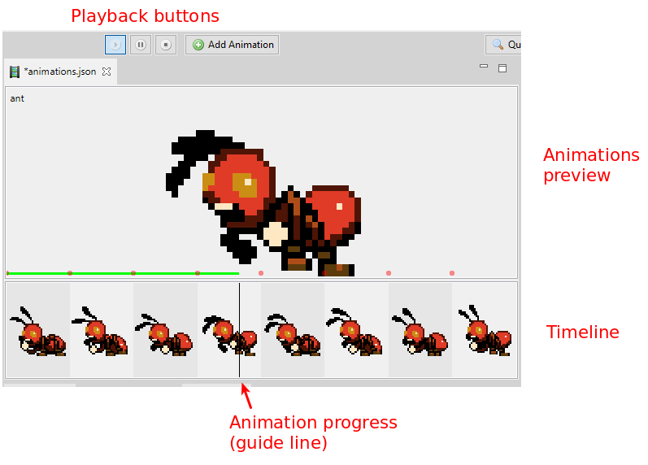
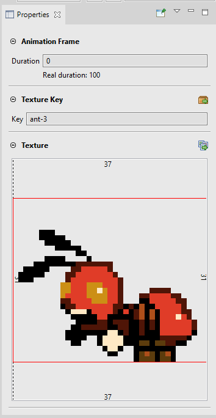
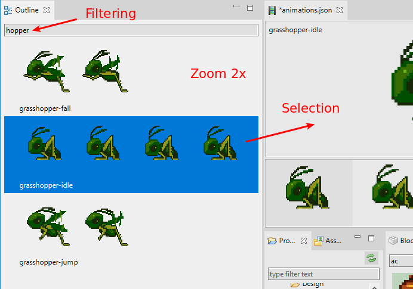

.. include:: _header.rst
   
.. sectnum::
   :depth: 3
   :start: 5

.. highlight:: javascript

Animations Editor
=================

Probably, the most common animations in Phaser_ games are the so called sprite-animations or frame-based animations.

Animation:

Animation frames:

.. image:: images/animations-editor/eagle-spritesheet.png
  :alt: Eagle animation frames. 

In Phaser_ v3, the animations are `created <https://photonstorm.github.io/phaser3-docs/Phaser.Animations.AnimationManager.html#create__anchor>`_ as global objects, in the `animations manager <https://photonstorm.github.io/phaser3-docs/Phaser.Animations.AnimationManager.html>`_:

You can create a single animation:

.. code::

    this.anims.create({
        "key": "acorn",
        "frameRate": 12,
        "repeat": -1,
        "frames": [
            {
            "key": "atlas",
            "frame": "acorn-1"
            },
            {
            "key": "atlas",
            "frame": "acorn-2"
            },
            {
            "key": "atlas",
            "frame": "acorn-3"
            }
        ]
    });

Or multiple animations:

.. code::

    this.anims.fromJSON(
        "anims": [
            { 
                "key": "acorn", 
                // ....
            },
            { 
                "key": "player", 
                // ....
            }
        ]
    );

The common is to create the animations once in the game, probably in the preloader scene. Later, you can play an animation on a sprite object passing the animation key to the `play(..) <https://photonstorm.github.io/phaser3-docs/Phaser.GameObjects.Sprite.html#play__anchor>`_ method:

.. code::

    mySprite.play("acorn");

Other way to create the animations is packing them all in a single JSON file, and load the file using the `this.load.animation(..) <https://photonstorm.github.io/phaser3-docs/Phaser.Loader.LoaderPlugin.html#animation__anchor>`_ method:

.. code::

    this.load.animations("my-anims", "assets/animations.json");

|PhaserEditor|_ provides the |AnimationsEditor|_, to create the animations JSON file. So, the workflow is very simple:

* Create the animations JSON file with the |AnimationsEditor|_.

* Import the animations JSON file into an **Asset Pack** file with the |AssetPackEditor|_.

* Play the animations in your code, with the `play(..)`_ method.

Create the animations file
--------------------------

The default `project template <workbench.html#project-structure>`_ contains an animations file, but you can create other animations file with the *File* |-| *New* |-| *Animations File* menu option, or pressing the `New <workbench.html#new-button>`_ button of the main toolbar and selecting the *Animations File* option.

Adding animations to the file
-----------------------------

To create a new, empty animation, press the **Add Animation** button in the toolbar. It shows a dialog to enter the animation name.

.. image:: images/animations-editor/animations-new-empty.png
  :alt: Create a new, empty animation.

The new animation is empty, so you have to add some frames to it. The frames (or better said, the frame keys) could be dragged from the |AssetsView|_ or the `Blocks view`_ and dropped into the animation timeline.

Automatic creation of animations
~~~~~~~~~~~~~~~~~~~~~~~~~~~~~~~~

Usually, artists name the frames of the animations with certain pattern, something like this:

* ``player-jump-1``

* ``player-jump-2``

* ``player-jump-3``

* ``player-idle-1``

* ``player-idle-2``

* ``player-idle-3``

* ``enemy_idle01``

* ``enemy_idle02``

* ``enemy_idle03``

* ``enemy_attack01``

* ``enemy_attack02``

* ``enemy_attack03``

There are different patterns, but the common is to use some common prefix for the frames of the same animation, with a numeric suffix.

The |AnimationsEditor|_ takes advantage of these naming patterns and uses an algorithm to create multiple animations with a given set of frames. The algorithm is simple, it groups all the frames with a common prefix and create an animation for each group, with group frames. The prefix of a frame is extracted by removing all non-alphabetic chars at the end of the name.

For example, the prefix of ``enemy_idle02`` is ``enemy_idle``, the prefix of ``player-jump-1`` is ``player-jump``. So, if we apply the algorithm to the frames listed before, you get the following groups:

* *player-jump*

  * ``player-jump-1``

  * ``player-jump-2``

  * ``player-jump-3``

* *player-idle*

  * ``player-idle-1``

  * ``player-idle-2``
  
  * ``player-idle-3``
 
* *enemy_idle*

  * ``enemy_idle01``

  * ``enemy_idle02``

  * ``enemy_idle03``

* *enemy_attack*

  * ``enemy_attack01``

  * ``enemy_attack02``

  * ``enemy_attack03``

So, the |AnimationsEditor|_ creates the animations **player-jump**, **player-idle**, **enemy-idle** and **enemy-attack**.

Create the animations by dropping frames
~~~~~~~~~~~~~~~~~~~~~~~~~~~~~~~~~~~~~~~~

To create the animations, you can drag the frames from somewhere and drop them into:

* The `Outline view`_.
* The center of the editor (if it is not showing a particular animation, because in that case it will append the frames at the end of the animation).

The frames can be taken from:

* The `Blocks view`_.

* The frames, atlas, sprite-sheet, image preview section of the |PropertiesView|_.

* The |AssetsView|_.

If you drop an atlas or sprite-sheet, the editor will use all the frames inside them.

 .. image:: images/animations-editor/animations-editor-drop-frames-new-animation.png
    :alt: Drop frames into the editor to create multiple animations.

When the frames are dropped, the editor opens a dialog to enter a prefix for all the animations. It is useful if the frames use names like `idle` or `attack` but you want to organize them so you can use a prefix `enemy` to get the animations `enemy-idle` and `enemy-attack`. Sure, you can leave it blank.

 .. image:: images/animations-editor/animations-enter-prefix.png
    :alt: Enter prefix for new animations.

.. image:: images/animations-editor/animations-created-by-drop.png
    :alt: The created animations.

Creating the animations with the Create Animations button
~~~~~~~~~~~~~~~~~~~~~~~~~~~~~~~~~~~~~~~~~~~~~~~~~~~~~~~~~

When you select the frames in the `Blocks view`_, the |PropertiesView|_ shows a **Create animations** button in the **Animations** section. The button's text shows the number of animations could be created with the selection, and the button's tooltip shows the names.

Like when you `drop the frames <#create-the-animations-by-dropping-frames>`_, if you press the button, it opens a dialog to write a prefix for all the animations and finally create the animations. 

.. image:: images/animations-editor/animations-create-animations-button.png
    :alt: The Create animations button.

Animations Editor layout
------------------------

The editor presents the animations in two layouts:

* **Single animation layout**. When you select just one animation. It shows the animation preview and the timeline. If you press the ``Esc`` key, the animation is unselected and the editor shows all the animations.

  .. image:: images/animations-editor/animations-single-animation-layout.png
    :alt: Single animation layout.

* **Multiple animations layout**. When you select zero, or more than one animation. It shows the selected animations (or all the animations if the selection is empty) in a grid layout. Here you can click one animation to select it and therefore show it in the **single animation layout**.

  .. image:: images/animations-editor/animations-multiple-animations-layout.png
    :alt: Multiple animation layout.

Playing the animations
----------------------

When you select just one animation, the `main toolbar <workbench.html#main-toolbar>`_ shows the buttons to play, pause or stop the selected animation. When the animation is playing, the `timeline <#animation-timeline>`_ shows a `vertical line <#timeline-progress-line>`_ (or cursor) with the progress of the animation. You can press the ``Space`` key to play/pause the animation.

When you select multiple animations, the `main toolbar`_ shows the buttons to play or stop all the animations at the same time. 

.. image:: images/animations-editor/animations-playing-multiple.png
    :alt: Multiple animations playing.

Animation properties
--------------------

The |PropertiesView|_ connects with the |AnimationsEditor|_ and display the properties of the animations or the animation frames.

You can change the properties of many animations or frames at the same time.

**Animation properties**

======================== ======================
**Key**                  The key that the animation will be associated with. i.e. ``sprite.animations.play(key)``.
**Frame Rate**           The frame rate of playback in frames per second (default 24 if duration is null)
**Duration**             How long the animation should play for in milliseconds. If not given its derived from ``frameRate``.
**Delay**                Delay before starting playback. Value given in milliseconds.
**Repeat**               Number of times to repeat the animation (-1 for infinity)
**Repeat Delay**         Delay before the animation repeats. Value given in milliseconds.
**Yoyo**                 Should the animation yoyo? (reverse back down to the start) before repeating?
**Show On Start**        Should ``sprite.visible = true`` when the animation starts to play?
**Hide On Complete**     Should ``sprite.visible = false`` when the animation finishes?
**Skip Missed Frames**   Skip frames if the time lags, or always advanced anyway?
======================== ======================

Animation frame properties
~~~~~~~~~~~~~~~~~~~~~~~~~~

When you select a frame the |PropertiesView|_ show its properties and you can change some of them.

============================== ===========================================
**Duration**                   Additional time (in ms) that this frame should appear for during playback.
*Real Duration*                It is a |PhaserEditor|_, read-only property. It shows the total duration of the frame (the animation `frameRate` duration plus the extra time set in the `duration` property).
*Texture Key*                  It is a |PhaserEditor|_, read-only property. It shows the key of the frame texture.
============================== ===========================================

In addition, the |PropertiesView|_ shows a preview of the frame texture.

Animation timeline
------------------

When you select a single animation, the |AnimationsEditor|_ shows a preview canvas and a timeline. The preview canvas displays the animation when you play it, the timeline shows the animation frames.

The timeline allows to add more frames to the animation, delete the frames or modify the frame properties.

Adding frames to the timeline
~~~~~~~~~~~~~~~~~~~~~~~~~~~~~

To add frames to the timeline you can drag texture frames (atlases, atlas frames, sprite-sheets, sprite-sheet frames, images) from the `Blocks view`_ or the |AssetsView|_ and drop them into the timeline.

If the timeline contains frames, you can insert the new frames at any position.

Also, you can drop the frames on the animation preview canvas, in that case the frames are appended to the timeline.

.. image:: images/animations-editor/animations-insert-frames-timeline.png
  :alt: Insert frames to the timeline.

Other timeline operations
~~~~~~~~~~~~~~~~~~~~~~~~~

You can modify the timeline in different ways:

* Change the order of frames by dragging them.

* Delete the selected frames (``Delete`` key or **Delete** context menu option).

* Zoom in/out of the images, by rolling the mouse wheel while pressing one of these keys: ``Ctrl``, ``Alt`` or ``Shift``.

Timeline progress-line
~~~~~~~~~~~~~~~~~~~~~~

When the animation is `playing <#playing-the-animations>`_ the timeline shows a vertical line that indicates the progress of the animation.

.. image:: images/animations-editor/animations-timeline-playing.png
  :alt: Timeline cursor.

Blocks view 
-----------

The `Blocks view`_ is a `general purpose view <workbench.html#blocks-view>`_ that connects with the |AnimationsEditor|_ and shows all the available `Asset Pack keys <asset-pack-editor.html>`_ related to textures and texture frames.

You can drag the textures from the `Blocks view`_ and drop them on: 

* The |AnimationsEditor|_ center area to `create multiple animations <#automatic-creation-of-animations>`_ or `append the frames <#adding-frames-to-the-timeline>`_ to a selected animation.

* The `timeline <#animation-timeline>`_ to `insert new frames <#adding-frames-to-the-timeline>`_. 

* The `Outline view`_ to `create multiple animations`_.

The `Blocks view`_ allows to `zoom in/out and filter the content <workbench.html#other-blocks-view-features>`_ by its name.

Outline view
------------

The `Outline view`_ is a `workbench view <workbench.html#outline-view>`_ that connects with the |AnimationsEditor|_ and lists all the animations.

You can select one or many animations, to play them or `modify their properties <#animation-properties>`_. Also, you can delete the selected frames by pressing the ``Delete`` key or using the context menu.

Other function of the `Outline view`_ is as a drop-place to `create new animations <#create-the-animations-by-dropping-frames>`_, by dropping frames on it.

This view, like many other visual elements of the IDE, can be zoomed in/out (mouse wheel plus one of the keys ``Ctrl``, ``Alt`` or ``Shift``) and you can filter its content by the key of the animations.

Keyboard shortcuts
------------------

These are the keyboard shortcuts of the |AnimationsEditor|_:

=================================== ==========
Delete animations or frames         ``Delete``
Play/pause the animation            ``Space``
Undo                                ``Ctrl+Z``
Redo                                ``Ctrl+Y``
=================================== ==========