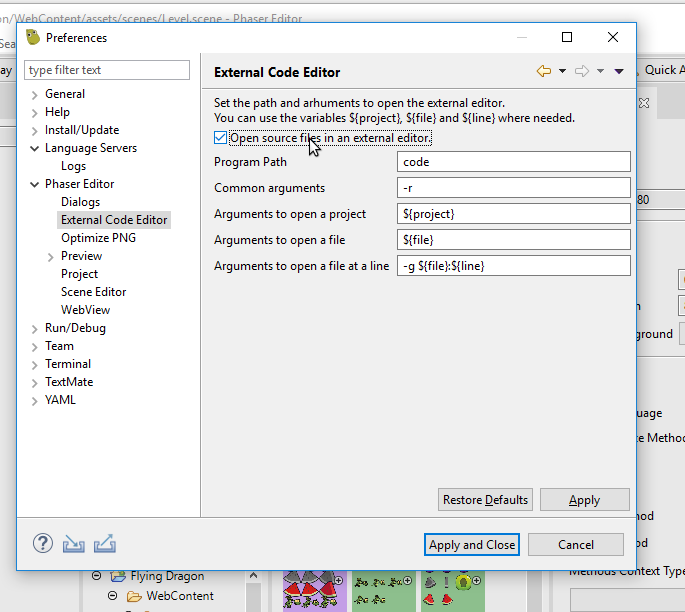

.. include:: _header.rst

.. sectnum::
   :depth: 3
   :start: 8

Code Editors
============

TODO

Integration with external editors
~~~~~~~~~~~~~~~~~~~~~~~~~~~~~~~~~

|PhaserEditor|_ uses the Language Server Protocol to edit the HTML, JavaScript, JSON, and other web files. It is a protocol used by |vscode|_ so both editors share a similar experience and configuration. However, is a common practice to use |PhaserEditor|_ to design the levels, animations, and packs, but use VS Code or any other editor to code the game logic.

In |PhaserEditor|_ you can configure an external editor, and some functions will be delegated to that editor. The main toolbar will show a button to launch the external editor and open the current project in it. Other parts of the IDE, like the `Scene Editor <scene-editor.html>`_ and the `Project view <workbench.html#project-view>`_ will launch the external editor too, to edit the code files.

.. image:: images/code-editors/external-editor-button.png

To configure the external editor go to *Preferences → Phaser Editor → External Code Editor*. You should check the parameter **Open source files in an external editor** to enable the external editor integration. The other parameters are about to configure the command line arguments. By default, it uses the |vscode|_ arguments. Important: in the **Program path** parameter you should set the full path to the editor executable.

