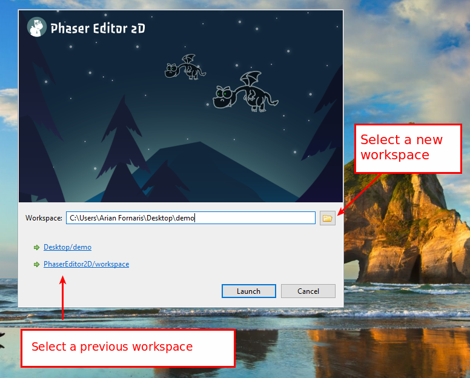
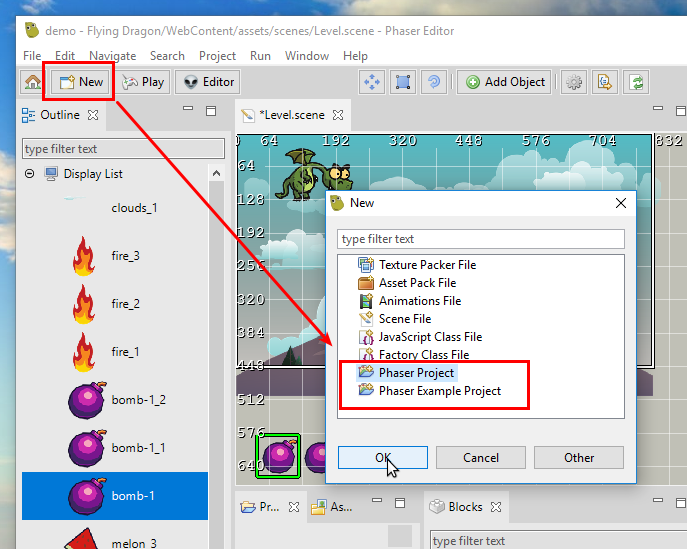
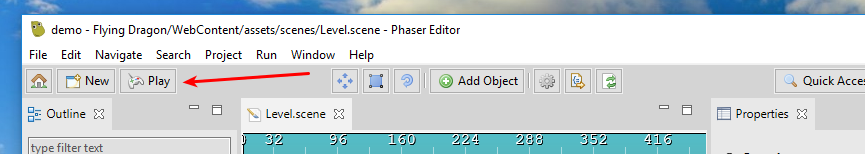
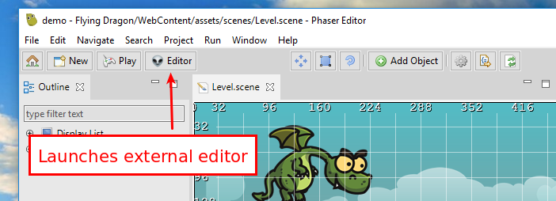

.. include:: _header.rst

.. sectnum::
   :depth: 3
   :start: 1

First Steps
===========

In this section, we explain step by step some of the common tasks you may do when starting with |PhaserEditor|_.

Download and install
--------------------

Binaries are available in the `Downloads <https://phasereditor2d.com/blog/downloads>`_ page of the |PhaserEditor|_'s website. |PhaserEditor|_ is not an installable application, it is distributed in form of ZIP files that you can un-compress and run. Note there are three different files, one for each supported platform: Windows, macOS, and Linux.

Run Phaser Editor 2D
--------------------

Un-compress the ZIP file and double click on the executable file ``PhaserEditor2D.exe``. Well, each platform has a different executable name, you can find more details about your platform in the next sections. Together with the executable, there is a script to run the editor in debug mode. This mode is useful to get debug messages or start an instance with a clean state. 

When |PhaserEditor|_ starts, it shows a splash screen and later a **Launcher Dialog**. In this dialog, you should select the path to the workspace. Usually, the default path is fine (a ``workspace`` sub-folder in the current dialog), but you can change it. The workspace is a special folder to store the projects and other data like preferences. You can change the list of workspaces and other settings in *Preferences → General → Startup and Shutdown → Workspaces*.

`Learn more about the workspace <workbench.html#workspace-and-projects>`_

Windows
~~~~~~~

To run |PhaserEditor|_ on Windows run the file ``PhaserEditor2D.exe``. 

Execute the file ``Debug.bat`` to run the editor in debug mode.

macOS
~~~~~

|PhaserEditor|_ is distributed in macOS as an application (``.app`` folder). To run it the first time, you should right-click on the ``Phaser Editor 2D`` application and select ``Open``. This step is needed because the editor is not certified by Apple. The second time, you can run the editor with a double click.

To run the editor in debug mode, you can execute the ``Debug.sh`` script in a terminal.

When we build the editor for macOS we add execution permission to a series of files, but if the OS shows a message about execution permissions, you can set them again using the ``SetExecPermissions.sh`` script.

Linux
~~~~~~~~~

To run |PhaserEditor|_ on Linux executes the file ``PhaserEditor2D``.

To run the editor in debug mode, execute the script ``Debug.sh``.

When we build the editor distribution, we set execution permission to a couple of files, however, if for any reason you need to set these permissions again, run the script ``SetExecPermissions.sh`` in a terminal.

Create your first game
----------------------

When the editor opens the first time (or an empty workspace) it shows the `Start <workbench.html#start-perspective>`_ perspective. That perspective provides the links to create a project or an example project:

`Learn more about the Start perspective <workbench.html#start-perspective>`_

.. image:: images/start-perspective.png

The **New Project** link opens a wizard where you can set some settings like the initial game size or programming language (JavaScript or TypeScript). 

The **New Example Project** opens a wizard where you can select an example to be cloned as a project.

You can create new projects at any time, by clicking the **New** button of the main toolbar.

`Learn more about wizards <workbench.html#resource-wizards>`_

Regular Project
~~~~~~~~~~~~~~~

The regular project wizard shows settings related to the game configuration: game size, canvas type, scale mode, etc... In addition, you can select the language to be used in the project: JavaScript 6 or TypeScript.

`Learn more about the Phaser Project wizard <workbench.html#phaser-project-wizard>`_

.. image:: images/new-project-wizard.png

The wizard creates a project with a `basic structure <workbench.html#project-structure>`_ and a few files common in many projects, like an `Asset Pack file <asset-pack-editor.html>`_, a `Texture Atlas file <texture-packer-editor.html>`_ and a `Scene file <scene-editor.html>`_.

Example Project
~~~~~~~~~~~~~~~

You can create a project based in some of the official Phaser examples or the |PhaserEditor|_ examples. It is a valuable resource to learn Phaser.

`Learn more about the Phaser Example Project wizard <workbench.html#phaser-example-project-wizard>`_

.. image:: images/workbench/new-example-project.png
   :alt: The Phaser Example Project.

Play the project
----------------

|PhaserEditor|_ has a built-in HTTP server that you can use to play the game project. When you click the **Play** button in the main toolbar, the built-in server is started and the default OS default browser is launched. You can configure the default browser in *Preferences → General → Web Browser*.

`Learn more about running the game <workbench.html#play-button>`_

Switching projects
------------------

|PhaserEditor|_ allows to work with many projects at the same time ---it is a feature inherited from the |EclipseIDE|_--- however, in Phaser game development you don't create references between projects, so we decided to use the `Active Project <workbench.html#active-project>`_ concept. This means that you are going to say to the IDE what is the project you are working on and the UI will show only the content and commands related to that project.

You can select the `active project`_ at any time switching to the `Start <workbench.html#start-perspective>`_ perspective or launching the **Open Project Dialog** (``Ctrl+Alt+P`` or right-click on the **Start** button).

.. image:: images/open-project-dialog.png

External editors integration
----------------------------

The "war" of code editors and IDEs is bloody and there is not a clear winner. |PhaserEditor|_ allows to edit all common web files (JS, TS, HTML, CSS,...) and provides a acceptable tooling. However, it is very important for us that you can use your loved, alien code editor to write the game logic.

`Learn more about the external editors integration <code-editors.html#integration-with-external-editors>`_

We choose |vscode|_ as the first option, and generate full compatible projects, but you can configure any other code editor. 

*Window* |-| *Preferences* |-| *Phaser Editor* |-| *External Code Editor*

Unlock Phaser Editor 2D
-----------------------

|PhaserEditor|_ is a commercial product, you `should purchase a license key <https://gumroad.com/l/phasereditor/>`_ to use it in all its potential (**Premium** mode). However, by default, it runs in a **Free** mode that provides all the features and tools but is limited to a certain number of game assets.

To activate the editor, click on *Help → Unlock Phaser Editor*, it shows an activation dialog, write the purchased license key and click on the **Activate** button.

This is a table with a comparison between the **Free** and **Premium** mode:

=========================== =============== ================
Assets                      Free mode       Premium mode
=========================== =============== ================
Image keys                  Limited to 10   No limits
Texture Atlas keys          Limited to 3    No limits
Tilemap keys                Limited to 5    No limits
Scene (``.scene`` files)    Limited to 5    No limits
Others                      No limits       No limits
=========================== =============== ================

The **keys** are defined in the `asset pack files <asset-pack-editor.html>`_.

There are three types of licenses:

* One year license.
* Two years license.
* Lifetime license.

As the name suggests, the difference is only about the expiration date. Important: a license is valid for all versions of |PhaserEditor|_, they are just limited by the purchase/expiration dates.
