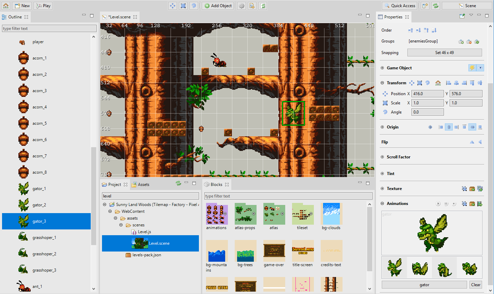
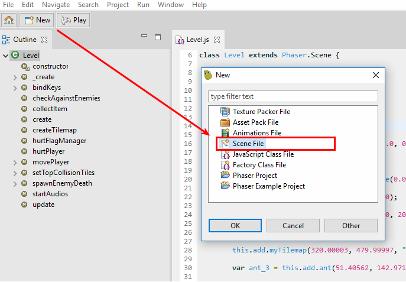
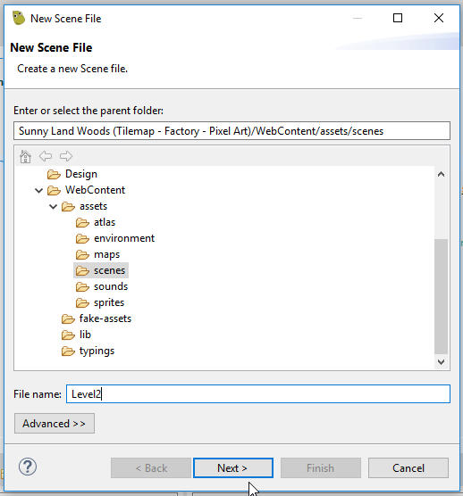
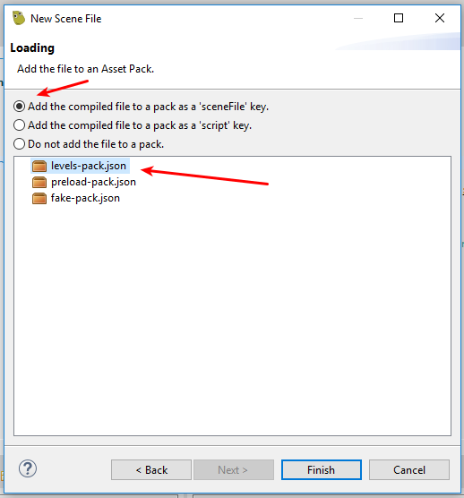
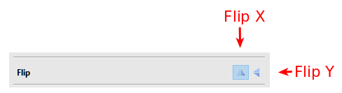
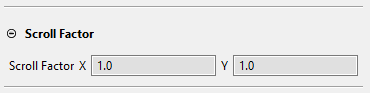
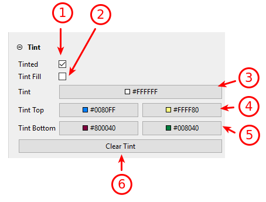
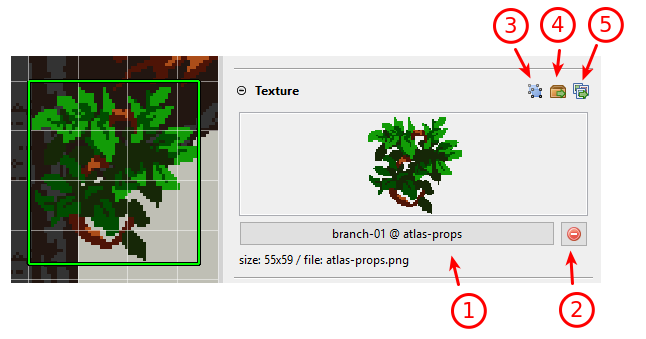
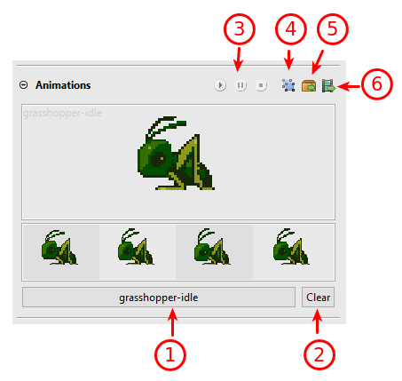
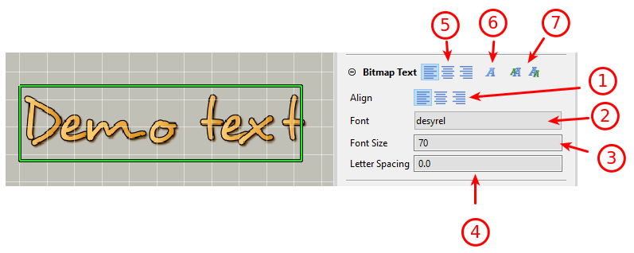

.. include:: _header.rst
   
.. sectnum::
   :depth: 3
   :start: 7

Scene Editor
============

The |SceneEditor|_ is the most important editor of the IDE. As its name suggests, this editor provides visual tools to create scenes (or levels).

The |SceneEditor|_ is pretty similar to other scene makers in the market, it has common and particular features. Maybe the most relevant difference is that this editor `compiles the scene <#scene-compiler>`_ into readable Phaser_ code.

Phaser_ provides support for certain file formats like the `asset pack <asset-pack-editor.html>`_ and the `sprite animations <animations-editor.html>`_, but it lacks a full-feature Scene file format suitable for level editors. And maybe it should be that way because Phaser_ is a framework and you may use it in very different ways and very different context.

So, how can we develop a scene editor? We know we need to save the scene in a custom format. We have two main options:

#. We can create a custom runtime, or plugin, to load the scene files in the game and create the objects in the fly.

#. We can create a scene compiler, that translates the custom scene file into Phaser_ code.

The second option plays much better with the |PhaserEditor|_ philosophy of being fully compatible with a vanilla Phaser_ runtime. So this compiler gets a custom scene file and generates a clean, readable, hand-writing-like Phaser_ code. Even this option has other advantages: it is very easy to debug the scene and know exactly how the objects are created.

In the previous version of |PhaserEditor|_, we used custom scene renderers based on desktop UI toolkits, because of the lack of a **Web View** available in all the OS platforms. However, now the |EclipseIDE|_ provides better support for its **Web View** and we migrated the scene renderer to Phaser_. This means, what you see in the scene editor is what you get in the game because both are built with the same technology: Phaser_.

Create a new Scene file
-----------------------

The scene files (``*.scene``) are created using the **New Scene File** wizard. This wizard can be opened from the main menu: *File* |-| *New* |-| *Scene File*, or using the `New button <workbench.html#new-button>`_.

The **New Scene File** wizard is divided into two steps:

#. Set the location and name of the new scene file.

#. Select an `asset pack file <asset-pack-editor.html#importing-javascript-files>`_ to import the scene compiled code in the game. This is optional.

Adding objects to the scene
---------------------------

When you activate the |SceneEditor| (open, select, focus on) the `main toolbar <workbench.html#main-toolbar>`_ shows a couple of buttons dedicated to the |SceneEditor|_. In the middle, there is the **Add Object** button.

The **Add Object** button shows a menu with the object types supported by the |SceneEditor|_.

.. image:: images/scene-editor/scene-editor-add-button.png
  :alt: The Add Object button.

Some objects typically use a resource. The `Image`_, `Sprite`_ and `Tile Sprite`_ types use textures (images, atlas frames, sprite-sheet frames). The `Bitmap Text`_ uses a bitmap font. When you select to add any of these objects, the editor opens a dialog to select the asset needed by the object.

.. image:: images/scene-editor/scene-editor-add-object-select-texture.png
  :alt: Select the texture of a new object.

Finally, the new object is added to the center of the scene:

.. image:: images/scene-editor/scene-editor-add-object-done.png
  :alt: Added object.

When you select to add a `Text`_ object, it does not open any dialog because it does not require any asset, the `Text`_ object is created with a ``New Text`` value and added to the center of the scene.

.. image:: images/scene-editor/scene-editor-add-text.png
  :alt: Added a Text object.

Adding objects from the Blocks view
~~~~~~~~~~~~~~~~~~~~~~~~~~~~~~~~~~~

When the `Blocks view`_ connects with the active |SceneEditor|_, it shows all the `file keys or file configurations <asset-pack-editor.html>`_ that you can use to create new objects.

A new object is created when you drag a file key from the `Blocks view`_ and drop it into the scene.

Each type of file creates a particular type of object by default. However, once the object is created, `you can morph it to another type <#morphing-objects-to-a-different-type>`_.

====================== ====================
Blocks element          Scene Object type
====================== ====================
Image key              `Image`_
Atlas frame key        `Image`_
Sprite-sheet frame key `Image`_
Animation key          `Sprite`_
Bitmap Font key        `Bitmap Text`_
====================== ====================

.. image:: images/scene-editor/scene-editor-drag-from-blocks-view.png
  :alt: Dropping an animation from the Blocks view.

.. image:: images/scene-editor/scene-editor-drag-from-blocks-view-done.png
  :alt: The new object is created with a Sprite type.

Adding objects from the Assets view
~~~~~~~~~~~~~~~~~~~~~~~~~~~~~~~~~~~

The |AssetsView|_ shows the files created by the |PhaserEditor|_ editors. In the case of the `Asset Pack files <asset-pack-editor.html>`_, it also shows the file keys defined in the file.

In the same way, you `drop file keys from the Blocks view <adding-objects-from-the-blocks-view>`_ into the scene, you can drag the file keys from the |AssetsView|_ and drop them into the scene. Take a look at the previous section for more details on the kind of objects are created.

.. image:: images/scene-editor/scene-editor-drag-from-assets-view.png
  :alt: Drag file keys from the Assets view.

Supported object types
----------------------

The |SceneEditor|_ is in active development and only supports a very basic set of object types. Eventually, we should add more types and more properties. However, you can use an `object factory <#making-reusable-objects>`_ to create objects of any type, even your custom type.

The list of supported object types is:

* `Image`_

* `Sprite`_

* `Tile Sprite`_

* `Bitmap Text`_

* `Text`_

* `Group`_

Common properties
~~~~~~~~~~~~~~~~~

Like it is in the other editors of the IDE, the `Properties view <workbench.html#properties-view>`_ connects with the active |SceneEditor|_ and show the properties of the objects selected in the scene or the `Outline view`_.

In the Phaser_ API, the properties of the game object types are divided into dedicated classes in the `Phaser.GameObjects.Components <https://photonstorm.github.io/phaser3-docs/Phaser.GameObjects.Components.html>`_ namespace. So, an object type contains its properties and methods but also inherits a couple of "component" classes, like `Phaser.GameObjects.Components.Transform <https://photonstorm.github.io/phaser3-docs/Phaser.GameObjects.Components.Transform.html>`_ or `Phaser.GameObjects.Components.Tint <https://photonstorm.github.io/phaser3-docs/Phaser.GameObjects.Components.Tint.html>`_.
 

In the `Properties view`_ of the |SceneEditor| we split the properties more or less in the same way, each properties section is dedicated to a specific Phaser_ game object component class. There is not a 100% match, there are sections dedicated only to |SceneEditor|_-properties or there are sections with a merge of Phaser_ API properties and editor-properties.

The editor-properties are not part of the Phaser_ API and are needed by the editor to help create the scenes, but are not generated in the final code. They are design-time properties.

In this chapter, we explain the properties that are common to the majority of the supported game object types.

Variable properties section
###########################

This section is used by the editor and the `scene compiler`_ to identify the object and provides certain operations.

.. image:: images/scene-editor/scene-editor-variable-section.png
  :alt: Variable section.

#. The **generate property** button. You can check or un-check it. By default, the `scene compiler`_ assign an object to a local variable, but if you set true this property, the object is assigned to an instance field. Do this when you need to get access to the object outside the *create* method.

#. The **go-to source** button. Click it to open the JavaScript editor and scroll to the line where this object is created. If you enabled an `external editor <code-editors.html#integration-with-external-editors>`_ then it opens the external editor.

#. The **Var Name** property is used by the `scene compiler`_ as the variable name and the `Outline view`_ use it as the label of the object.
  
  .. image:: images/scene-editor/scene-editor-variable-section-var-name-property.png
    :alt: Variable name.

4. The same in *(1)*.

Editor properties section
#########################

A section that contains properties and buttons that are not part of the Phaser_ API but are used to provide certain functionalities of the editor.

.. image:: images/scene-editor/scene-editor-editor-section.png
  :alt: Editor section.

1. The **Type** property displays the `type of the game object <#supported-object-types>`_. You can click the button `to morph the object to another type <#morphing-objects-to-a-different-type>`_, which is an important feature.

  .. image:: images/scene-editor/scene-editor-editor-section-type-property.png
    :alt: Type property.

2. The **Transparency** property. You can change its value to render the object in the editor with certain transparency, but it is not applied to the object in the game. Note it is not included in the generated code.

  .. image:: images/scene-editor/scene-editor-editor-section-transparency-property.png
    :alt: Transparency property.

3. The **Order** buttons allow changing the order the objects are created in the scene, which is the same order they are rendered.

  .. image:: images/scene-editor/scene-editor-editor-section-order.png
    :alt: The Order buttons.

  1. Moves the object up in the order (or press ``PageUp`` key).

  2. Moves the object down in the order (or press ``PageDown`` key).

  3. Moves the object to the top of the order (or press ``Home`` key).

  4. Moves the object to the bottom of the order (or press ``End`` key).

  You can see in the `Outline view`_ the result of the ordering.

4. The **Groups** displays the groups that contain the object, and buttons to add or remove the object to the groups. A group (that is part of the Phaser_ API, see `Phaser.Group <https://photonstorm.github.io/phaser3-docs/Phaser.GameObjects.Group.html>`_ ) is a powerful resource in your hands. You can use it as an object pool or as an object classifier. In many Phaser_ examples and games, you can see how the groups are used to apply common behavior to objects instead of creating custom types. `Read more about groups <#group>`_.

  .. image:: images/scene-editor/scene-editor-editor-section-group.png
    :alt: Groups property.

  1. Lists the groups containing the object. One object could be added to many groups.    

  2. A button to add the object to an existent group, or a new group.

    .. image:: images/scene-editor/scene-editor-editor-section-add-group-button.png
      :alt: Add to group button.

  3. A button to delete the object from one of its groups.

    .. image:: images/scene-editor/scene-editor-editor-section-remove-from-group-button.png
      :alt: Removes an object from a group.

  4. A button to select a specific group and see its content.

    .. image:: images/scene-editor/scene-editor-editor-section-select-group-button.png
      :alt: Select group.

5. The **Snapping** button is a shortcut to set the snapping value of the scene editor, using the size of the selected object. Many games use fixed-size images and the objects are placed in a grid. The snapping feature of the |SceneEditor|_ helps to set a custom grid and place the objects quickly. See more in the `Snapping properties section`_.

Game Object properties section
##############################

The majority of the objects you add to the scene are a subtype of the `Phaser.GameObjects.GameObject <https://photonstorm.github.io/phaser3-docs/Phaser.GameObjects.GameObject.html>`_. The **Game Object** section exposes properties of the `GameObject <https://photonstorm.github.io/phaser3-docs/Phaser.GameObjects.GameObject.html>`_ class and other properties that are not part of the Phaser_ API but are used by the editor to provide more flexibility.

.. image:: images/scene-editor/scene-editor-game-object-section.png
  :alt: Game Object section.

1. The **Active** button. It sets On or Off the `active <https://photonstorm.github.io/phaser3-docs/Phaser.GameObjects.GameObject.html#active__anchor>`_ property.

2. The **Visible** button. It sets On or Off the `visible <https://photonstorm.github.io/phaser3-docs/Phaser.GameObjects.Components.Visible.html#visible__anchor>`_ property. If this button is set On, the object will be rendered in the editor with a certain transparency.

3. The **Name** property. If it is selected, then the **Var Name** of the object will be used as `the name <https://photonstorm.github.io/phaser3-docs/Phaser.GameObjects.GameObject.html#name__anchor>`_ too.

4. The **Factory** property is not Phaser_ API, it says to the `scene compiler`_ to use a different factory for the object. You can write the new factory name directly in the text-box or select one from the menu. Leaves it empty to use the default factory.

  .. code::

    // using the default factory "sprite"
    var gator = this.add.sprite(560.0, 144.0, "atlas", "gator-1"); 

    // using the custom factory "gator"
    var gator = this.add.gator(560.0, 144.0, "atlas", "gator-1");

  .. image:: images/scene-editor/scene-editor-game-object-factory.png
    :alt: Game Object factory.

  Learn more about factories in the `Making reusable objects`_ section.

5. The **Factory R. Type** property is not Phaser_ API, you can use it together with the **Factory** property to create custom objects. When you use a custom factory, probably, the object returned by it is a custom type too, like ``Player`` or ``Enemy``. You can use this property to set the return type of a custom factory. The variables that reference the object will be declared with the custom type and you will get access to all its properties and methods.

  In JavaScript, the code is generated like this:

  .. code::

    var gator = this.add.gator(560.0, 144.0, "atlas", "gator-1");
    /** @type {Gator} */
    this.fGator = gator;
    

  Note that, if an instance property is generated for the object (``fGator``), then it is annotated with the ``Gator`` type.

  In TypeScript, it has even more sense, because this language supports static typing. In the above case, it will generate a property with the ``Gator`` type. 

  
  .. code::

    private fGator: Gator;

  Learn more about factories in the `Making reusable objects`_ section.

6. The **Build Object** property is not part of the Phaser_ API. It indicates to the `scene compiler`_ to generate a call to the ``build`` method. This is useful for objects that are created with a custom factory and a custom object type. You can implement a ``build`` method in the custom type to set-up the object with initial values that may depend on other object properties. Look in the next image how in the ``build`` method the velocity values are set regarding the user data set to the object.

  .. image:: images/scene-editor/scene-editor-game-object-build.png
    :alt: Game Object build.

7. The **Data** property is associated with the `data <https://photonstorm.github.io/phaser3-docs/Phaser.GameObjects.GameObject.html#setData__anchor>`_ property of the Phaser_ API. This property is a reference to the `Phaser.Data.DataManager <https://photonstorm.github.io/phaser3-docs/Phaser.Data.DataManager.html>`_. It allows setting user data to the object. 

  This is the workflow:

  1. Click on the **add** button and write the new data property name.

    .. image:: images/scene-editor/scene-editor-game-object-data-add.png
      :alt: Add data property.

  2. The property was added, now write its value. This value is verbatim-written in the generated code. This means, you can write literals like ``"high"``, ``{value:10, dir:"left"}`` or even JavaScript expressions like ``Math.random() * gator.width``.

    .. image:: images/scene-editor/scene-editor-game-object-data-value.png
      :alt: Set the data property value.

  This is how it is inserted in the generated code:

  .. code-block:: javascript
    :emphasize-lines: 4,4

    var gator = this.add.gator(576.0, 368.0, "atlas", "gator-1");
    gator.setData("distance", 40);
    gator.setData("horizontal", false);
    gator.setData("power", 10);
    gator.build();

  3. Delete or select other objects with the same property or the same property and value.

    .. image:: images/scene-editor/scene-editor-game-object-data-value-menu.png
      :alt: Data property menu.

Transform properties section
############################

This section contains the properties and tools to transform the position, scale, and angle of the objects. As you can see, the section toolbar contains a lot of tools, that may be repeated next to the properties or in the main IDE toolbar.

You can write the value (or a JavaScript expression like ``12*16``) of the properties directly in the text-box.

.. image:: images/scene-editor/scene-editor-transform-section.png
  :alt: Transform section.

1. The `Position X/Y properties <https://photonstorm.github.io/phaser3-docs/Phaser.GameObjects.Components.Transform.html#x__anchor>`_ are part of the Phaser_ API. You can change them directly or by pressing the **Position tool**. Note the position tool appears next to the property, in the section toolbar and the main IDE toolbar.

  .. image:: images/scene-editor/scene-editor-transform-section-position.png
    :alt: Position properties.

  The **Position tool**  can be activated with the ``M`` key.

2. The `Scale X/Y properties <https://photonstorm.github.io/phaser3-docs/Phaser.GameObjects.Components.Transform.html#scaleX__anchor>`_ are part of the Phaser_ API. You can change it also with the **Scale tool**, present next to the property, in the section toolbar or the IDE toolbar. Also, you can press the ``S`` key.

  .. image:: images/scene-editor/scene-editor-transform-section-scale.png
    :alt: Scale properties.

3. The `Angle property <https://photonstorm.github.io/phaser3-docs/Phaser.GameObjects.Components.Transform.html#angle__anchor>`_ is part of the Phaser_ API. It is expressed in degrees and you can change it directly or by pressing the **Angle tool**. This tool can be activated with the ``N`` key.

  .. image:: images/scene-editor/scene-editor-transform-section-angle.png
    :alt: Angle properties.

4. The section toolbar provides the buttons to activate the **Position**, **Scale** and **Angle** tools.  

5. The **Transform Coords tool** allows changing the coords of the transformations. The values are **local** or **global**.

  .. image:: images/scene-editor/scene-editor-transform-section-coords.png
    :alt: Transform coords.

5. The **Align tools** allow to align the objects to the left, right, center, top, bottom, and middle. If you select many objects, the align operation works taking one of them as reference. If you select a single object, the align operations take as reference the borders of the scene.

Origin properties section
#########################

This section contains the properties and tools to change the origin of an object. The origin tool can be activated by pressing the **Origin tool** button or the ``O`` key.

  .. image:: images/scene-editor/scene-editor-transform-section-origin.png
    :alt: Origin properties.

  Also, section toolbar provides shortcuts to set the origin of an object to a preset value.

  .. image:: images/scene-editor/scene-editor-transform-section-origin-presets.png
    :alt: Origin presets.

Flip properties section
#######################

This is a simple section with two buttons to flip the object in the X (`flipX <https://photonstorm.github.io/phaser3-docs/Phaser.GameObjects.Components.Flip.html#flipX__anchor>`_) or Y (`flipY <https://photonstorm.github.io/phaser3-docs/Phaser.GameObjects.Components.Flip.html#flipY__anchor>`_) axes. These properties are Phaser_ API.

Scroll Factor properties section
################################

This section provides the `scroll factor properties <https://photonstorm.github.io/phaser3-docs/Phaser.GameObjects.Components.ScrollFactor.html>`_, that are part of the Phaser_ API.

Tint properties section
#######################

The `tint properties <https://photonstorm.github.io/phaser3-docs/Phaser.GameObjects.Components.Tint.html>`_ are used to change the tint color of the objects, without the need to create a new texture. You can apply a single tint color to the whole texture or different tint colors in different places of the texture. These properties are part of the Phaser_ API.

.. warning::
  Tint properties are applied only if the WebGL renderer is used. Learn how to configure the renderer in the `Scene renderer preferences`_ section.

1. The `isTinted <https://photonstorm.github.io/phaser3-docs/Phaser.GameObjects.Components.Tint.html#isTinted__anchor>`_ property. Check it to enable the tinting on the object.

2. The `tintFill <https://photonstorm.github.io/phaser3-docs/Phaser.GameObjects.Components.Tint.html#tintFill__anchor>`_ property. Check it to Fill or Add the tint color.

  .. image:: images/scene-editor/scene-editor-tint-section-fill.png
    :alt: Tint fill.

3. The `tint <https://photonstorm.github.io/phaser3-docs/Phaser.GameObjects.Components.Tint.html#tintFill__anchor>`_ property. It applies a single tint color to the whole object.

4. The `tintTopLeft <https://photonstorm.github.io/phaser3-docs/Phaser.GameObjects.Components.Tint.html#tintTopLeft__anchor>`_ and `tintTopRight <https://photonstorm.github.io/phaser3-docs/Phaser.GameObjects.Components.Tint.html#tintTopRight__anchor>`_ properties. The tint colors to be applied to the top corners of the object. 

  .. image:: images/scene-editor/scene-editor-tint-section-tint.png
    :alt: Tint property.

5. The `tintBottomLeft <https://photonstorm.github.io/phaser3-docs/Phaser.GameObjects.Components.Tint.html#tintBottomLeft__anchor>`_ and `tintBottomRight <https://photonstorm.github.io/phaser3-docs/Phaser.GameObjects.Components.Tint.html#tintBottomRight__anchor>`_ properties. The tint colors to be applied to the bottom corners of the object. 

  .. image:: images/scene-editor/scene-editor-tint-section-tintTopBottom.png
    :alt: Tint properties for the top and the bottom.

Image
~~~~~

When you drop a texture in the |SceneEditor|_, by default, it creates a  `Phaser.GameObjects.Image <https://photonstorm.github.io/phaser3-docs/Phaser.GameObjects.Image.html>`_ object. The main difference with the `Sprite`_ is that **Image** objects cannot `play sprite animations <https://photonstorm.github.io/phaser3-docs/Phaser.GameObjects.Sprite.html#play__anchor>`_.

**Image** objects are created in code using the `image factory <https://photonstorm.github.io/phaser3-docs/Phaser.GameObjects.GameObjectFactory.html#image__anchor>`_:

.. code::

  var branch_1 = this.add.image(192, 512, "atlas-props", "branch-01");

The **Image** object contains all the `common properties`_:

* `Variable properties section`_

* `Editor properties section`_

* `Game Object properties section`_

* `Transform properties section`_

* `Origin properties section`_

* `Flip properties section`_

* `Scroll Factor properties section`_

* `Tint properties section`_

Also, it contains the `Texture properties section`_.

Texture properties section
##########################

There are multiple types of objects that `contains textures <https://photonstorm.github.io/phaser3-docs/Phaser.GameObjects.Components.Texture.html#texture__anchor>`_, like the `Image`_, `Sprite`_ and `Tile Sprite`_. This section displays the texture of an object and buttons to perform related actions.

1. The **Texture** button. It shows the **frame** and **key** of the texture. Click on it to change the texture of the object. You can double click on the texture preview too. It opens a dialog with all the textures defined in the `asset pack files <asset-pack-editor.html>`_ of the project.

  .. image:: images/scene-editor/scene-editor-texture-section-change.png
    :alt: Change the texture of the object.

2. The **Delete texture** button. It removes the texture from the object.

  .. image:: images/scene-editor/scene-editor-texture-section-delete.png
    :alt: Delete the object texture.

3. Click the **Select all** button to select in the scene all the objects with the same texture.

4. All textures in the |SceneEditor|_ are defined in asset pack files. This button opens the asset pack file containing the texture in the |AssetPackEditor|_.

5. If the texture was packed with the |TexturePackerEditor|_, this button opens the atlas file that contains the texture.

Sprite
~~~~~~

The `Phaser.GameObjects.Sprite <https://photonstorm.github.io/phaser3-docs/Phaser.GameObjects.Sprite.html>`_ object is often used to represent characters and items. The main difference with the `Image`_ object is that the **Sprite** can `play sprite animations`_.

To create a **Sprite** object you can:

* `Morph <#morphing-objects-to-a-different-type>`_ an scene object into a **Sprite** object.

* Drop on the scene an animation key from the `Blocks view`_.

  .. image:: images/scene-editor/scene-editor-create-sprite.png
    :alt: Create sprite with animation.

**Sprite** objects are created in code using the `sprite factory <https://photonstorm.github.io/phaser3-docs/Phaser.GameObjects.GameObjectFactory.html#sprite__anchor>`_:

.. code::

  var grasshopper = this.add.sprite(577, 675, "atlas", "grasshopper-idle-1");

The **Sprite** object contains all the `common properties`_:

* `Variable properties section`_

* `Editor properties section`_

* `Game Object properties section`_

* `Transform properties section`_

* `Origin properties section`_

* `Flip properties section`_

* `Scroll Factor properties section`_

* `Tint properties section`_

It also contains the: 

* `Texture properties section`_, that is dedicated to all the objects with texture. 

* `Animations properties section`_, that is dedicated only to the **Sprite** objects.

Animations properties section
#############################

As we explained in the previous topic, the `Sprite`_ object a `play sprite animations`_. In many cases, you may want to place animated objects in the scene with an initial animation. Phaser_ does not provide an **initial animation** or **auto-play animation** property, but the |SceneEditor|_ allows to set this **auto-play animation** to the **Sprite** object, and the compiler will generate an extra instruction that plays the animation:

.. code-block:: javascript
    :emphasize-lines: 2,2
    
    var grasshopper = this.add.sprite(577, 675, "atlas", "grasshopper-idle-1")
    grasshopper.anims.play("grasshopper-idle");

The **Animations** properties section shows a preview of the **auto-play animation** and the buttons to select the animation or remove it.

1. A button that shows the key of the animation and that you can click to select another animation.

  .. image:: images/scene-editor/scene-editor-animations-section-select.png
    :alt: Select the auto-play animation.

2. Removes the **auto-play animation**. This means, no animation is played when the object is created.

3. The playback buttons of the animation preview.

4. A button to select all the objects with the same **auto-play animation**.

5. A button to open the **auto-play animation** key in the |AssetPackEditor|_.

6. A button to open the **auto-play animation** in the |AnimationsEditor|_.

Tile Sprite
~~~~~~~~~~~

The `Phaser.GameObjects.TileSprite <https://photonstorm.github.io/phaser3-docs/Phaser.GameObjects.TileSprite.html>`_ object is used in backgrounds, platforms, and any other object that can be rendered as a repeated texture. We recommend reading the `API documentation <https://photonstorm.github.io/phaser3-docs/Phaser.GameObjects.TileSprite.html>`_ for tips and better understanding.

To create a **Tile Sprite** object, you can click on the `Add Object button <#adding-objects-to-the-scene>`_ and select the **Tile Sprite** option. Or you can:

1. Create an `Image`_ or `Sprite`_ object (using any method).

2. Morph the `Image`_ or `Sprite`_ object into a **Tile Sprite** object. You can do this in two ways:

  * Morph it by selecting the **Tile Sprite** type in the `Editor properties section`_.

      .. image:: images/scene-editor/scene-editor-tilesprite-morph.png
        :alt: Morph to Tile Sprite. 

  * Select the object and press the ``L`` key. It morphs the object into a **Tile Sprite** and activate the ** Tile Size** tool.

    .. image:: images/scene-editor/scene-editor-tilesprite-morph-and-resize.png
      :alt: Morph to Tile Sprite and activate the Tile Size tool.

**Tile Sprite** objects are created in code using the `tileSprite factory <https://photonstorm.github.io/phaser3-docs/Phaser.GameObjects.GameObjectFactory.html#tileSprite__anchor>`_:

.. code::

  this.add.tileSprite(0, 0, 400, 200, "backgrounds", "bg-trees");

The **Tile Sprite** object contains all the `common properties`_:

* `Variable properties section`_

* `Editor properties section`_

* `Game Object properties section`_

* `Transform properties section`_

* `Origin properties section`_

* `Flip properties section`_

* `Scroll Factor properties section`_

* `Tint properties section`_

It also contains the: 

* `Texture properties section`_, that is dedicated to all the objects with texture. 

* `Tile Sprite properties section`_, that is dedicated only to the **Tile Sprite** objects.

Tile Sprite properties section
##############################

This section provides editors for the **Tile Sprite** specific properties and the shortcuts to activate different **Tile Sprite** tools.

.. image:: images/scene-editor/scene-editor-tilesprite-section.png
  :alt: Tile Sprite properties.

1. The **Tile Size** has the **Width** and **Height** properties. You can set the property's value directly in the text-boxes or activating the **Tile Size tool**. This tool displays three handlers to change the **width**, **height** or **both**. The tool can be activated also by pressing the ``L`` key.
  
  Also, you can set the **Tile Size** to the original texture size.

  .. image:: images/scene-editor/scene-editor-tilesprite-section-size.png
    :alt: Tile Sprite size properties.

2. The `tilePosition <https://photonstorm.github.io/phaser3-docs/Phaser.GameObjects.TileSprite.html#setTilePosition__anchor>`_ property. You can change it with the **Tile Position tool** or setting the values directly in the text-boxes.

  .. image:: images/scene-editor/scene-editor-tilesprite-section-tileposition.png
    :alt: Tile Sprite position properties.

3. The `tileScale <https://photonstorm.github.io/phaser3-docs/Phaser.GameObjects.TileSprite.html#setTileScale__anchor>`_ property. You can change it with the **Tile Scale tool** or setting the values directly in the text-boxes.

  .. image:: images/scene-editor/scene-editor-tilesprite-section-tilescale.png
    :alt: Tile Sprite scale properties.

Bitmap Text
~~~~~~~~~~~

The `Phaser.GameObjects.BitmapText <https://photonstorm.github.io/phaser3-docs/Phaser.GameObjects.BitmapText.html>`_ is widely used in Phaser_ game development to display texts.

You can create a `Bitmap Text`_ object in two ways:

* Drag a `BitmapFontFile <https://photonstorm.github.io/phaser3-docs/Phaser.Loader.FileTypes.BitmapFontFile.html>`_ key from the `Blocks view`_ and drop it in the scene.

  .. image:: images/scene-editor/scene-editor-bitmap-text-drop.png
    :alt: Drop BitmapFont key to create a BitmapText object.

* Or click on the `Add Object button`_ and select a `BitmapFontFile`_ key.

  .. image:: images/scene-editor/scene-editor-bitmap-text-create.png
    :alt: Create a BitmapText object.

**Bitmap Text** objects are created in code using the `bitmapText factory <https://photonstorm.github.io/phaser3-docs/Phaser.GameObjects.GameObjectFactory.html#bitmapText__anchor>`_:

.. code::

  this.add.bitmapText(100, 150, "desyrel", "Hello bitmap text!", 70, 0);

The **Bitmap Text** type contains all the `common properties`_:

* `Variable properties section`_

* `Editor properties section`_

* `Game Object properties section`_

* `Transform properties section`_

* `Origin properties section`_

* `Flip properties section`_

* `Scroll Factor properties section`_

* `Tint properties section`_

It also contains the: 

* `Text properties section`_, that is dedicated to all the objects with texts. 

* `Bitmap Text properties section`_, that is dedicated only to the **Bitmap Text** objects.

Text properties section
#######################

|PhaserEditor|_ supports two type of objects that display texts: `Text`_ and `Bitmap Text`_. This section is shared by both types, and it is just about to edit the text value of the objects.

.. image:: images/scene-editor/scene-editor-text-section.png
  :alt: Text section.

Bitmap Text properties section
##############################

This section is dedicated only to **Bitmap Text** objects.

1. The `align <https://photonstorm.github.io/phaser3-docs/Phaser.GameObjects.BitmapText.html#align__anchor>`_ property. You can align the multi-line text to the left, center, or right.

  .. image:: images/scene-editor/scene-editor-bitmap-text-section-align.png
    :alt: Align property.

2. The **Font** property is used to pass the key of the font (from the BitmapFont cache) to the `bitmapText factory`_. It is a button, click it to select a new font key.

  .. image:: images/scene-editor/scene-editor-bitmap-text-section-font.png
    :alt: Change the font to to the Bitmap Text.

3. The `fontSize <https://photonstorm.github.io/phaser3-docs/Phaser.GameObjects.BitmapText.html#fontSize__anchor>`_ property. In the section toolbar there are buttons to increase/decrease the size.

4. The `letterSpacing <https://photonstorm.github.io/phaser3-docs/Phaser.GameObjects.BitmapText.html#letterSpacing__anchor>`_ property.

5. The align buttons in the toolbar. Just like in point 1.

6. A button to change the font. Just like in point 2.

7. The buttons to increase/decrease the `fontSize`_.

Text
~~~~

Group
~~~~~

Morphing objects to a different type
~~~~~~~~~~~~~~~~~~~~~~~~~~~~~~~~~~~~

Making reusable objects
~~~~~~~~~~~~~~~~~~~~~~~

Scene properties
----------------

Snapping properties section
~~~~~~~~~~~~~~~~~~~~~~~~~~~

Display properties section
~~~~~~~~~~~~~~~~~~~~~~~~~~

Compiler properties section
~~~~~~~~~~~~~~~~~~~~~~~~~~~

WebView properties section
~~~~~~~~~~~~~~~~~~~~~~~~~~

Scene Compiler
--------------

Scene Editor preferences
------------------------

Scene renderer preferences
~~~~~~~~~~~~~~~~~~~~~~~~~~

Scene Editor toolbar
--------------------

Blocks view
-----------

The `general purpose Blocks view <workbench.html#blocks-view>`_ provides building blocks for the active editor. In the case of the |SceneEditor|_, the `Blocks view`_ displays all the `file configurations or file keys <asset-pack-editor.html>`_ that you can use to create the scene objects:

* Image keys.
* Atlas frame keys.
* Sprite-sheet frame keys.
* Animation keys.
* Bitmap Font keys.

Outline view
------------

Keyboard shortcuts
------------------

