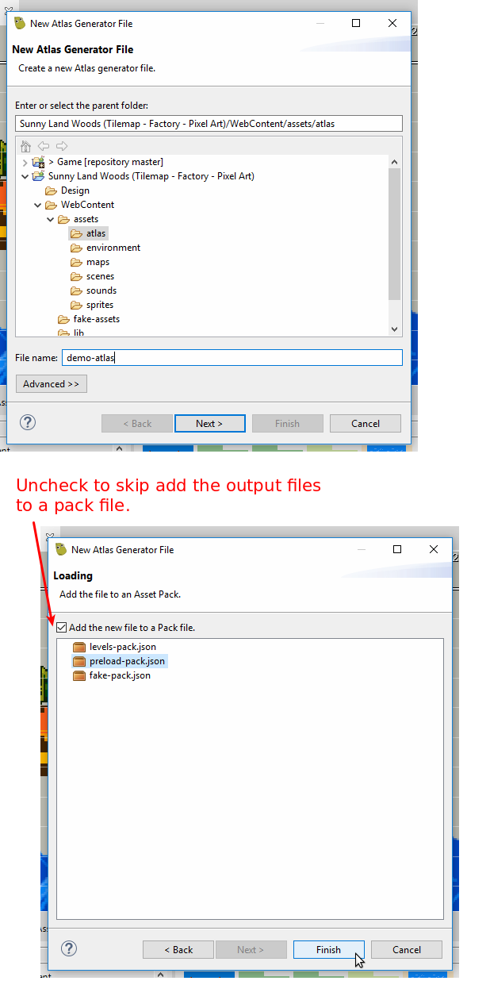
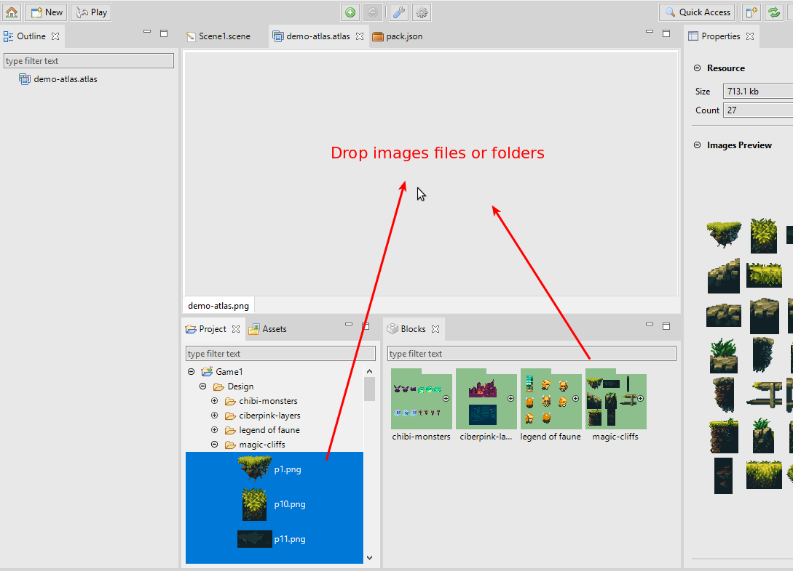
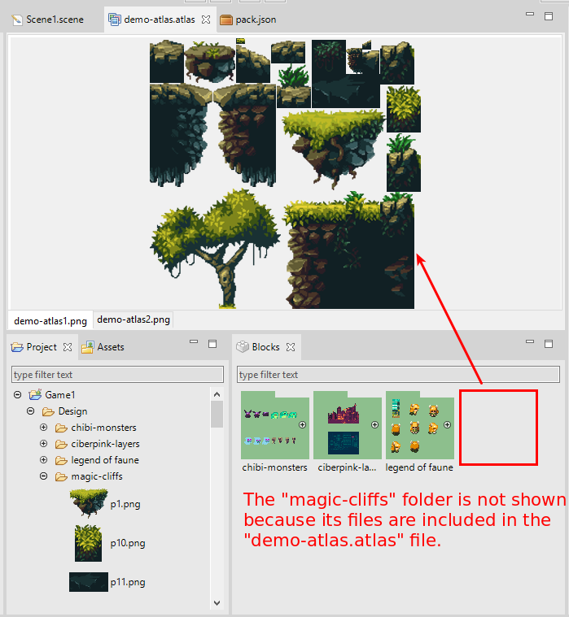
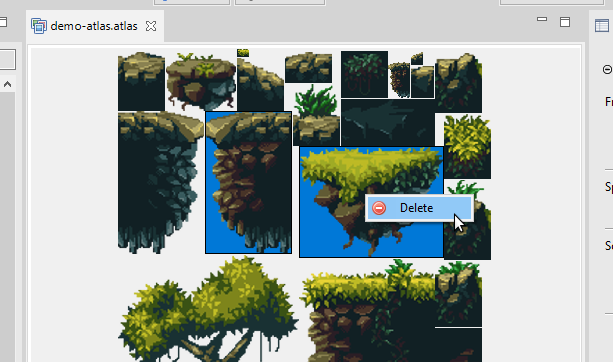
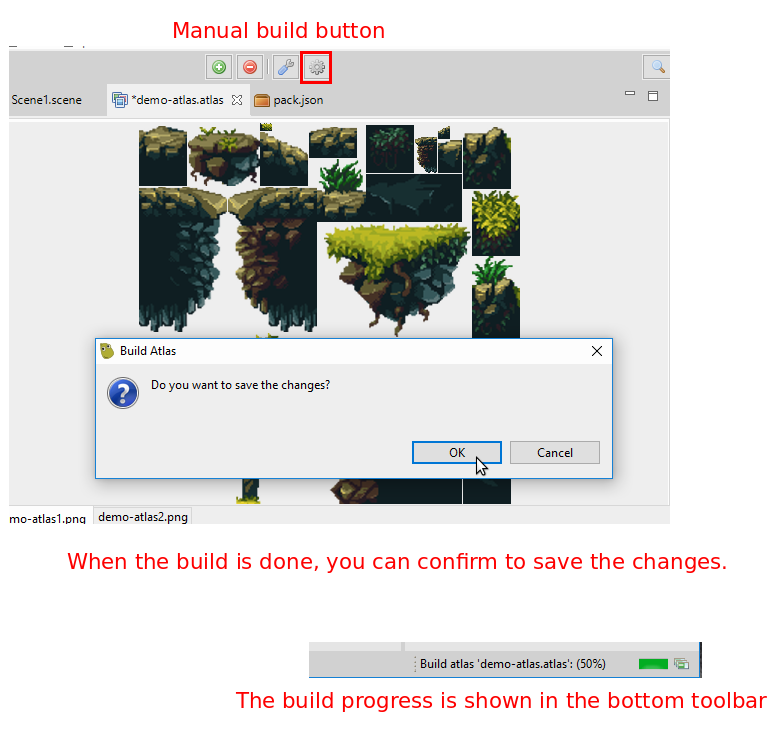
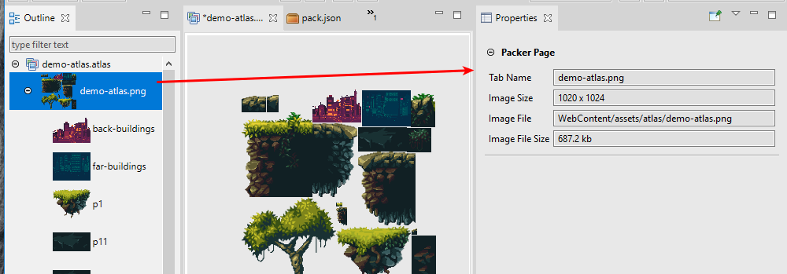
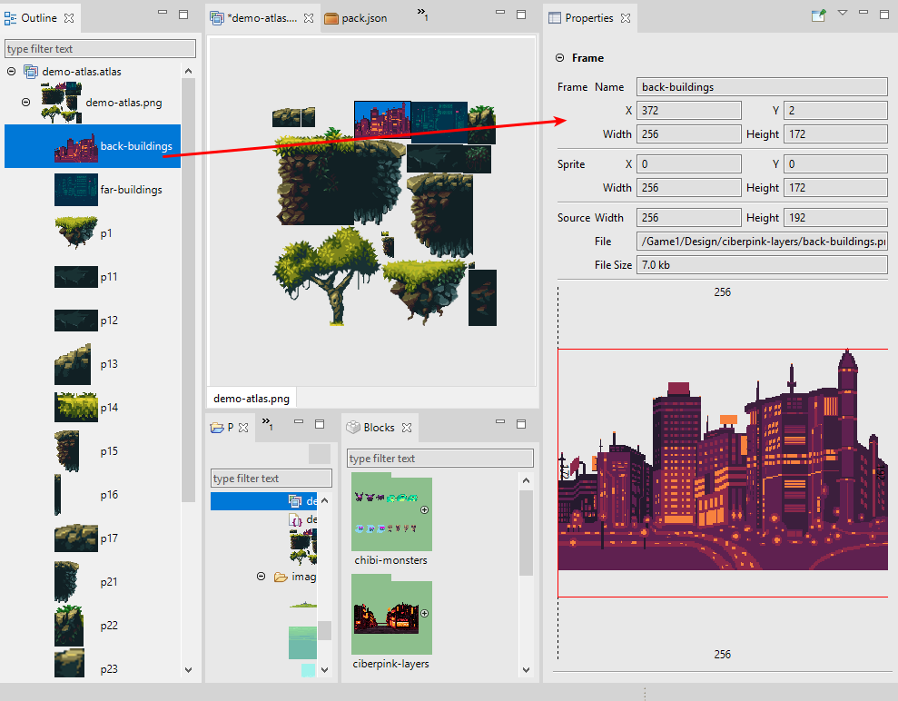

.. include:: _header.rst
   
.. sectnum::
   :depth: 3
   :start: 3

Texture Packer Editor
=====================

The packing of images in a textures atlas is a widely used technique for game development. It improves the game performance (especially in a WebGL context) and reduces the size of the game (a plus for browser games).

There are several tools, free and commercial, to create a texture atlas. In the Phaser_ community, the `TexturePacker <https://www.codeandweb.com/texturepacker>`_ developed by `CodeAndWeb <https://www.codeandweb.com>`_ is very popular and has built-in support for Phaser_.

|PhaserEditor|_ has its own texture packer, based on the `LibGDX tools <https://github.com/libgdx/libgdx/tree/master/extensions/gdx-tools>`_. It uses the MaxRects algorithm, that provides a high packing ratio.

Create a new atlas file
-----------------------

The Texture Packer uses ``.atlas`` files as configurations. To pack your images, you should create an atlas file with the wizard **New Texture Packer File**.

`Learn more about resource wizards <workbench.html#resource-wizards>`_

The **Texture Packer File** wizard shows two pages. The first page is common to all the file wizards, you should set the name and path of the file. We recommend creating the atlas file in the "assets" folder of your game because the output files will be placed in the same folder.

The second page allows you to automatically add the generated atlas files (``.json`` + ``.png``) in a selected `pack file <asset-pack-editor.html>`_.

The ``.atlas`` file may be excluded from the distribution of your game. Only the output files: the packed textures and the Phaser_ JSON atlas file are needed.

Add images to the atlas
-----------------------

To add images to the atlas, drag the files from the `Project view <workbench.html#project-view>`_ or the `Blocks view <workbench.html#blocks-view>`_ and drop them into **Texture Packer Editor**. You can drop folders too, the editor will scan for the images and add them.

The `Blocks view`_ shows the candidates images to be added to the atlas. The criterions to include an image file in the `Blocks view`_ is:

* The image file does not belong to the ``WebContent`` folder tree.
* The image file is not included in any **Texture Packer Editor** file (``*.atlas``).

If you have a lot of huge images in your project, it may impact the IDE performance. We strongly recommend keeping your project clean of images that are not used by any of the |PhaserEditor|_ files or the game files.

`Learn more about resource filters <workbench.html#resource-filters>`_

Delete images from the atlas
----------------------------

Select the images in the editor or the `Outline view <workbench.html#outline-view>`_  and press the  ``Del`` key or the **Delete** option of the context menu. You have to save the editor to persist the changes.

Build atlas
-----------

When you add or remove images in the **Texture Packer Editor**, it re-builds the atlas. However, you may want to force a build when you change atlas settings or the source images. Note when you perform a build you should save the editor to persist the changes, including the output files.

The editor builds an atlas with the `multi-atlas <https://photonstorm.github.io/phaser3-docs/Phaser.Loader.LoaderPlugin.html#multiatlas__anchor>`_ format. It means multiple images will be generated if needed.

Click on the **Build Atlas** button to force a build.

Packing settings
----------------

You can adjust the texture packing with the following parameters:

============================== ==========================================================
Parameter                      Documentation
============================== ==========================================================
**Min/Max Size**               To change the size of the texture image. There are cases where the editor generates more than one page (images), to fit the given size. However, you can change the max size of the texture to make space for all the sprites.
**Size constraints**           You can select **Any Size** (default) or **POT (Power of 2)**. In the second case the editor generates a texture with a size power of 2. In some platforms this kind of textures performs better.
**Padding**                    It controls the spacing between the sprites. It is useful to remove artifacts from sprites animations, tile sprites, in general when the source images has color pixels in the borders. By default it puts 2.
**Strip white spaces**         To remove the extra space of sprites. If your source images have extra space (transparent areas) around the picture, then activating these parameters the editor generates a texture that removes that spaces and a JSON file that specify to Phaser to render the sprites with the right spacing. By default these parameters are on.
**Use parent's folder name**   Prepends the parent folders name to the frames name. Many times developers group the source images in different folders with a special meaning, for example, the images are grouped in an **Attacking** and **Idle** folders, so, by enabling this parameter, the names of the folders are prepended to the name of the frames: **Attacking_001** .. **Attacking_010**, **Idle_001** .. **Idle_010**. This naming convention may be useful for `automatic animations creation <animations-editor.html>`_.
**Use indexes**                To sort the sprites by using a **_01.png** suffix in the source files.
**Grid Layout**                       To pack the images in a uniform grid. You can use this together with the Indexes option to create spritesheets.
**Debug**                      Paints the bound of the sprites in the output image.
============================== ==========================================================

Click on the **settings button** to open the packing parameters in the `Properties view <workbench.html#properties-view>`_.

.. image:: images/texture-packer-editor/packing-properties.png
   :alt: Texture packer settings.

Properties of frames and pages
------------------------------

When you select a frame or a page in the `Outline view`_ or the editor, the `Properties view`_ will show the correspondent information.

Selected page properties:

Selected frame properties:

