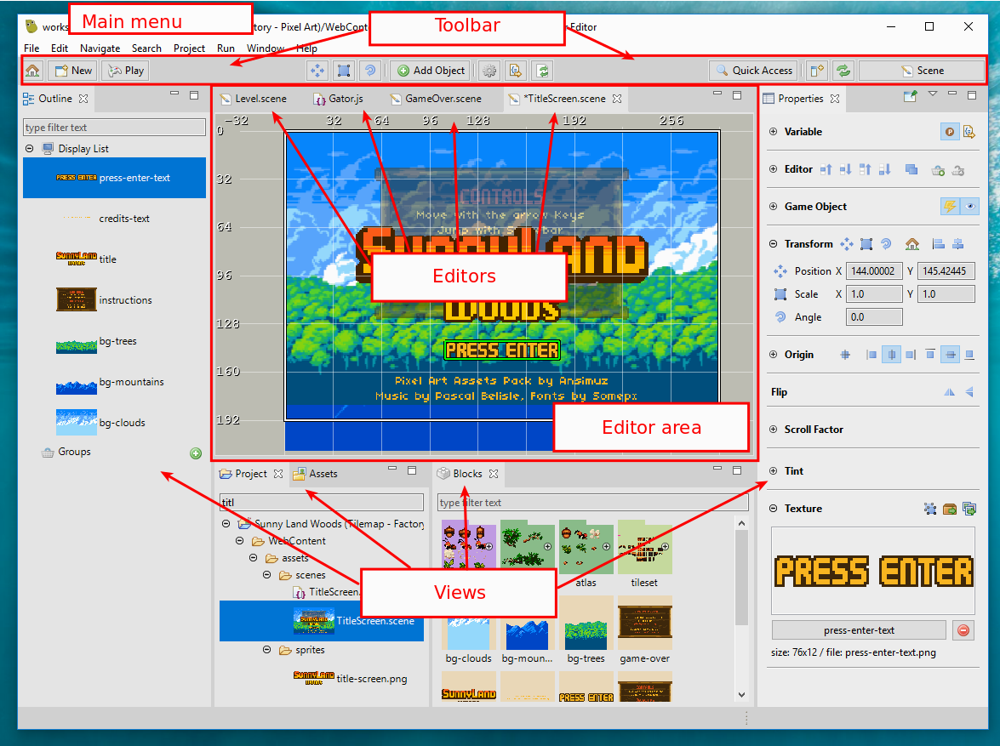

.. sectnum::
   :depth: 3
   :start: 2

Workbench
=========

Phaser Editor is based on the Eclipse IDE and inherits its concepts and features. In this chapter we explain some key concepts that are common to modern editors and IDEs but could be different in Phaser Editor.

The Eclipse IDE is a general purpose tool that is open, flexible and powerful. Maybe for this reason, it results complex for some users, but we believe that we can customize and transform the Eclipse IDE into a friendly and productive tool for game development.

When you run the editor, it opens the workbench in the selected workspace. The workbench contains windows, and each window contains parts (views and editors), an editor area, main toolbar and main menu. All these elements are grouped and layout in a perspective, and you can switch from one perspective to other. Different windows may contain different perspectives. For example, you can open the Scene design perspective in a window and the Phaser Labs perspective in other window, that you can move to a second monitor.

`Learn more about the workbench in the Eclipse Help <https://help.eclipse.org/2019-06/topic/org.eclipse.platform.doc.user/gettingStarted/qs-02a.htm?cp=0_1_0_0>`_

Views
-----

A view is a small window, or better say, a **part**, inside the workbench window. They are commonly used to present the information of certain resource (workspace, project or file). A view may have a menu or/and a toolbar, with commands that only affects the view's content.

.. image:: images/view-menu-toolbar.png

Most of the view are about to navigate content or show the properties of an object. However, some views allow to edit content, but that content is modified at the moment, there is not the **dirty** concept available in editors. A view may persists its state in the workspace metadata.

You can add, close, stack, dock, minimize/maximize views. The views layout are part of the perspective and is persisted across sessions or perspective switching.

`Learn more about views in the Eclipse Help <https://help.eclipse.org/2019-06/topic/org.eclipse.platform.doc.user/gettingStarted/qs-02e.htm?cp=0_1_0_1_1>`_

Editors
-------

The editors are, like the views, **parts** of the workbench window. You can close, add, stack, dock, minimize/maximize editors, but the editor layout are not part of the perspective. This means, when you switch to other perspective, the editors remains open. Only the editor area is affected.

Editors have input. The common input of an editor is a file. The editors have a **dirty** state, that is activated when the content is modified but not saved. When you close an editor it shows a confirmation dialog if its state is **dirty**.

An editor can contribute items to the `main toolbar <#the-main-toolbar>`_. When an editor is activated, the center of the toolbar is filled with its contributions.

.. image:: images/workbench/toolbar-contributions.png

`Learn more about the editors in the Eclipse Help <https://help.eclipse.org/2019-06/topic/org.eclipse.platform.doc.user/gettingStarted/qs-02d.xhtml?cp=0_1_0_1_0>`_

Perspectives
------------

A perspective groups views and menu items with a common purpose. For example, the `Scene perspective <#scene>`_ provides the views to better design scenes and related assets.

The layout of the views and the editor area is persisted in the perspective. If you change the layout, the perspective is modified. Actually, you can reset a perspective or save its layout as a new perspective. 

In the `Window → Perspective` menu is listed the operations you can do with perspectives (Open, Customize, Save As, Reset, Close, Close All). In addition, in the toolbar you can do a few of them:

.. image:: images/toolbar-perspective-section.png

1. Open a view.
2. Reset the perspective.
3. Switch to other perspective.

`Learn more about perspectives in the Eclipse Help <https://help.eclipse.org/2019-06/topic/org.eclipse.platform.doc.user/gettingStarted/qs-43.htm?cp=0_1_0_15>`_

Workspace, projects and resources
---------------------------------

The workspace is a folder that stores the projects and metadata (like preferences or any other data needed by the plugins). When you run the editor, it first `opens the launcher <first-steps.html#run-phaser-editor-2d>`_, to select the workspace folder. Then, the workbench is opened and presents all the data of the selected workspace.

Usually, to develop a game you only need a project. The Eclipse IDE supports references between projects but it is something that you don't really need for Phaser development. A common setup is to create a workspace for each game, with the main game project and maybe other projects related to the game: to test or learn some Phaser features or develop ideas related to the game.

Phaser Editor introduces the concept of `active project <#active-project>`_. It is a project selected by the user as the working project, and many of the UI (views, toolbars, dialogs, commands) presents only the information in the scope of that project.

Resources
~~~~~~~~~

The resources are the logical elements of the workspace, and follow this hierarchy:

* Workspace Root

    * Projects

        * Folders and files

Physically, a project could be created in any location of the filesystem, but the workspace keeps a reference to it. It is a common practice to create the workspace folder in a private user space, but place the projects in shared repositories.

Folders and files are always logically inside the project. Usually, folders and files are physically stored in the project, but you can create links to folders and files located in any location of the filesystem.

The **resources** is a powerful and flexible tool you have to adapt your project to different scenarios. Phaser Editor introduced the `Project view <#project-view>`_ to navigate and create the resources or the `active project <#active-project>`_, but the Eclipse IDE provides more `advanced and general tools <https://help.eclipse.org/2019-06/help/topic/org.eclipse.platform.doc.user/tasks/tasks-1c.htm?cp=0_3_6>`_.

`Learn more about resources in the Eclipse Help <https://help.eclipse.org/2019-06/help/topic/org.eclipse.platform.doc.user/concepts/concepts-12.htm?cp=0_2_1_0>`_

Resource properties
~~~~~~~~~~~~~~~~~~~

When you select a resource in the `Project view <#project-view>`_, the main properties are shown in the `Properties view <#properties-view>`_, together with some actions like open the resource in the `Terminal view <#the-terminal-view>`_ or the OS explorer. The project resource has special properties like the Scene size and language.

.. image:: images/workbench/project-properties.png
   :alt: Project properties.

Cleaning projects
~~~~~~~~~~~~~~~~~

Phaser Editor builds an internal model of many of the objects you define in the different files. When you add, delete or modify a set of resources, the project builders are executed and process the affected resources, and update the internal model. Let's see an example:

All the asset keys you define in the `pack files <asset-pack-editor.html>`_ are part of the internal model, and UI parts like the `Animations Editor <animations-editor.html>`_ and the `Scene Editor <scene-editor.html>`_ read that model to find the resources needed to render the objects. The scene files and animations files do not keep a reference to the physical images, else they store the name of the asset keys, and at render time, they look into the internal project model the asset associated to a key and get the physical image location from the asset properties. When you modify a pack file, the internal model is updated, and the editors are refreshed so they will show the new content, if it is the case.

If for any reason, you think the editors or views are showing outdated or wrong information, you can force to build the internal model of the project. To do this, you can open the **Clean** dialog in `Project → Clean...`

.. image:: images/workbench/clean-project-dialog.png
   :alt: Clean project dialog.

...or you can select a project in the `Project view <#project-view>`_ and click on the **Clean** button of the **Project** section of the `Properties view <#properties-view>`_.

.. image:: images/workbench/clean-project-button.png
   :alt: Clean project button in the Properties view.
   
Phaser Project structure
------------------------

Active project
--------------

To simplify the workflow, Phaser Editor uses the concept of **active project**. The idea is to put some of the UI elements in the scope of that project.

* `Project <#project-view>`_ and `Assets <#assets-view>`_ views: only show the content of the active project.

* The **New** button of the `toolbar <#the-main-toolbar>`_: the resources are created in the active project.

* The **Play** button of the `toolbar <#the-main-toolbar>`_: it opens the active project in the browser.

You can activate any project at any time. There different ways to do this:

* When you create a new project, it is set as the active project.

* In the **Home** button of the `toolbar <#the-main-toolbar>`_, right click and select the active project.
  
  .. image:: images/open-project-dialog.png
     :alt: Dialog to change the active project.

* In the `Start <#start-perspective>`_ view, click on a project link.

  .. image:: images/workbench/start-project-links.png
     :alt: Start perspective open project links.

`Learn more about the active project <first-steps.html#switching-projects>`_

Preferences
-----------
 

In construction.

Offline help
------------

In construction.

The main toolbar
----------------

In construction.

Properties view
---------------

In construction.

Outline view
------------

In construction.

Blocks view
-----------

In construction.

Project view
------------

In construction.

The Terminal view
-----------------

In construction.

Main perspectives
-----------------

In construction.

Start perspective
~~~~~~~~~~~~~~~~~

In construction.

Scene perspective
~~~~~~~~~~~~~~~~~

In construction.

Git perspective
~~~~~~~~~~~~~~~

In construction.

Update the IDE
--------------

In construction.