.. include:: _header.rst

.. sectnum::
   :depth: 3
   :start: 3

Workbench
=========

|PhaserEditor|_ is based on the |EclipseIDE|_ and inherits its concepts and tools. In this chapter we explain some key concepts of the workbench, that is the term used in |EclipseIDE|_ to refers to the desktop development environment.

`Learn more in the Eclipse Help about the workbench <https://help.eclipse.org/2019-06/topic/org.eclipse.platform.doc.user/gettingStarted/qs-02a.htm?cp=0_1_0_0>`_

The |EclipseIDE|_ is a general purpose tool that is open, flexible and powerful. Maybe, for this reason, it is complex for some users, but we believe that we can customize and transform it into a friendly, modern and productive tool for game development.

When you run the editor, it opens the workbench in the selected workspace. The workbench contains windows, and each window contains parts (views and editors), an editor area, `main toolbar`_ and main menu. All these elements are grouped and layout in a perspective, and you can switch perspectives. Different windows may contain different perspectives. For example, you can open the Scene design perspective in a window and the Phaser Labs perspective in another window, that you can move to a second monitor.

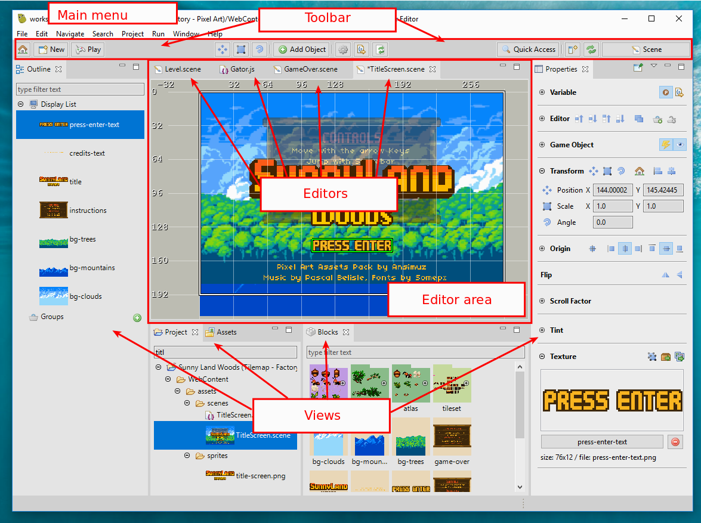

Views
-----

A view is a small window, or better say, a **part**, inside the workbench window. They are commonly used to present the information of a certain resource (workspace, project or file). A view may have a menu or/and a toolbar, with commands that only affect the view's content.

`Learn more about views in the Eclipse Help <https://help.eclipse.org/2019-06/topic/org.eclipse.platform.doc.user/gettingStarted/qs-02e.htm?cp=0_1_0_1_1>`_

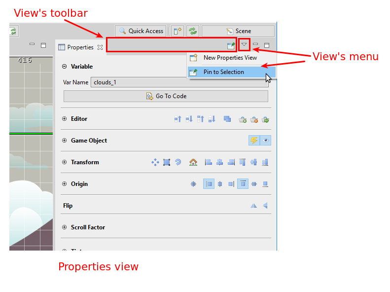

Most of the view is about to navigate content or show the properties of an object. However, some views allow to edit content, but that content is modified at the moment, there is not the **dirty** concept available in editors. A view may persist its state in the workspace metadata.

You can add, close, stack, dock, minimize/maximize views. The views layout are part of the perspective and is persisted across sessions or perspective switching.

Editors
-------

The editors are, like the views, **parts** of the workbench window. You can close, add, stack, dock, minimize/maximize editors, but the editor layout is not part of the perspective. This means, when you switch to another perspective, the editors remain open. Only the editor area is affected.

`Learn more about editors in the Eclipse Help <https://help.eclipse.org/2019-06/topic/org.eclipse.platform.doc.user/gettingStarted/qs-02d.xhtml?cp=0_1_0_1_0>`_

Editors have input. The common input of an editor is a file. The editors have a **dirty** state, that is activated when the content is modified but not saved. When you close an editor it shows a confirmation dialog if its state is **dirty**.

An editor can contribute items to the `main toolbar`_. When an editor is activated, the center of the toolbar is filled with its contributions.

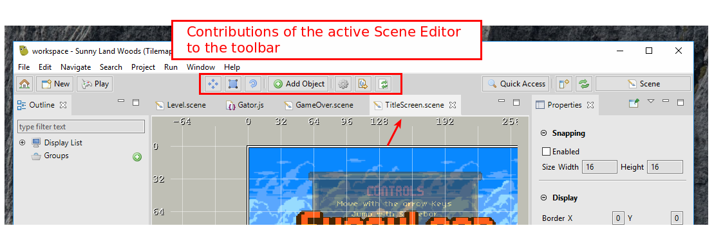

Perspectives
------------

A perspective groups views and menu items with a common purpose. For example, the `Scene perspective`_ provides the views to better design scenes and related assets.

`Learn more about perspectives in the Eclipse Help <https://help.eclipse.org/2019-06/topic/org.eclipse.platform.doc.user/gettingStarted/qs-43.htm?cp=0_1_0_15>`_

The layout of the views and the editor area is persisted in the perspective. If you change the layout, the perspective is modified. Actually, you can reset a perspective or save its layout as a new perspective. 

In the *Window* |-| *Perspective* menu has listed the operations you can do with perspectives (Open, Customize, Save As, Reset, Close, Close All). In addition, in the toolbar you can do a few of them:

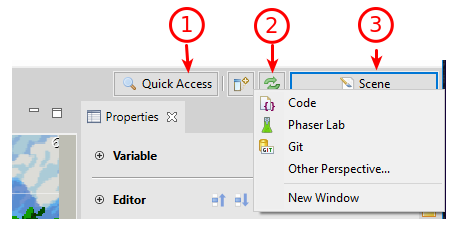

1. Open a view.
2. Reset the perspective.
3. Switch to another perspective.

Workspace, projects, and resources
----------------------------------

The workspace is a folder that stores the projects and metadata (like preferences or any other data needed by the plugins). When you run the editor, it first `opens the launcher <first-steps.html#run-phaser-editor-2d>`_, to select the workspace folder. Then, the workbench is opened and presents all the data of the selected workspace.

`Learn more about resources in the Eclipse Help <https://help.eclipse.org/2019-06/topic/org.eclipse.platform.doc.user/concepts/concepts-12.htm?cp=0_2_1_0>`_

Usually, to develop a game you only need a project. The |EclipseIDE|_ supports references between projects but it is something that you don't really need for Phaser_ development. A common setup is to create a workspace for each game, with the main game project and maybe other projects related to the game: to test or learn some Phaser_ features or develop ideas related to the game.

|PhaserEditor|_ introduces the concept of `active project`_. It is a project selected by the user as the working project, and many of the UI (views, toolbars, dialogs, commands) presents only the information in the scope of that project.

Resources
~~~~~~~~~ 

The resources are the logical elements of the workspace, and follow this hierarchy:

* Workspace Root

* Projects

* Folders and files

Physically, a project could be created in any location of the filesystem, but the workspace keeps a reference to it. It is a common practice to create the workspace folder in a private location, but place the projects in shared repositories.

Folders and files are always logically inside the project. Usually, folders and files are physically stored in the project, but you can create links to folders and files located in any location of the filesystem. In addition to links, you can create virtual folders. Virtual folders are folders that exist only in the |EclipseIDE|_ workspace tree and have no file system location.

`Learn more about virtual folders in the Eclipse Help <https://help.eclipse.org/2019-06/topic/org.eclipse.platform.doc.user/concepts/virtualfolders.htm?cp=0_2_1_3>`_

The **resources** is a powerful and flexible tool you have to adapt your project to different scenarios. |PhaserEditor|_ introduced the `Project view`_ to navigate and create the resources or the `active project`_, but the |EclipseIDE|_ provides more `advanced and general tools <https://help.eclipse.org/2019-06/topic/org.eclipse.platform.doc.user/tasks/tasks-1c.htm?cp=0_3_6>`_.

Resource properties
~~~~~~~~~~~~~~~~~~~

When you select a resource in the `Project view`_, the main properties are shown in the `Properties view`_, together with some actions like open the resource in the `Terminal view`_ or the OS explorer. The project resource has special properties like the Scene size and language.

.. image:: images/workbench/project-properties.png
   :alt: Project properties.

Resource filters
~~~~~~~~~~~~~~~~

When you create a project, it automatically configures two resource filters to exclude ``node_modules`` and ``.git`` folders.

It is important to exclude from the project all the files that are not related directly to the game. |PhaserEditor|_ performs intensive resource analysis to compute its internal model, detects content types, makes the thumbnails and other operations. If your project has hundreds of little files (like may happens in NodeJS modules), the build process could slow down the IDE. We recommend to create your Phaser game content in a project, and the server side or other related software in another project ---actually, you can consider other IDE, like |vscode|_.

If you include source repositories it may be worst because files could be duplicated and it will create a mess in the internal model. The best practice is to store the projects inside the repositories, not the repositories inside the projects (or just add a resource filter to exclude it).

.. warning:: Don't exclude the ``.project`` file of your project. It is required by the IDE and excluding it may create unexpected behaviors.

`Learn more in the Eclipse Help about resource filters <https://help.eclipse.org/2019-06/topic/org.eclipse.platform.doc.user/concepts/resourcefilters.htm?cp=0_2_1_5>`_

To manage the resource filters, open the **Properties dialog** of a resource. Select the folder or project and do any of these actions: 

* Press ``Alt+Enter``.
* Open the context menu (right-click) and select *Properties*.
* Click the **All Properties** button of the **Resource** section in the `Properties view`_.

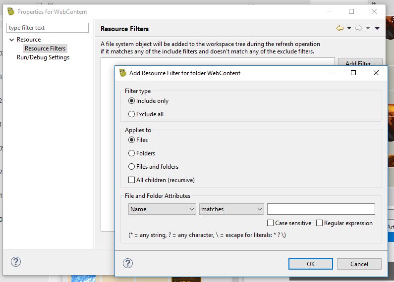

Cleaning projects
~~~~~~~~~~~~~~~~~

|PhaserEditor|_ builds an internal model of many of the objects you define in the different files. When you add, delete or modify a set of resources, the project builders are executed and process the affected resources, and update the internal model. Let's see an example:

All the asset keys you define in the `pack files <asset-pack-editor.html>`_ are part of the internal model, and UI parts like the |AnimationsEditor|_ and the |SceneEditor|_ read that model to find the resources needed to render the objects. The scene files and animations files do not keep a reference to the physical images, else they store the name of the asset keys, and at render time, they look into the internal project model the asset associated to a key and get the physical image location from the asset properties. When you modify a pack file, the internal model is updated, and the editors are refreshed so they will show the new content if it is the case.

If for any reason, you think the editors or views are showing outdated or wrong information, you can force to build the internal model of the project. To do this, you can open the **Clean** dialog in *Project* |-| *Clean...*

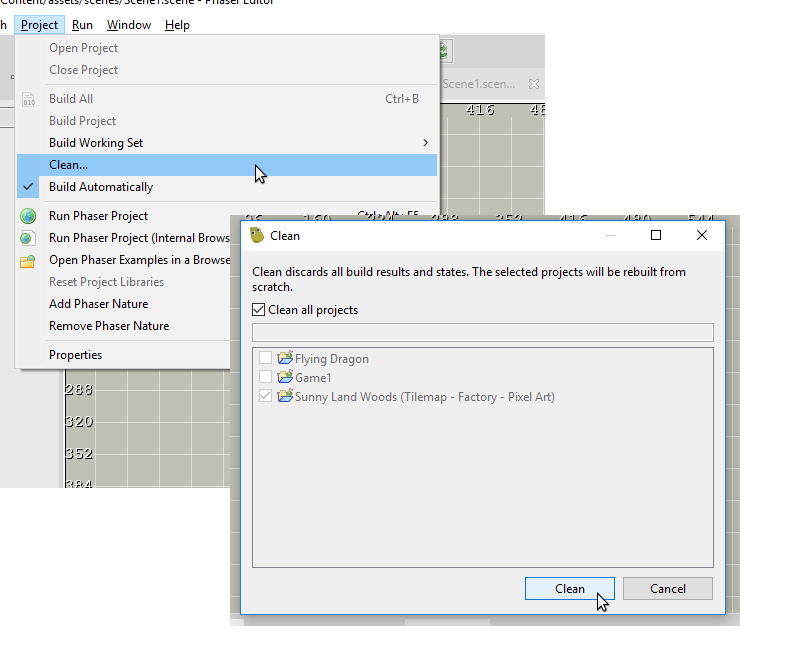

Also, or you can select a project in the `Project view`_ and click on the **Clean** button of the **Project** section of the `Properties view`_.

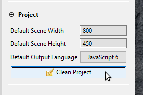

Or just click on the **Refresh** button in the `Project view`_ toolbar:

.. image:: images/workbench/clean-project-button-toolbar.png
   :alt: Clean project button in the toolbar.

Resource wizards
----------------

|PhaserEditor|_ uses wizards to create any type of resource and set the initial parameters. All these wizards share a group of parameters common to all resources, like the name, the path inside the workspace and the physical location (it may be a link). You can open the wizards in different parts of the IDE:

`Learn more about wizards in the Eclipse Help <https://help.eclipse.org/2019-06/nav/0_4_4_2>`_

* In the main menu: *File* |-| *New*.
* In the context menu of the `Project <#project-view>`_ or `Project Explorer view`_.
* In the **New** button of the `main toolbar`_.
* In the `Quick Access dialog`_ (search for ``new item``).
* In the `Chains <phaser-labs.html#chains-view>`_ or `Phaser Examples <phaser-labs.html#phaser-examples-view>`_ views, where you can create a project with the selected example.

Note you can group the wizards in two groups: file wizards and project wizards. |PhaserEditor|_ provides a wizard to create a game project with a basic structure, ready to start coding the game, and another wizard to create a project based on an example, that you can read and modify to learn Phaser_ or |PhaserEditor|_ features.

Phaser Project Wizard
~~~~~~~~~~~~~~~~~~~~~

This wizard creates a project ready to start making your game. The wizard contains two pages. The first page shows the common parameters for all the projects:

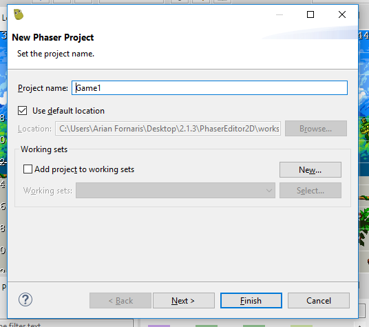

.. list-table::
   :header-rows: 1

   * - Parameter
     - Description
   * - **Project name**
     - Should be unique in the workspace.
   * - **Default location**
     - By default, the project is physically created inside the workspace folder, but you can choose another location.
   * - Working sets
     - You can add the project to a `working set <https://help.eclipse.org/2019-06/index.jsp?nav=%2F0_4_4_2>`_, where you can logically group of your projects. This is a concept used by the `Project Explorer view`_.

The second page shows the parameters used to customize the project content. There are two groups, the **Game Configuration** and the **Code** parameters. The first group uses a subset of the `Phaser Game Configuration <https://photonstorm.github.io/phaser3-docs/Phaser.Types.Core.html#.GameConfig>`_ and are included in the code.

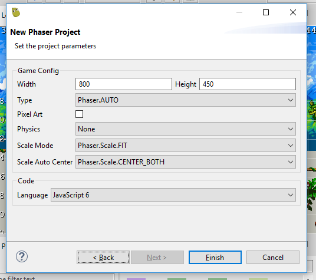

.. list-table::
   :header-rows: 1

   * - Parameter
     - Description
   * - **Width** and **Height**
     - The width and height of the game, in pixels.
   * - **Type**
     - Which renderer to use. ``Phaser.AUTO``, ``Phaser.CANVAS``, ``Phaser.HEADLESS``, or ``Phaser.WEBGL``. ``AUTO`` picks ``WEBGL`` if available, otherwise ``CANVAS``.
   * - **Pixel Art**
     - Prevent pixel art from becoming blurred when scaled. It will remain crisp (tells the WebGL renderer to automatically create textures using a linear filter mode).
   * - **Physics**
     - The Physics system (``NONE``, ``ARCADE``, ``IMPACT``, ``MATTER``).
   * - **Scale Mode**
     - The scale mode as used by the Scale Manager.
   * - **Scale Auto Center**
     - Automatically center the canvas within the parent?
   * - **Language**
     - The language to be used to code the game: JavaScript or TypeScript. In both cases, the project will be configured to be compatible with |vscode|_
    

Project structure
+++++++++++++++++

The project structure is pretty similar to a static web project. It contains a ``WebContent`` folder with the files that are part of the game. Especially, it contains the ``index.html`` file. It is the root of the game.

In the following table, we provide a short description of each file of the ``WebContent`` folder.

.. table:: Files common to all Phaser projects   

   ================================== =======================================================
   ``index.html``                     The entry point of the game. It is very basic, and loads the ``main.js`` file. 
   ``main.js``                        The Phaser_ game instance is created. It starts a ``Boot`` scene that is part of this file too.
   ``jsconfig.json``                  This is the "project" file used by the Language Server include in |PhaserEditor|_. If you are familiar with |vscode|_ you know what this file is. If you create a TypeScript project, then you will find a ``tsconfig.json`` file instead.
   ``typings/phaser.d.ts``            The type definitions of the Phaser_ API. It is used by the Language Server in both type of projects, JavaScript and TypeScript.
   ``lib/phaser.js``                  Contains the Phaser_ framework. You can replace it by a newer version or a custom build. It is loaded by the ``index.html`` file, so you have full control to load the Phaser_ runtime.
   ================================== =======================================================

.. table:: Files created by the Phaser Project wizard:

   ================================== =======================================================
   ``assets/pack.json``               A manifest of the assets used by the game. This file is loaded in the ``Boot`` scene, but you are free to change it. Actually, you are free to change anything. `Learn more about the Asset Pack Editor and pack files <asset-pack-editor.html>`_.
   ``assets/animations.json``         An empty animations file. It is included in the ``pack.json`` file. `Learn more about sprite animations and the Animations editor <animations-editor.html>`_.
   ``assets/atlas/textures.atlas``    An empty texture atlas file. `Learn more about the Texture Packer Editor and atlas file <texture-packer-editor.html>`_.
   ``assets/atlas/textures.json``     The Phaser_ atlas file derived from the ``texture.atlas`` file ---generated by the `Texture Packer Editor <texture-packer-editor.html>`_---. It is included in the ``pack.json`` file.
   ``assets/scenes/Scene1.scene``     An empty scene file. You can add objects to this scene using the |SceneEditor|_.
   ``assets/scenes/Scene1.js``        The compiled scene file. It is included in the ``pack.json`` file and is the thing you see when play the project.
   ================================== =======================================================

The other top-level folder is the ``Design`` folder, where you can store files related to the design process. Is very common to store there the original images used by the `Texture Packer Editor <texture-packer-editor.html>`_, to generate the Phaser_ atlas files.

Phaser Example Project Wizard
~~~~~~~~~~~~~~~~~~~~~~~~~~~~~

Learn by examples is a common practice in Phaser_. The Phaser_ team spend a lot of time on creating examples that showcase certain features or concepts. In |PhaserEditor|_ we follow that practice and provide a few numbers of examples that show how you can use the different tools in the editor. 

In the Phaser Example Project wizard, you can select an example from |PhaserEditor|_ or from the |PhaserOfficialExamples|_, and create a project.

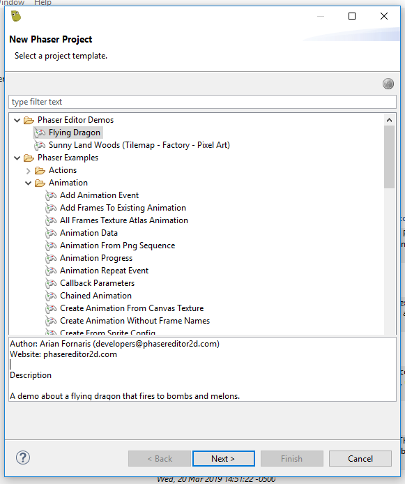

This wizard can be open as any other wizard, but also from views that display the |PhaserOfficialExamples|_, like the `Chains <phaser-labs.html#chains-view>`_ and the `Phaser Examples <phaser-labs.html#phaser-examples-view>`_ view.

Import and Export wizards
-------------------------

The Import wizards are very useful, especially the one to import projects into the workspace. The workspace use to be private, local, and the projects are often shared in SCM systems or any other place, and then imported into the workspace. You can zip a project and publish it in your blog, in a tutorial article.

When you import a project, you have the option to create a copy in the workspace or link the project in the workspace. You have to be careful, because if the project is part of a source repository (like a Git repository) and you copy it in the workspace, then the changes are not part of the repository, in that case, the correct is to import a link to the project.

To open the import wizard click on *File* |-| *Import...*. The dialog shows the elements you can import, in the case of the projects, select the **Existing Projects into the Workspace**. Note another useful element you can import are preferences. `Learn more about the import wizards in the Eclipse Help <https://help.eclipse.org/2019-06/topic/org.eclipse.platform.doc.user/reference/ref-70.htm?cp=0_4_4_2_4>`_.

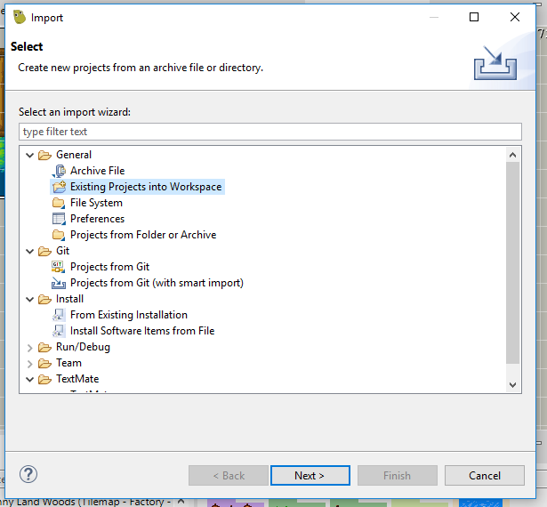

The export wizard is similar to the import wizard. Open it on the menu *File* |-| *Export...*. It opens a dialog with the elements you can export, for example, the preferences.

`Learn more about the export wizard in the Eclipse Help <https://help.eclipse.org/2019-06/topic/org.eclipse.platform.doc.user/reference/ref-71.htm?cp=0_4_4_2_5>`_

Preferences
-----------

Almost every customization you can do in the IDE is via the Preferences. The preferences are stored in the workspace and you can `import or export <#import-and-export-wizards>`_ them, or part of them. You can open the **Preferences Dialog** in the menu *Window* |-| *Preferences*.

`Learn more about Preferences in the Eclipse Help <https://help.eclipse.org/2019-06/topic/org.eclipse.platform.doc.user/reference/ref-72.htm?cp=0_4_1>`_

Themes
~~~~~~

The UI and editors themes is a subject where many of you have a very personal preference. |PhaserEditor|_ provides a default light theme in addition to those provided by the |EclipseIDE|_. You can change the theme in *General* |-| *Appearance*. 

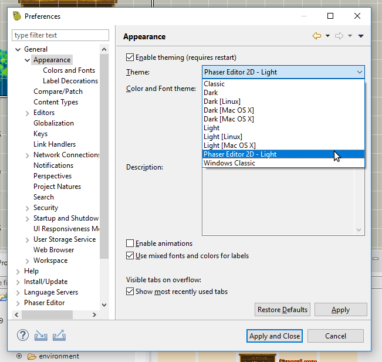

You can even disable theming, and the editor will look more like a native application (it requires a restart).

Key Bindings
~~~~~~~~~~~~

Commands key bindings is a powerful tool in |EclipseIDE|_. You can assign keys to a command in the *General* |-| *Keys* preferences. 

`Learn more about keys preferences in the Eclipse Help <https://help.eclipse.org/2019-06/topic/org.eclipse.platform.doc.user/concepts/accessibility/keyboardshortcuts.htm?cp=0_4_1_33>`_

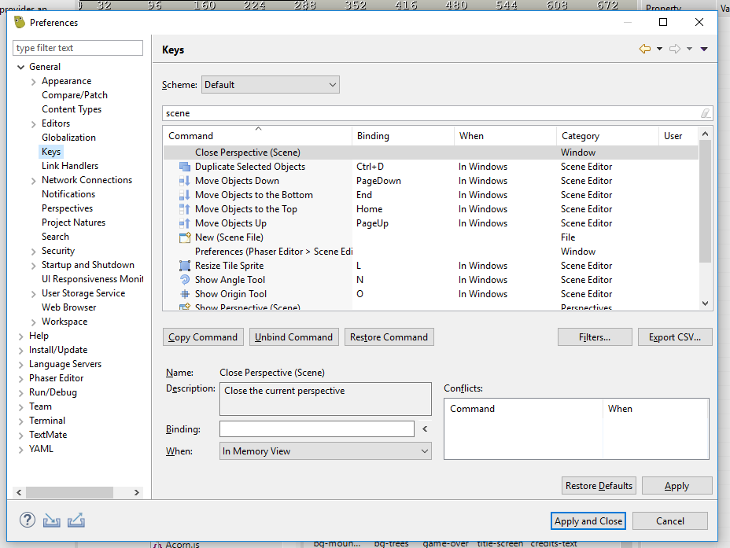

Phaser Editor preferences
~~~~~~~~~~~~~~~~~~~~~~~~~

The **Phaser Editor** category in the **Preferences Dialog** provides the settings related to the specific tools introduced by |PhaserEditor|_:

External Code Editor preferences
~~~~~~~~~~~~~~~~~~~~~~~~~~~~~~~~

   Configures the |ExternalEditor|_.

Optimize PNG preferences
~~~~~~~~~~~~~~~~~~~~~~~~

   Configures the `PNG images optimizer <misc.html#optimize-png-images>`_.

Preview preferences
~~~~~~~~~~~~~~~~~~~

   Configures how images and other visual resources are shown in the IDE.

   .. image:: images/workbench/preferences-preview.png
      :alt: The Preview settings.

   Note there are other two subcategories, **Spritesheet**, and **Tilemap**.

Project preferences
~~~~~~~~~~~~~~~~~~~

   Some default values for every project in the workspace. When you open a `Phaser Project Wizard`_, it will use these default values. The same when you open a `Scene File Wizard <scene-editor.html#create-new-scene-file>`_.

   .. image:: images/workbench/preferences-project.png
      :alt: The default project settings.

Scene Editor preferences
~~~~~~~~~~~~~~~~~~~~~~~~

   Configures `the Scene Editor preferences <scene-editor.html#scene-editor-preferences>`_.

WebView preferences
~~~~~~~~~~~~~~~~~~~

   There are a couple of components that use a WebView or embedded browser. |PhaserEditor|_ provides two WebView implementations:

   * Platform dependent browser.
   * Chromium browser.

   In this preferences page, you can select the WebView implementation to be used. The Chromium browser is very experimental, we just recommend it in Windows systems, if the system browser does not fit your needs.

   .. image:: images/workbench/preferences-webview.png
      :alt: Default embedded browser settings.

Main toolbar
------------

The main toolbar provides buttons for common actions.

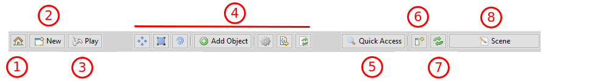

#. `Home button`_
#. `New button`_
#. `Play button`_
#. `Toolbar editor area`_
#. `Quick Access button`_
#. `Add view button`_
#. `Reset perspective button`_
#. `Open perspective button`_

.. _`Quick Access dialog`: #quick-access-button

Home button
~~~~~~~~~~~

Click on this button to switch to the `Start perspective`_. If your intention is to open another project, you can right-click on the button and select it.

You can open the same dialog with the keys ``Ctrl+Alt+P``, or searching in the `Quick Access dialog`_ for ``open project dialog``.

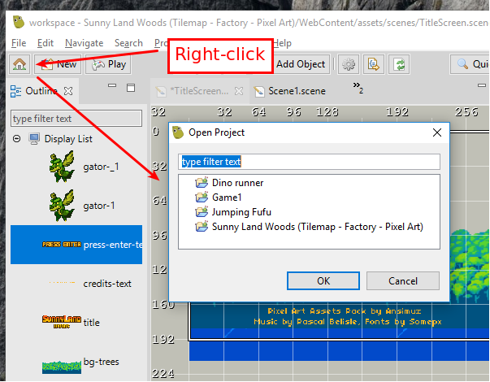

New button
~~~~~~~~~~

This button shows a list of the most common wizards to create new resources.

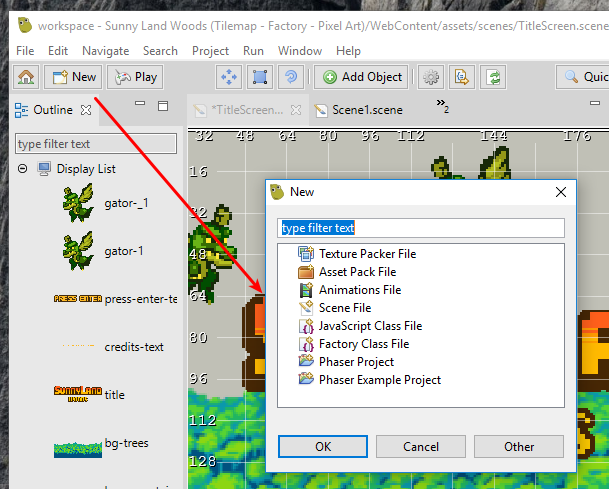

Play button
~~~~~~~~~~~

This button launches the `local web server <misc.html#built-in-web-server>`_ and the system browser and points to the ``WebContent`` of the project. In other words, it runs the game.

Other ways to run the game is pressing the keys ``Ctrl+Alt+F5`` or searching in the `Quick Access dialog`_ for ``run phaser project``.

You can configure the system browser in the `Web Browser preferences <https://help.eclipse.org/2019-06/topic/org.eclipse.platform.doc.user/reference/ref-42.htm?cp=0_4_1_53>`_.

Toolbar editor area
~~~~~~~~~~~~~~~~~~~

The center area of the toolbar is reserved for the active editor. The active editor can contribute its own buttons, with actions that affect only the editor. For example, the |SceneEditor|_ provides buttons to select a transformation tool, or a button to add a new object. The |AnimationsEditor|_ provides the buttons for the playback of the animations.

Quick Access button
~~~~~~~~~~~~~~~~~~~

This button opens the **Quick Access dialog**, where you can search for editors, views, perspectives, commands, menus, wizards, preference pages, and other sources that can be contributed by third-party plugins.

You can open this dialog with the keys ``Ctrl+3``.

`Learn more in the Eclipse Help about Navigating the user interface using the keyboard <https://help.eclipse.org/2019-06/topic/org.eclipse.platform.doc.user/concepts/accessibility/navigation.htm?cp=0_2_12_0>`_

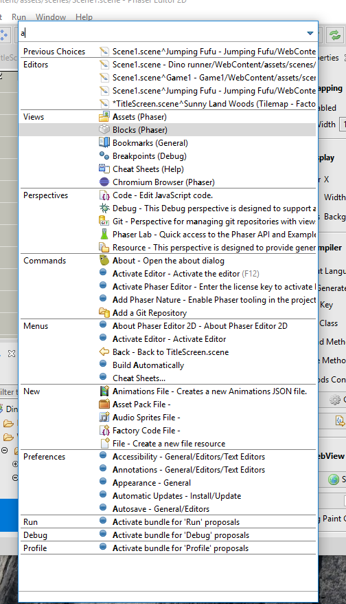

Add view button
~~~~~~~~~~~~~~~

This button launches the **Show View** dialog. Alternatives to the button is the *Window* |-| *Show View* menu and the keys ``Alt+Shift+Q, Q``.

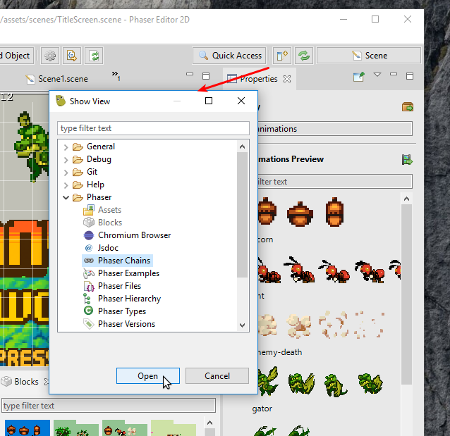

Reset perspective button
~~~~~~~~~~~~~~~~~~~~~~~~

It resets the current `perspective <#perspectives>`_ to the default layout. You can click on *Window* |-| *Perspective* |-| *Reset Perspective...* too.

Open perspective button
~~~~~~~~~~~~~~~~~~~~~~~

It shows a menu with the most used perspectives, so you can open one of them. The **Other** option launches the **Open Perspective** dialog. Also, there is the menu option *Window* |-| *Perspective* |-| *Open Perspective*.

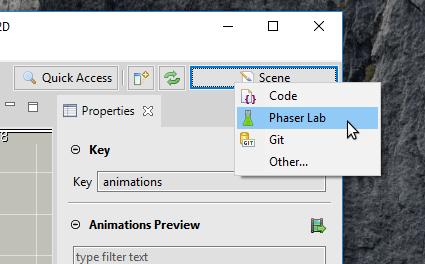

Properties view
---------------

The Properties view is an important |EclipseIDE|_ part. It is like the Inspector view in other visual development tools. It shows the properties of the selected elements of the active part of the workbench. When you select something in an editor or a view, if it provides properties adapters, then the selection properties are shown in the Properties view.

`Learn more in the Eclipse Help about the Properties view <https://help.eclipse.org/2019-06/topic/org.eclipse.platform.doc.user/reference/ref-29.htm?cp=0_4_4_1_6>`_

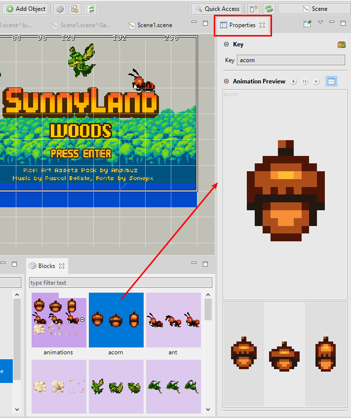

This view can play a role of information or editor. In the image above, the Properties show the information of the animation ``acorn`` selected in the `Blocks view`_. However, if you select the same animation in the |AnimationsEditor|_, the Properties view shows text editors for the animation attributes.

.. image:: images/workbench/properties-view-edit.png
   :alt: The Properties view as fields editor.

By default, the Properties view shows the content of the workbench's selection, if the selection changes, the content changes, but you can pin the current selection. And you can create a new Properties window, which is great when you want to pin certain information but want to see the properties of other objects.

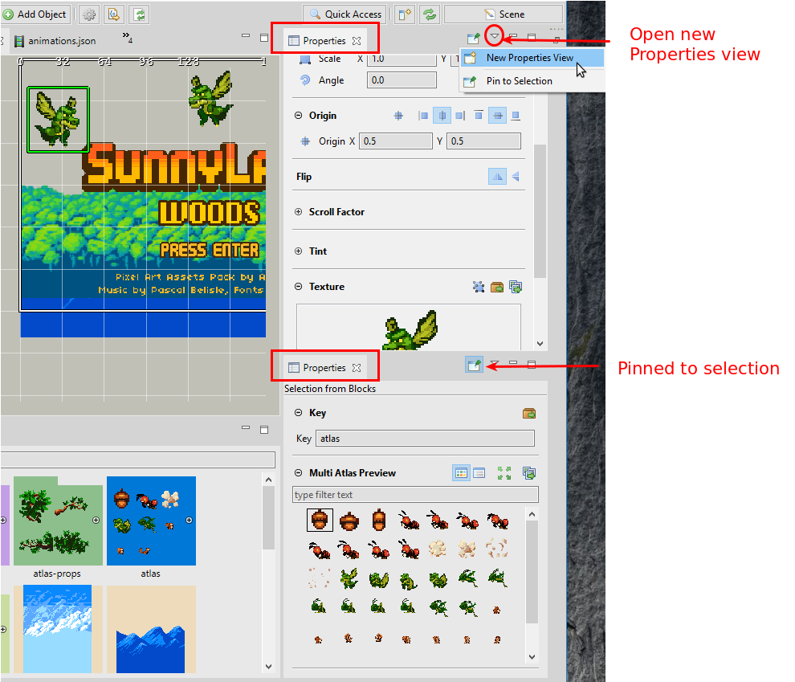

Outline view
------------

The Outline view is a general view to display hierarchical information. It is provided by the |EclipseIDE|_ and used widely by the |PhaserEditor|_ specific editors. When an editor is activated, the Outline view connects with it and display the editor content with certain structure (often as a tree or a list).

`Learn more in the Eclipse Help about the Outline view <https://help.eclipse.org/2019-06/topic/org.eclipse.platform.doc.user/concepts/coutline.htm?cp=0_2_4_6>`_

This connection with the active editor also includes the selection. Both shares the same selection, that is updated when it is changed in one of the two places.

It is very common that the Outline view shows the name of the elements, so you can perform a content filtering by name. In graphical editors, the element icons may reflect the real appearance of the element and it can be zoomed in/out (just hold one of the keys ``Alt``, ``Ctrl`` or ``Shift`` and scroll the mouse wheel).

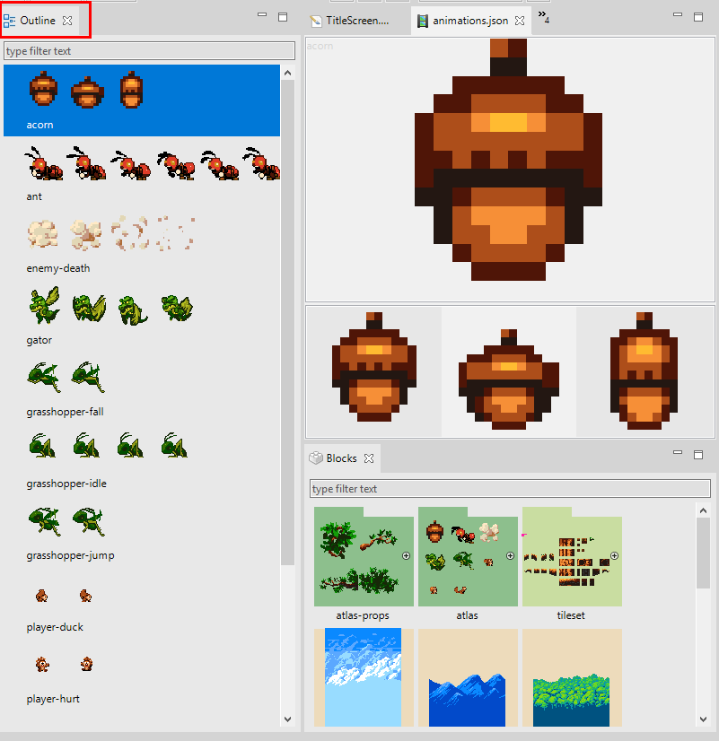

Blocks view
-----------

This view is a recent concept in |PhaserEditor|_. Its purpose is to provide, in a visual and clean way,  the different building blocks needed to create the objects in the active editor. So you can drag a block and drop it on the editor.

When an editor is activated, the **Blocks view** request to it all the elements (blocks) that can be used to create the objects in the editor. Not all the editors adapt to the **Blocks view**. Actually, at this moment only two editors provide building blocks: the `Scene Editor blocks <scene-editor.html#building-blocks>`_ and the `Animations Editor blocks <animations-editor.html#building-blocks>`_.

The content in the **Blocks view** could be nested. It can show **terminal** and **no-terminal** elements. In the next image, it shows the blocks of a |SceneEditor|_, note the texture atlas ``atlas-props`` **no-terminal** block can be expanded/collapsed and shows the atlas frames.

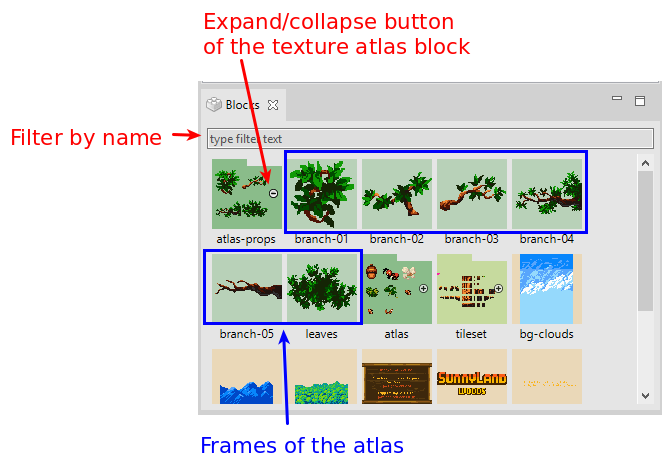

Blocks can be painted with a solid background. Its color depends on the active editor interests, but usually, the same color is assigned to blocks of the same "type".

Other Blocks view features
~~~~~~~~~~~~~~~~~~~~~~~~~~

Other key aspects of this view are:

* You can perform a quick search for the element names.

* It is zoomable: hold one of the keys ``Alt``, ``Ctrl`` or ``Shift`` and scroll the mouse wheel.

Active project
--------------

To simplify the workflow, |PhaserEditor|_ uses the concept of **active project**. The idea is to put some of the UI elements in the scope of that project.

* `Project <#project-view>`_ and `Assets <#assets-view>`_ views: only show the content of the active project.

* The **New** button of the `main toolbar`_: the resources are created in the active project.

* The **Play** button of the `main toolbar`_: it opens the active project in the browser.

You can activate any project at any time. There different ways to do this:

* When you create a new project, it is set as the active project.

* In the **Home** button of the `main toolbar`_, right click and select the active project.
  
  .. image:: images/workbench/open-project-dialog.png
     :alt: Dialog to change the active project.

* In the `Start <#start-perspective>`_ view, click on a project link.

  .. image:: images/workbench/start-project-links.png
     :alt: Start perspective open project links.

However the common is to work on a single project at the same time, you may create other projects and open the files in editors. To reduce the confusion, |PhaserEditor|_ shows the name of the project in the editor's tab if the file belongs to a non-active project.

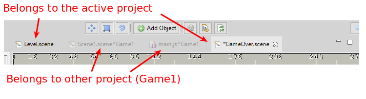

Assets view
-----------

This view displays files of the `active project`_ related to the process of create the scenes. It keeps these assets organized so you have direct access to them. In case of the `pack files`_, it shows all the keys defined in the files, and you can drag and drop them into the editors.

Some key aspects of this view:

* It shows the content of the `active project`_.

* You can do a quick search on the element names.

* It is zoomable: hold one of the keys ``Alt``, ``Ctrl`` or ``Shift`` and scroll the mouse wheel.

* You can drag the pack keys and drop them in editors like the |SceneEditor|_ and the |AnimationsEditor|_.

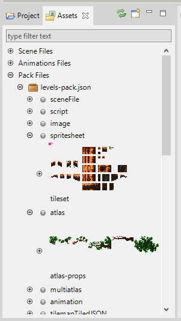

Project view
------------

This view shows the `active project`_ content and provides common resource operations. There are a couple of features that make this view friendly with game development and a better alternative than the other resource navigation views provided by |EclipseIDE|_ (`Project Explorer view`_ and **Navigator**).

Quick resource search
~~~~~~~~~~~~~~~~~~~~~

You can perform a quick search for the resources name.

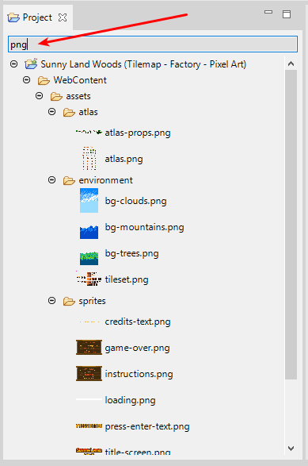

In-line preview of files
~~~~~~~~~~~~~~~~~~~~~~~~

Many of the files with visual content are in-line previewed. It is the case of images, sounds, and scenes.

.. hint:: Some preview images (like scenes) are created by incremental builders. If there is a missing or out-dated image, you can `re-build the whole project internal state <#cleaning-projects>`_. 

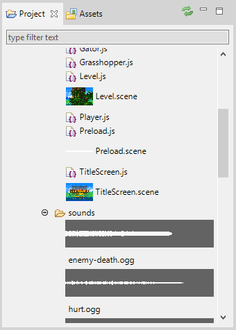

Zooming
~~~~~~~

As many other UI in the IDE, you can zoom-in/out the **Project view** images. Hold any of these keys: ``Alt``, ``Ctrl`` or ``Shift`` and scroll the mouse wheel.

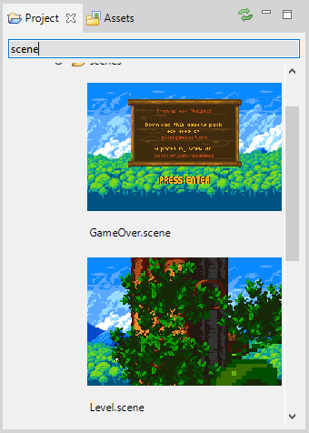

Properties support
~~~~~~~~~~~~~~~~~~

The **Project** view contributes information and actions to the `Properties view`_.

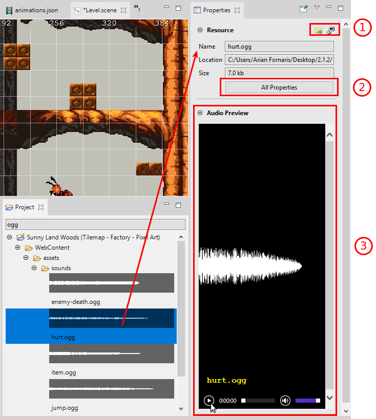

#. A button to locate the resource in your OS and a button to open the `Terminal view`_ in the directory of the resource.
#. Open the **Properties dialog** provided by |EclipseIDE|_. It shows additional properties like encoding and `resource filters`_.
#. Some graphical files are previewed (media and scene files).

Context menu
~~~~~~~~~~~~

The context menu of the **Project view** provides a few options if you compare it with the `Project Explorer view`, however, it covers the most common operations.

* Open a file with another editor.

* Create a new resource.

* Remove, move, rename and delete resources.

* Open the **Properties dialog**.

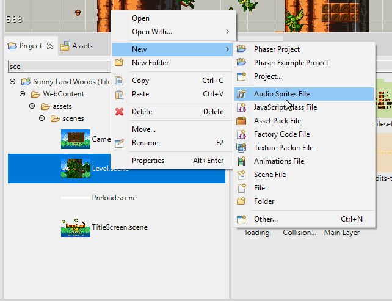

Project Explorer view
---------------------

This view is the default project navigator provided by |EclipseIDE|_. All third-party plugins, like the `Git tooling <#git-perspective>`_, is integrated with it. If you experience any issue with the `Project view`_, you can open the **Project Explorer** and complete the task. 

In the previous version of |PhaserEditor|_, we used this view to navigate the resources, but it is not as friendly for game development as we wish. Eventually, we should implement many of the features provided by this view in the `Project view`_ and short the gap.

`Learn more in the Eclipse Help about the Project Explorer view <https://help.eclipse.org/2019-06/topic/org.eclipse.platform.doc.user/reference/ref-27.htm?cp=0_4_4_1_4>`_

Terminal view
-------------

This is a terminal implementation provided by the |EclipseIDE|_. It could be especially useful for TypeScript projects.

You can open the **Terminal view** with the `Show View dialog <#add-view-button>`_ or with the `Terminal button of the Properties of a resource <#properties-support>`_.

`Visit the Terminal TM plugin in the Eclipse Marketplace <https://marketplace.eclipse.org/content/tm-terminal>`_

.. image:: images/workbench/terminal-open-in-properties.png
   :alt: Open Terminal view with Properties button.

Perspectives overview
---------------------

In this section, we present the most common perspectives provided by |PhaserEditor|_.

Start perspective
~~~~~~~~~~~~~~~~~

This is the initial perspective. It is shown when the workbench starts in a clean workspace and it provides some useful links:

#. Links to `create new projects <#phaser-project-wizard>`_.
#. Links to `open a project <#active-project>`_. The project name with a bold font is the one is `active <#active-project>`_.
#. Links to the social accounts of |PhaserEditor|_.
#. Links to the latest news from the |PhaserEditor|_ website.

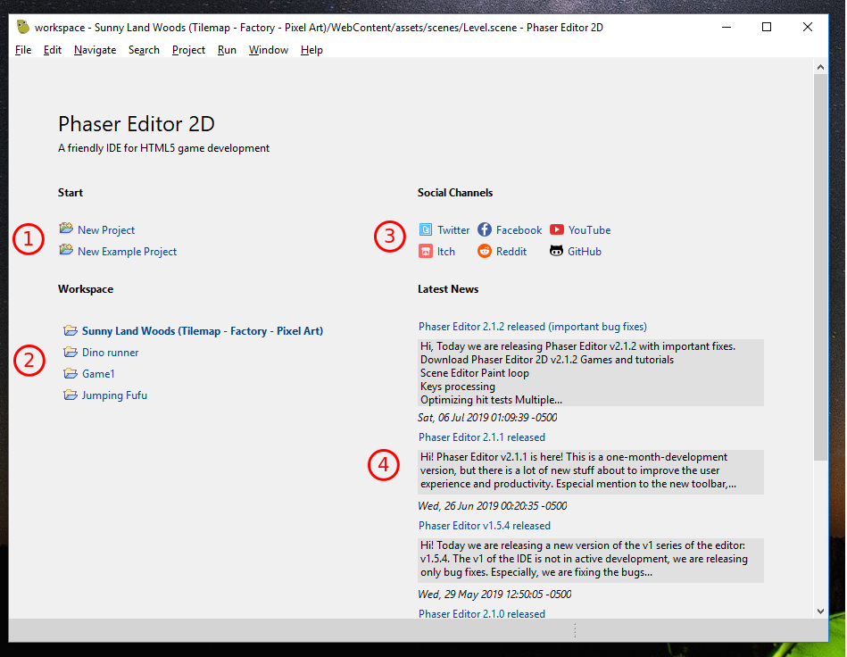

Scene perspective
~~~~~~~~~~~~~~~~~

This perspective is focused on design the scenes and other related files, like the `texture atlas files`_, `pack files`_ and `animations files`_. 

It includes the views: `Outline view`_, `Properties view`_, `Project view`_, `Assets view`_ and `Blocks view`_.

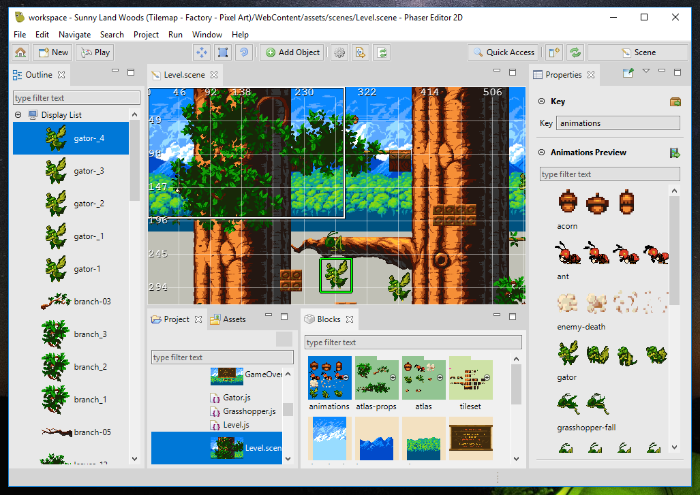

Code perspective
~~~~~~~~~~~~~~~~

Dedicated to JavaScript/TypeScript coding, this perspective provides the views `Project view`_, `Assets view`_, `Phaser Chains <phaser-labs.html#phaser-chains-view>`_, `Problems view <https://help.eclipse.org/2019-06/topic/org.eclipse.platform.doc.user/concepts/cprbview.htm?cp=0_2_4_5>`_, `Terminal view`_, `Jsdoc view <phaser-labs.html#jsdoc-view>`_, and `Properties view`_.

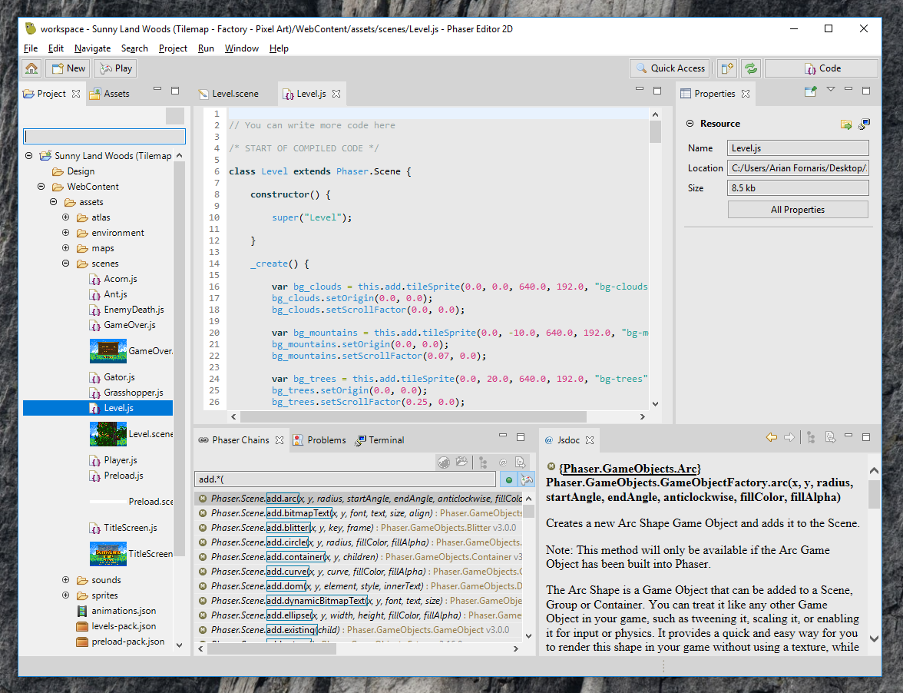

Git perspective
~~~~~~~~~~~~~~~

The `Eclipse Git <https://www.eclipse.org/egit/>`_ plugin provides this perspective to manage your Git repositories. 

`Learn more in the Eclipse Help about the Eclipse Git tools <https://help.eclipse.org/2019-06/topic/org.eclipse.egit.doc/help/EGit/User_Guide/User-Guide.html?cp=2>`_

.. image:: images/workbench/git-perspective.png
   :alt: Git perspective.

Automatic updates
-----------------

|PhaserEditor|_ checks for updates at the startup, but you can force an update check in the menu option *Help* |-| *Check for Updates*.

The updates are incremental (only modified/new plugins are downloaded), and it may be faster than download the whole editor from the website, especially if the update does not include a new Phaser version ---that may contain new examples and assets--- or a new |EclipseIDE|_ version (approximately every four months). 

You can disable the automatic update in the `preferences`_ page *Install/Update* |-| *Automatic Updates*.

`Learn more in the Eclipse Help about updating and installing software <https://help.eclipse.org/2019-06/topic/org.eclipse.platform.doc.user/tasks/tasks-129.htm?cp=0_3_17>`_

Phaser version update
~~~~~~~~~~~~~~~~~~~~~

The editor always provides the latest Phaser_ version. If the |PhaserDevs|_ release a new version of Phaser_, we release a new version of |PhaserEditor|_ ---the editor files could take around a week to be ready---, with the latest Phaser_ release. 

This means, all the tools that consume the Phaser_ resources display always an updated information. However, your project Phaser_ runtime is not updated. By default, |PhaserEditor|_ copies the ``phaser.js`` runtime in the ``WebContent/lib`` folder, and it is never updated automatically. If you wish to update your game to the latest Phaser_ you should do it manually, by replacing the ``phaser.js`` file (or your custom Phaser_ build) with the desired version.

Possible issues
~~~~~~~~~~~~~~~

The updating is a complex operation, especially when it includes a new |EclipseIDE|_ version. If the IDE does not start, execute the ``Debug.bat`` script ( or ``Debug.sh`` in the other platforms), to clean the plugins cache and other metadata and fix possible incompatibilities.

Sometimes, an update includes new data, new views or new perspectives, that are not present in the workspace you are working on. In that case, if you experience any issue, you can `start with a new workspace <first-steps.html#run-phaser-editor-2d>`_ and `import <#import-and-export-wizards>`_ the projects.

Help System
-----------

The |PhaserEditor|_ installation includes this help and the workbench help (provided by |EclipseIDE|_). Many tools only provide online help, but this is an integrated environment, and the help is part of that integration. Eventually, we should integrate all the Phaser related views and editors with the help, providing contextual assistance.

`Learn more in the Eclipse Help about the Help System <https://help.eclipse.com/topic/org.eclipse.platform.doc.user/tasks/help.xhtml?cp=0_3_15>`_
